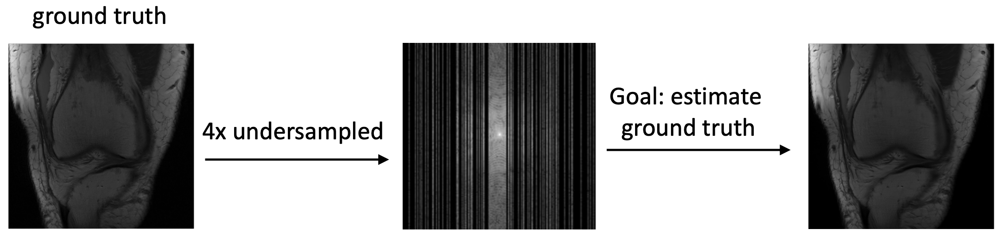

# Accelerated MRI reconstruction with U-Net

This folder contains code to train and validate a U-Net for accelerated MRI reconstruction. Accelerated MRI reconstruction is a compressed sensing task where the goal is to recover a ground-truth image from an under-sampled measurement. The under-sampled measurement is based in the frequency domain and is often called the $k$-space.

***

### List of contents

* [Questions and bugs](#Questions-and-bugs)

* [Datasets and model checkpoints](#Datasets-and-model-checkpoints) 

* [Training](#Training) 

* [Inference](#Inference) 

***

# Questions and bugs

- For questions relating to the use of MONAI, please us our [Discussions tab](https://github.com/Project-MONAI/MONAI/discussions) on the main repository of MONAI.
- For bugs relating to MONAI functionality, please create an issue on the [main repository](https://github.com/Project-MONAI/MONAI/issues).
- For bugs relating to the running of a tutorial, please create an issue in [this repository](https://github.com/Project-MONAI/Tutorials/issues).

# Datasets and model checkpoints

The experiments are performed on the [fastMRI](https://fastmri.org/dataset) dataset. Users should request access to the dataset
from the [owner's website](https://fastmri.org/dataset).

We have already provided a model checkpoint `best_model.pt` for a U-Net with 7,782,849 parameters. To obtain this checkpoint, we trained
a U-Net with the default hyper-parameters in `train.py` on the T2 subset of the brain dataset. The user can train their model on an arbitrary portion of the dataset.

# Training

Running `train.py` trains a U-Net. The default setup automatically detects a GPU for training; if not available, CPU will be used.

    # Run this to get a full list of training arguments
    python ./train.py -h
    
    # This is an example of calling train.py
    python ./train.py
        --data_path_train train_dir \
        --data_path_val val_dir \
        --exp accelerated_mri_recon \
        --exp_dir ./ \
        --mask_type equispaced \
        --num_epochs 50 \
        --num_workers 0 \
        --lr 0.0001

# Inference

The notebook `inference.ipynb` contains an example to perform validation. Average SSIM score over the validation set is computed and then
one sample is picked for visualization.

