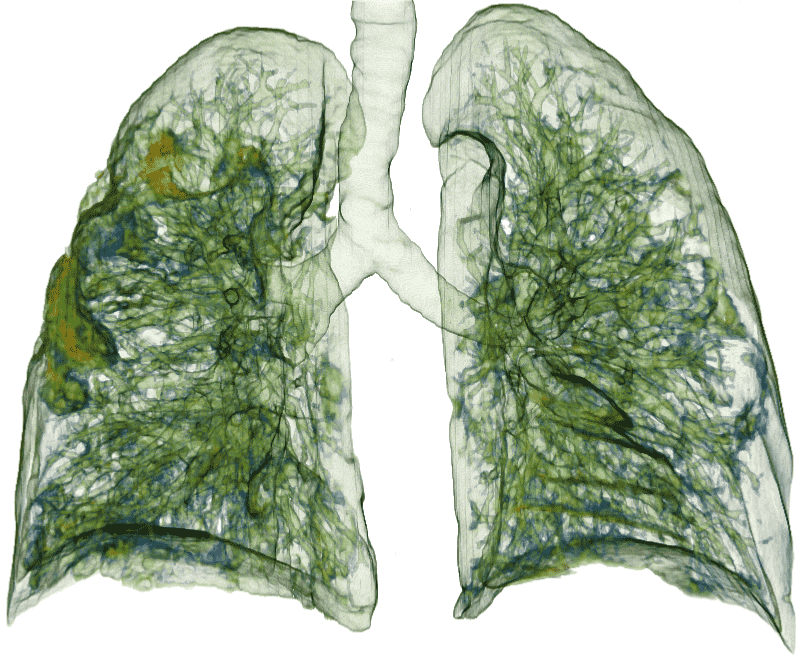
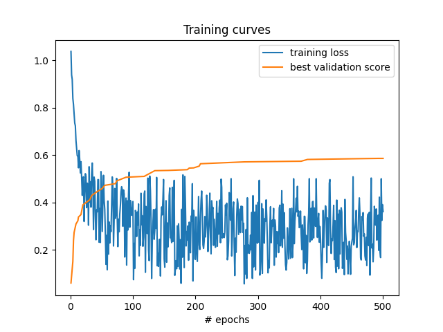

# A U-Net model for lung lesion segmentation from CT images

[Challenge website](https://covid-segmentation.grand-challenge.org/COVID-19-20/) | [Leaderboard](https://covid-segmentation.grand-challenge.org/evaluation/challenge/leaderboard/)

This directory contains a simple baseline method [using MONAI](https://monai.io) for training, validation, and inference for [COVID-19 LUNG CT LESION SEGMENTATION CHALLENGE - 2020](https://covid-segmentation.grand-challenge.org/COVID-19-20/) (a MICCAI Endorsed Event). The implementation is a basic deep learning pipeline which could serve as a starting point for further algorithmic improvements.

<p>


</p>

## Overview

1. [Requirements](#requirements)
1. [Dependencies and installation](#dependencies-and-installation)
1. [Usages](#usages)
    1. [Training](#training-and-validation-at-every-epoch)
    1. [Inference](#inference)
    1. [Results](#results)
    1. [Further readings](#further-readings)
1. [Submitting to the leaderboard](#submitting-to-the-leaderboard)
1. [License](#license)

## Requirements

The script is tested with:

- `Ubuntu 18.04` | `Python 3.6` | `CUDA 10.2`

On a GPU with [automatic mixed precision support](https://developer.nvidia.com/automatic-mixed-precision):

- the default training pipeline requires about 5.5GB memory,
- the default inference pipeline requires about 2.3GB memory.

## Dependencies and installation

### Pytorch

Please follow [the Pytorch instructions](https://pytorch.org/get-started/locally/) for installation. To verify that you have a viable installation, please run:

```bash
python -c 'import torch; print(torch.rand(4, 2, device="cuda"))'
```

### MONAI

```bash
pip install "git+https://github.com/Project-MONAI/MONAI#egg=monai[nibabel,ignite,tqdm]"
```

For more information please check out [the installation guide](https://docs.monai.io/en/latest/installation.html).

## Usages

Download `run_net.py` to a local folder. The following instructions assume that [the challenge data](https://covid-segmentation.grand-challenge.org/Download/) are also downloaded and unzipped into the same folder.

### Training (and validation at every epoch)

```bash
python run_net.py train --data_folder "COVID-19-20_v2/Train" --model_folder "runs"
```

During training, the top three models will be selected based on the per-epoch validation and stored at `--model_folders`.

The training uses convenient file loading modules and a few intensity and spatial random augmentations using [MONAI](https://github.com/Project-MONAI/MONAI):

- `LoadNiftid`, `AddChanneld`, `Orientationd`, `Spacingd`, `ScaleIntensityRanged`

Load the image data into the LPS orientation (Left to right, Posterior to anterior, Superior to inferior), with a resolution of 1.25mm x 1.25mm x 5.00mm, and intensity between [-1000.0, 500.0] scaled to [0.0, 1.0].

- `SpatialPadd`

Pad the volumes to have at least 192x192 voxels in its first two spatial dimensions.

- `RandAffined`, `RandGaussianNoised`, `RandFlipd`

Data augmentations randomized at every training iteration.

- `RandCropByPosNegLabeld`

Randomly sample image/label pairs of shape `(192, 192, 16)` with balanced samples from the foreground (lesion) and background (anywhere else in the volume).

- U-Net model

the UNet model is from [`monai.networks.nets.BasicUNet`](https://docs.monai.io/en/latest/networks.html#basicunet).

- Sliding window inference

Segmentations are generated by [`monai.inferers.SlidingWindowInferer`](https://docs.monai.io/en/latest/inferers.html#monai.inferers.SlidingWindowInferer) with a window size of `(192, 192, 16)`.
Note that the evaluation scores from this inference pipeline is not computed at the original data resolution, and is presented here for model selection purpose only.

### Inference

```bash
python run_net.py infer --data_folder "COVID-19-20_v2/Validation" --model_folder "runs"
```

This command will load the best validation model, run inference, and store the predictions at `./output`.

### Results

<p>

</p>

This baseline method achieves 0.6904 ± 0.1801 Dice score on the challenge validation set.

### Further readings

- For MONAI technical documentation, please visit [docs.monai.io](https://docs.monai.io/).
- Please visit [`Project-MONAI/tutorials`](https://github.com/Project-MONAI/tutorials) for more examples, including:
  - [`3D segmentation pipelines`](https://github.com/Project-MONAI/tutorials/tree/master/3d_segmentation),
  - [`Dynamic UNet`](https://github.com/Project-MONAI/tutorials/blob/master/modules/dynunet_tutorial.ipynb),
  - [`Training acceleration`](https://github.com/Project-MONAI/tutorials/tree/master/acceleration).

## Submitting to the leaderboard

By default, the predictions generated at `./output/to_submit` are ready for submission. Please zip the folder and follow [the upload instructions](https://covid-segmentation.grand-challenge.org/evaluation/challenge/submissions/create/) to submit it.

For any queries, please contact [the challenge organizers](https://covid-segmentation.grand-challenge.org/Contact/).

## License

The code is licensed under [the Apache License 2.0](https://github.com/Project-MONAI/tutorials/blob/master/LICENSE).
