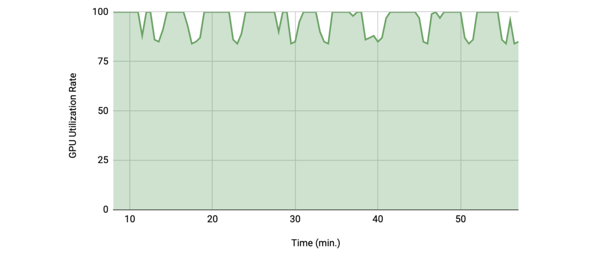

# Fast Model Training Guide

Typically, model training is a time-consuming step during deep learning development, especially in medical imaging applications. Volumetric medical images are usually large (as multi-dimensional arrays) and the model training process can be complex. Even with powerful hardware (e.g. CPU/GPU with large RAM), the workflows often require profiling and tuning to achieve high performance. And using carefully selected algorithms -- such as network architectures, loss functions, optimizers -- can accelerate the training.

To provide an overview of the fast training techniques in practice, this document introduces details of how to profile the training pipelines, analyze the datasets, select suitable algorithms, and optimize GPU utilization in single GPU, multi-GPU or multi-node.

* [Profiling the pipelines](#profiling-the-pipelines)
  * [Deep Learning Profiler (DLProf)](#1-deep-learning-profiler-dlprof)
  * [NVIDIA Nsight Systems](#2-nvidia-nsight-systems)
  * [NVIDIA Tools Extension (NVTX)](#3-nvidia-tools-extension-nvtx)
  * [NVIDIA Management Library (NVML)](#4-nvidia-management-library-nvml)
* [Optimizing data loading function](#optimizing-data-loading-function)
  * [Cache I/O and transforms data to accelerate training](#1-cache-io-and-transforms-data-to-accelerate-training)
  * [Cache intermediate outcomes into persistent storage](#2-cache-intermediate-outcomes-into-persistent-storage)
  * [SmartCache mechanism for large datasets](#3-smartcache-mechanism-for-large-datasets)
  * [`ThreadDataLoader` vs. `DataLoader`](#4-threaddataloader-vs-dataloader)
* [Algorithmic improvement](#algorithmic-improvement)
  * Optimizing choices of algorithms to speed up model training and improve convergence.
* [Optimizing GPU utilization](#optimizing-gpu-utilization)
  * [Automated mixed precision (AMP)](#1-automated-mixed-precision-amp)
  * [Execute transforms on GPU](#2-execute-transforms-on-gpu)
  * [Adapt `cuCIM` to execute GPU transforms](#3-adapt-cucim-to-execute-gpu-transforms)
  * [Cache IO and transforms data to GPU](#4-cache-io-and-transforms-data-to-gpu)
* [Leveraging multi-GPU](#leveraging-multi-gpu)
  * Demonstration of multi-GPU training for performance improvement.
* [Leveraging multi-node distributed training](#leveraging-multi-node-distributed-training)
  * Demonstration of distributed multi-node training for performance improvement.
* [Examples](#examples)
  * Applications in medical image segmentation with various efficiency and effectiveness improvements.
  * [Spleen segmentation](#1-spleen-segmentation)
  * [Brain tumor segmentation](#2-brain-tumor-segmentation)
  * [Pathology metastasis detection task](#3-pathology-metastasis-detection-task)

## Profiling the pipelines

Model training in deep learning requires sufficient experience regarding various practical applications. For example, medical image analysis normally leverages necessary knowledge about imaging protocols (e.g., spacing, orientation, etc.) to achieve decent model performance. Moreover, the training of large deep learning models heavily relies on high-efficiency GPU devices. But sometimes the great capacities of GPUs are not fully exploited due to the bottlenecks such as data loading, data augmentation.

Here, we provide several methods for users to analyze their programs when using MONAI. The analyses include operation-based GPU activity and overall GPU activity during model training. They will greatly help users manage computing bottlenecks and provide insights for the area to be improved for better computing efficiency.

### 1. Deep Learning Profiler (DLProf)

[Deep Learning Profiler](https://docs.nvidia.com/deeplearning/frameworks/dlprof-user-guide/) is a tool for profiling deep learning models to help data scientists understand and improve the performance of their models visually via the DLProf Viewer or by analyzing text reports. We will refer to Deep Learning Profiler simply as DLProf.

DLProf generates reports of summary and detailed analysis of GPU activities based on the whole training program. The format of output reports can be determined by users. An example of an execution script is shown as follows.

```bash
dlprof --mode pytorch \
       --reports summary \
       --formats json \
       --output_path ./outputs_base \
       python3 train.py
```

And the output `.json` file contains various aspects of GPU information.

```json
  "All Kernels" :
  {
    "All kernels" :
    {
      "# Kernels" : 39,
      "CPU Time (ns)" : 10115333085,
      "GPU Time (ns)" : 9016239970
    },
    "All other kernels" :
    {
      "# Kernels" : 32,
      "CPU Time (ns)" : 2246830231,
      "GPU Time (ns)" : 5318794154
    },
    ...
  }
```

### 2. NVIDIA Nsight Systems

[NVIDIA Nsight™ Systems](https://developer.nvidia.com/nsight-systems) is a system-wide performance analysis tool designed to visualize algorithms, help to identify the largest opportunities to optimize, and tune to scale efficiently across any quantity or size of CPUs and GPUs.

Nsight provides a great GUI to visualize the output database (`.qdrep` file) from the analysis results of DLProf. With necessary annotation inside the existing training scripts. The GPU utilization of each operation can be seen through the interface. Then, users understand better which components are the bottlenecks. The detailed example is shown in the following
[performance profiling tutorial]( https://github.com/Project-MONAI/tutorials/blob/master/performance_profiling/).

As shown in the following figure, each training epoch can be decomposed into multiple steps, including data loading (I/O), model forward/backward operation, optimization, etc. Then, necessary improvement can be conducted targeting certain steps. For example, if data loading (I/O) takes too much time during training, we can try to cache them into CPU/GPU bypassing data loading and pre-processing. After program optimization, users can re-run the analysis to compare the results before and after optimization.


### 3. NVIDIA Tools Extension (NVTX)

[NVIDIA® Tools Extension Library (NVTX)](https://github.com/NVIDIA/NVTX) is a powerful mechanism that allows users to manually instrument their application. With a C-based and a Python-based Application Programming Interface (API) for annotating events, code ranges, and resources in your applications. Applications that integrate NVTX can use NVIDIA Nsight, Tegra System Profiler, and Visual Profiler to capture and visualize these events and ranges. In general, NVTX can bring valuable insight into the application while incurring almost no overhead.

To leverage the visualization capacities of Nsight, necessary annotation and tagging in Python script are required. For MONAI transforms, we provide the `Range` function from `monai.utils.nvtx` to add tags for each transform (data pre-processing and augmentation) in the transform chains. Then the analysis results would be itemized based on different transforms.

```py
train_transforms = Compose(
    [
        Range("LoadImage")(LoadImaged(keys=["image", "label"])),
        Range()(EnsureChannelFirstd(keys=["image", "label"])),
        Range("Spacing")(
            Spacingd(
                keys=["image", "label"],
                pixdim=(1.5, 1.5, 2.0),
                mode=("bilinear", "nearest"),
            )
        ),
        ...
    ]
)
```

For the rest of the script, `nvtx` library provides functions `start_range` and `end_range` for users to define the range of the analysis. And user can choose colors of the itemized analysis in Nsight visualization.

```py
rng_train_dataload = nvtx.start_range(message="dataload", color="red")
batch_data = next(train_loader_iterator)
inputs, labels = (
    batch_data["image"],
    batch_data["label"],
)
nvtx.end_range(rng_train_dataload)

optimizer.zero_grad()

rng_train_forward = nvtx.start_range(message="forward", color="green")
with torch.cuda.amp.autocast():
    outputs = model(inputs)
    loss = loss_function(outputs, labels)
nvtx.end_range(rng_train_forward)
```

The concrete examples can be found in the profiling tutorials of [radiology pipeline]( https://github.com/Project-MONAI/tutorials/blob/master/performance_profiling/radiology) and [pathology pipelines](https://github.com/Project-MONAI/tutorials/blob/master/pathology/tumor_detection/ignite/profiling_camelyon_pipeline.ipynb).

### 4. NVIDIA Management Library (NVML)

[NVIDIA Management Library (NVML)](https://developer.nvidia.com/nvidia-management-library-nvml) is a C-based API for monitoring and managing various states of the NVIDIA GPU devices. It provides direct access to the queries and commands exposed via `nvidia-smi`. The runtime version of NVML ships with the NVIDIA display driver, and the SDK provides the appropriate header, stub libraries and sample applications. During model training, users can execute `watch -n 1 nvidia-smi` command to monitor real-time GPU activities for each GPU.

Some third-party libraries provide Python API to access NVML library, such as [pynvml](https://github.com/gpuopenanalytics/pynvml). Using the following script, the real-time GPU status (e.g., memory consumption, utilization rate, etc.) can be read and stored into a dictionary `data`.

```py
#!/usr/bin/env python

from pynvml import *
from pynvml.smi import nvidia_smi
from time import sleep

device_id = 0
record_step = 1.0
nvsmi = nvidia_smi.getInstance()

with open("nvidia_smi.csv", "a") as f:
    f.write("time\tgpu_util\tused\ttotal\tratio\n")

for _i in range(1000):
    data = nvsmi.DeviceQuery('memory.total, memory.free, memory.used, utilization.gpu, utilization.memory')["gpu"]
    with open("nvidia_smi.csv", "a") as f:
        print(
            "{0:f}\t{1:.5f}\t{2:.5f}\t{3:.5f}\t{4:.5f}".format(
                iter_time,
                data[device_id]["utilization"]["gpu_util"],
                data[device_id]["fb_memory_usage"]["used"],
                data[device_id]["fb_memory_usage"]["total"],
                data[device_id]["fb_memory_usage"]["used"] / data[device_id]["fb_memory_usage"]["total"] * 100.0
            )
        )

    sleep(record_step)
    iter_time += record_step
```

As shown in the example, the results can be saved into a `.csv` file. With necessary visualization tools (Microsoft Excel, Google Sheets, etc.), we can visualize the dynamic changes of model metrics. The following figure shows an example of the dynamic changes of GPU utilization rate.



## Optimizing data loading function
With the tools described in the previous sections, we can identify the bottlenecks and adopt optimization strategies to manage them, Data loading is usually a key component for end-to-end pipelines, especially for 3D medical images. MONAI provides various strategies for different use cases.

### 1. Cache I/O and transforms data to accelerate training

Users often need to train the model with many (potentially thousands of) epochs over the training data to achieve decent model quality. A native PyTorch implementation may repeatedly load data and run the same pre-processing steps for every data point during training, which can be time-consuming and redundant.

MONAI provides a multi-thread `CacheDataset` and `LMDBDataset` to accelerate these loading steps during training by storing the intermediate outcomes before the first randomized transform in the transform chain. Enabling this feature could potentially give 10x training speedups in the [Datasets experiment](https://github.com/Project-MONAI/tutorials/blob/master/acceleration/dataset_type_performance.ipynb).


### 2. Cache intermediate outcomes into persistent storage

`PersistentDataset` is similar to `CacheDataset`, where the caches are persisted to disk storage or LMDB for rapid retrieval across experimental runs (as is the case when tuning hyperparameters), or when the entire size of the dataset exceeds available memory. `PersistentDataset` could achieve similar performance when comparing to `CacheDataset` in [Datasets experiment](https://github.com/Project-MONAI/tutorials/blob/master/acceleration/dataset_type_performance.ipynb).
 with an SSD storage.

### 3. SmartCache mechanism for large datasets

Another efficient strategy is to only train with a subset of the dataset in each epoch (and dynamically, partially replace the subset in every epoch). It's the `SmartCache` mechanism in [NVIDIA Clara-train SDK v3.0](https://docs.nvidia.com/clara/tlt-mi/clara-train-sdk-v3.0/nvmidl/additional_features/smart_cache.html#smart-cache).

MONAI provides a PyTorch version `SmartCache` as `SmartCacheDataset`. In each epoch, only the items in the cache are used for training, and simultaneously, another thread is preparing replacement items by applying the transforms to items that are not in the cache. Once one epoch is completed, `SmartCache` replaces the same number of items with replacement items.

For example, if we have five images: `[image1, image2, image3, image4, image5]`, and `cache_num=4`, `replace_rate=0.25`, the actual training images cached and replaced for every epoch are as follows:
```
epoch 1: [image1, image2, image3, image4]
epoch 2: [image2, image3, image4, image5]
epoch 3: [image3, image4, image5, image1]
epoch 3: [image4, image5, image1, image2]
epoch N: [image[N % 5] ...]
```
Full example of `SmartCacheDataset` is available at [Distributed training with SmartCache](https://github.com/Project-MONAI/tutorials/blob/master/acceleration/distributed_training/unet_training_smartcache.py).

### 4. `ThreadDataLoader` vs. `DataLoader`

If the transforms are light-weighted, especially when we cache all the data in RAM, the multiprocessing of PyTorch `DataLoader` may cause unnecessary IPC time and cause the drop of GPU utilization after every epoch. MONAI provides `ThreadDataLoader` which executes transforms in a separate thread:

a `ThreadDataLoader` example is available at [Spleen fast training tutorial](https://github.com/Project-MONAI/tutorials/blob/master/acceleration/fast_training_tutorial.ipynb).

## Algorithmic improvement

In most deep learning applications, algorithmic improvement has been witnessed to be effective for boosting training efficiency and performance (for example, from AlexNet to ResNet). The improvement may come from a novel loss function, or a sophisticated optimizer, or a different learning rate scheduler, or the combination of all previous items. For our demo applications of 3D medical image segmentation, we would like to further speed up training from the algorithmic perspective. The default loss function is soft Dice loss. And we changed it to `DiceCELoss` from MONAI to further improve the model convergence. Because the `DiceCELoss` combines both Dice loss and multi-class cross-entropy loss (which is suitable for the softmax formulation), and balance the importance of global and pixel-wise accuracies. The segmentation quality can be largely improved. The following figure shows the great improvement on model convergence after we change Dice loss to `DiceCELoss`, with or without enabling automated mixed precision (AMP).


Furthermore, we changed default optimizer to Novograd, modified learning rate related settings, and added other necessary improvements. The concrete examples are shown in
[spleen fast training tutorial](https://github.com/Project-MONAI/tutorials/blob/master/acceleration/fast_training_tutorial.ipynb) and [BraTS distributed training tutorial](https://github.com/Project-MONAI/tutorials/blob/master/acceleration/distributed_training/brats_training_ddp.py). Both are very typical applications in 3D medical image segmentation but with unique challenges. Spleen segmentation has very limited data but with large image size, and brain tumor segmentation has relatively small image samples but with a much larger data pool. Combing algorithmic improvement with computing improvement, our model training cost is significantly reduced when reaching the same level of performance as the existing pipeline.

## Optimizing GPU utilization

NVIDIA GPUs have been widely applied in many areas of deep learning training and evaluation, and the CUDA parallel computation shows obvious acceleration when comparing to traditional computation methods. To fully leverage GPU features, many popular mechanisms raised, like automated mixed precision (AMP), distributed data parallelism, etc. MONAI can support these features and provides several examples.

### 1. Automated mixed precision (AMP)

In 2017, NVIDIA researchers developed a methodology for mixed-precision training, which combined single-precision (FP32) with half-precision (e.g., FP16) format when training a network, and it achieved a similar accuracy as FP32 training using the same hyperparameters.

For the PyTorch 1.6 release, developers at NVIDIA and Facebook moved mixed precision functionality into PyTorch core as the AMP package, `torch.cuda.amp`.

MONAI workflows can easily set `amp=True/False` in `SupervisedTrainer` or `SupervisedEvaluator` during training or evaluation to enable/disable AMP. And we tried to compare the training speed of spleen segmentation task if AMP ON/OFF on NVIDIA V100 GPU with CUDA 11, obtained some benchmark results:

AMP tutorial is available at [AMP tutorial](https://github.com/Project-MONAI/tutorials/blob/master/acceleration/automatic_mixed_precision.ipynb).

### 2. Execute transforms on GPU

Running preprocessing transforms on CPU while keeping GPU busy by running the model training is a common practice and is an optimal resource distribution in many use cases.
From MONAI v0.7 we introduced PyTorch `Tensor` based computation in transforms, many transforms already support `Tensor` data. To accelerate the high-computation transforms, users can first convert input data into GPU Tensor by `ToTensor` or `EnsureType` transform, then the following transforms can execute on GPU based on PyTorch `Tensor` APIs.
GPU transform tutorial is available at [Spleen fast training tutorial](https://github.com/Project-MONAI/tutorials/blob/master/acceleration/fast_training_tutorial.ipynb).

### 3. Adapt `cuCIM` to execute GPU transforms

[cuCIM](https://github.com/rapidsai/cucim) has implemented an optimized version of several common transforms that we are using in the digital pathology pipeline. These transforms are natively being run on GPU and act on CuPy arrays.
In MONAI v0.7, besides PyTorch `Tensor` based GPU transforms, we also made the `cuCIM` transforms available in MONAI through adapters (`CuCIM` and `RandCuCIM`). For instance:

```py
from monai.transforms import CuCIM, RandCuCIM

RandCuCIM(name="color_jitter", brightness=64.0 / 255.0, contrast=0.75, saturation=0.25, hue=0.04)
CuCIM(name="scale_intensity_range", a_min=0.0, a_max=255.0, b_min=-1.0, b_max=1.0)
```

This has shown a speedup in the training of metastasis detection model. Please refer to [Pathology Metastasis Detection Task](#3-pathology-metastasis-detection-task) in the Examples section below for more details.

### 4. Cache IO and transforms data to GPU

Even with `CacheDataset`, we usually need to copy the same data to GPU memory for GPU random transforms or network computation in every epoch. An efficient approach is to cache the data to GPU memory directly, then every epoch can start from GPU computation immediately.

For example:
```py
train_transforms = [
    LoadImaged(...),
    AddChanneld(...),
    Spacingd(...),
    Orientationd(...),
    ScaleIntensityRanged(...),
    CropForegroundd(...),
    FgBgToIndicesd(...),
    EnsureTyped(..., data_type="tensor"),
    ToDeviced(..., device="cuda:0"),
    RandCropByPosNegLabeld(...),
]
dataset = CacheDataset(..., transform=train_trans)
```
Here we convert to PyTorch `Tensor` with `EnsureTyped` transform and move data to GPU with `ToDeviced` transform. `CacheDataset` caches the transform results until `ToDeviced`, so it is in GPU memory. Then in every epoch, the program fetches cached data from GPU memory and only execute the random transform `RandCropByPosNegLabeld` on GPU directly.
GPU caching example is available at [Spleen fast training tutorial](https://github.com/Project-MONAI/tutorials/blob/master/acceleration/fast_training_tutorial.ipynb).

## Leveraging multi-GPU

When we have fully utilized a single GPU during training, a natural optimization idea is to partition the dataset and execute model training in parallel on multiple GPUs.

Additionally, with more GPU devices, we can achieve more benefits:
- Some training algorithms can converge faster with a larger batch size and the training progress is more stable.
- If caching data in GPU memory, every GPU only needs to cache a partition, so we can use larger cache rate to cache more data in total to accelerate training.

For example, during the training of brain tumor segmentation task, with 8 GPUs, we can cache all the data in GPU memory directly and execute the following transforms on GPU device, so it's more than `10x` faster than single GPU training. More details are available at [BraTS distributed training tutorial](https://github.com/Project-MONAI/tutorials/blob/master/acceleration/distributed_training/brats_training_ddp.py).

## Leveraging multi-node distributed training

Distributed data parallelism (DDP) is an important feature of PyTorch to connect multiple GPU devices in multiple nodes to train or evaluate models, it can continuously improve the training speed when we fully leveraged multiple GPUs on a single node.

The distributed data parallel APIs of MONAI are compatible with the native PyTorch distributed module, pytorch-ignite distributed module, Horovod, XLA, and the SLURM platform. MONAI provides rich demos for reference: train/evaluate with `PyTorch DDP`, train/evaluate with `Horovod`, train/evaluate with `Ignite DDP`, partition dataset and train with `SmartCacheDataset`, as well as a real-world training example based on Decathlon challenge Task01 - Brain Tumor segmentation.

For more details about the PyTorch distributed training setup, please refer to: https://pytorch.org/docs/stable/distributed.html.

We obtained U-Net performance benchmarks of Brain tumor segmentation task for reference (based on CUDA 11, NVIDIA V100 GPUs):

More details are available at [BraTS distributed training tutorial](https://github.com/Project-MONAI/tutorials/blob/master/acceleration/distributed_training/brats_training_ddp.py).

## Examples

With all the above strategies, in this section, we introduce how to apply them to the typical use cases to improve the training efficiency.

### 1. Spleen segmentation

- Select the algorithms based on the experiments.
  1. As a binary segmentation task, we replaced the baseline `Dice` loss with a `DiceCE` loss, it can help improve the convergence. To achieve the target metric (mean Dice = 0.95) it reduces the number of training epochs from 200 to 50.
  2. We tried several numerical optimizers, and finally replaced the baseline `Adam` optimizer with `Novograd`, which consistently reduce the number of training epochs from 50 to 30.
- Optimize GPU utilization.
  1. With `AMP`, the training speed is significantly improved and can achieve almost the same validation metric as without `AMP`.
  2. The deterministic transform results of all the spleen dataset is around 8 GB, which can be cached in a V100 GPU memory. So, we cached all the data in GPU memory and executed the following transforms in GPU directly.
- Replace `DataLoader` with `ThreadDataLoader`. As all the data are cached in GPU, the computation of randomized transforms is on GPU and light-weighted, `ThreadDataLoader` help avoid the IPC cost of multi-processing in `DataLoader` and increase the GPU utilization.

In summary, with a V100 GPU, we can achieve the training converges at a target validation mean Dice of `0.95` within one minute (`52s` on a V100 GPU, `41s` on an A100 GPU), it is approximately `200x` faster compared with the native PyTorch implementation when achieving the target metric. And each epoch is `20x` faster than the regular training.


More details are available at [Spleen fast training tutorial](https://github.com/Project-MONAI/tutorials/blob/master/acceleration/fast_training_tutorial.ipynb).

### 2. Brain tumor segmentation

- Select the algorithms based on the experiments.
  1. `SegResNet` can provide more accurate results than `U-Net`, so we chose it in the baseline.
  2. Brain tumor segmentation task has three independent classes, so we replaced the `Dice` loss of baseline with a `DiceFocal` loss.
  3. As the baseline training curve is smooth, `Novograd` with a larger learning rate can converge faster than the `Adam` optimizer in baseline.
  4. Some foreground labels are small in image, a larger `overlap` of `sliding window` improved inference result (with guarantee of boundary smoothness).
  5. We also tried experiments with different hyperparameters of random transforms and networks. Finally, to achieve the target metric (mean Dice 0.78), the number of training epochs was reduced from 110 to 80.
- Optimize GPU utilization.
  1. Single GPU cannot cache all the data in memory, so we split the dataset into eight parts and cache the deterministic transforms result in eight GPUs to avoid duplicated deterministic transforms and `CPU->GPU sync` in every epoch.
  2. We executed all the random augmentations in GPU directly with the `ThreadDataLoader`. The GPU utilization of all the eight GPUs was always almost `100%` during training:
  
  3. As we already fully leveraged the GPUs, we continuously optimize the training with multiple nodes (32 V100 GPUs in four nodes). The GPU utilization of all the 32 GPUs was always `97%` during training.

In summary, combining the optimization strategies, the training time of eight V100 GPUs to achieve the target validation metric was around 40 minutes, which is more than `13x` faster than the baseline with a single GPU. And the training time of 32 V100 GPUs was around `13` minutes, which is `40x` faster than the baseline:


More details are available at [BraTS distributed training tutorial](https://github.com/Project-MONAI/tutorials/blob/master/acceleration/distributed_training/brats_training_ddp.py).


### 3. Pathology metastasis detection task

- Select the algorithms based on the experiments.
  1. Training dataset too large to effectively utilize caching mechanisms.
  2. Fast convergence within a few epochs, and a simple network (Resnet18), such that there is little room for performance gain from training perspective.
  3. The major bottleneck comes from data transformations, especially `ColorJitter` which is a random permutation of communication of four transforms. We employed CuCIM IO for loading whole slide images and cuCIM transforms for performing the chain of transforms on GPU.
In this way, we accelerated the data loading, data augmentation and preprocessing. Experiments performed with a single V-100 GPU on a DGX-2 workstation showed 3.3X speedup. The chart below shows the training loss curves of the two pipelines (based on Numpy/CuCIM) and the total time of 10 epochs.
- In these two experiments, the corresponding best FROC achieved is 0.70 for baseline (Numpy) pipeline at epoch 6, and 0.69 for CuCIM pipeline at epoch 2. Please note that the epoch at which the best model is achieved, as well as its corresponding FROC, can have some variabilities across runs with different random seeds.


More details are available at [Profiling Pathology Metastasis Detection Pipeline](https://github.com/Project-MONAI/tutorials/blob/master/performance_profiling/pathology/profiling_train_base_nvtx.ipynb).
