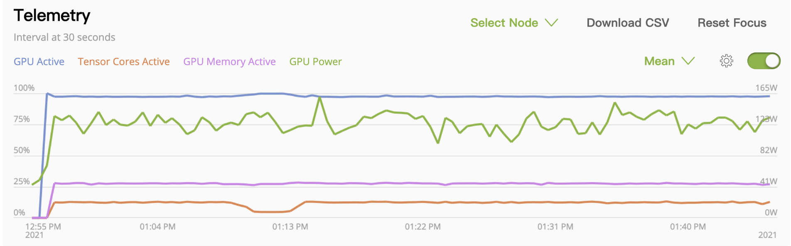

# Fast Model Training Guide

Typically, `model training` is the most time-consuming step during the deep learning development, especially in medical imaging applications. Because 3D medical images are usually large (as multi-dimensional arrays), which leads to much more CPU or GPU operations. Even with powerful hardware devices (e.g. CPU/GPU with large RAM), it is not easy to fully leverage them to achieve optimal performance. And if we cannot apply suitable algorithms (such as network model, loss function, optimizer, etc.) to the target dataset, the training progress may be very slow and hard to converge readily.

To provide an overall summary of the techniques to achieve fast training in our practice, this document introduces details of how to profile the training pipeline, analyze the dataset and select suitable algorithms, and optimize GPU utilization in single GPU, multi-GPU or even multi-node.

* [Profile pipeline](#profile-pipeline)
* [Analyzing dataset and select algorithms](#analyzing-dataset-and-select-algorithms)
* [Optimizing GPU utilization](#optimizing-gpu-utilization)
* [Leveraging multi-GPU](#leveraging-multi-gpu)
* [Leveraging multi-node distributed training](#leveraging-multi-node-distributed-training)
* [Examples](#examples)

## Profile pipeline

Model training in deep learning requires sufficient experience regarding various practical applications. For example, medical image analysis normally leverages necessary knowledge about imaging protocols (e.g., spacing, orientation, etc.) to achieve decent model performance. Moreover, training of large deep learning models heavily relies on high-efficiency GPU devices. But sometimes the great capacities of GPUs are not fully exploited with low utilization rate. It might be caused by low CPU-based operations, e.g., data loading, data augmentation, etc.

Here, we provide several methods for users to analyze their programs when using MONAI. The analysis results include operation-based GPU activity and overall GPU activity during model training. Such analysis will greatly help users reduce computing bottlenecks and provide insights for operations that require improvement to further increase computing efficiency.

### 1. Deep Learning Profiler (DLProf)

[Deep Learning Profiler](https://docs.nvidia.com/deeplearning/frameworks/dlprof-user-guide/) is a tool for profiling deep learning models to help data scientists understand and improve performance of their models visually via the DLProf Viewer or by analyzing text reports. We will refer to Deep Learning Profiler simply as DLProf.

DLProf generates reports of summary and detailed analysis of GPU activities based on the whole training program. The format of output reports can be determined by users. An example of execution script is shown as follows.

```
dlprof --mode pytorch \
       --reports summary \
       --formats json \
       --output_path ./outputs_base \
       python3 train.py
```

And the output `.json` file contains various aspects of GPU information.

```
  "All Kernels" :
  {
    "All kernels" :
    {
      "# Kernels" : 39,
      "CPU Time (ns)" : 10115333085,
      "GPU Time (ns)" : 9016239970
    },
    "All other kernels" :
    {
      "# Kernels" : 32,
      "CPU Time (ns)" : 2246830231,
      "GPU Time (ns)" : 5318794154
    },
    ...
```

### 2. NVIDIA Nsight Systems

[NVIDIA Nsight™ Systems](https://developer.nvidia.com/nsight-systems) is a system-wide performance analysis tool designed to visualize an application’s algorithms, help to identify the largest opportunities to optimize, and tune to scale efficiently across any quantity or size of CPUs and GPUs.

Nsight provides a great GUI to visualize the output database (`.qdrep` file) from analysis results of DLProf. With necessary annotation inside the existing training scripts. The GPU utilization of each operation can be clearly seen through the interface. Then, users understand better about which components is the bottleneck of computation. The detailed example is shown in the following
[performance profiling tutorial]( https://github.com/Project-MONAI/tutorials/blob/master/performance_profiling/profiling_train_base_nvtx.ipynb).

As shown in the following figure, each training epoch can be decomposed into several steps, including data loading (I/O), model forward/backward operation, optimization, etc. Then, necessary improvement can be conducted targeting certain steps. For example, if data loading (I/O) takes too much time during training, we can try to cache them into CPU/GPU bypassing data loading and pre-processing. After program optimization, user can re-use the tool further comparing the profiles before and after optimization and determine if the optimization is effective.


### 3. NVIDIA Tools Extension (NVTX)

[NVIDIA® Tools Extension Library (NVTX)](https://github.com/NVIDIA/NVTX) is a powerful mechanism that allows users to manually instrument their application. With a C-based and a python-based Application Programming Interface (API) for annotating events, code ranges, and resources in your applications. Applications which integrate NVTX can use NVIDIA Nsight, Tegra System Profiler, and Visual Profiler to capture and visualize these events and ranges. In general, the NVTX can bring valuable insight into the application while incurring almost no overhead.

To leverage the visualization capacities of Nsight, necessary annotation/tagging in python script is required. For MONAI transforms, we provide the `Range` function from `monai.utils.nvtx` to add tags for each transform (data pre-processing and augmentation) in the transform chains. Then the analysis results would be itemized based on different transforms.

```py
train_transforms = Compose(
    [
        Range("LoadImage")(LoadImaged(keys=["image", "label"])),
        Range()(EnsureChannelFirstd(keys=["image", "label"])),
        Range("Spacing")(
            Spacingd(
                keys=["image", "label"],
                pixdim=(1.5, 1.5, 2.0),
                mode=("bilinear", "nearest"),
            )
        ),
        ...
```

For the rest of script, `nvtx` library provides functions `start_range` and `end_range` for users to define the range of the analysis. And user can choose colors of the itemized analysis in Nsight visualization.

```py
rng_train_dataload = nvtx.start_range(message="dataload", color="red")
batch_data = next(train_loader_iterator)
inputs, labels = (
    batch_data["image"],
    batch_data["label"],
)
nvtx.end_range(rng_train_dataload)

optimizer.zero_grad()

rng_train_forward = nvtx.start_range(message="forward", color="green")
with torch.cuda.amp.autocast():
    outputs = model(inputs)
    loss = loss_function(outputs, labels)
nvtx.end_range(rng_train_forward)
```

### 4. NVIDIA Management Library (NVML)

[NVIDIA Management Library (NVML)](https://developer.nvidia.com/nvidia-management-library-nvml) is a C-based API for monitoring and managing various states of the NVIDIA GPU devices. It provides a direct access to the queries and commands exposed via `nvidia-smi`. The runtime version of NVML ships with the NVIDIA display driver, and the SDK provides the appropriate header, stub libraries and sample applications. During model training, users can execute `watch -n 1 nvidia-smi` command to monitor real-time GPU activities for each GPU.

Some third-party libraries provide python API to access NVML library, such as [pynvml](https://github.com/gpuopenanalytics/pynvml). Using the following script, the real-time GPU status (e.g., memory consumption, utilization rate, etc.) can be read real-time and stored into a dictionary `data`.

```py
from pynvml.smi import nvidia_smi
nvsmi = nvidia_smi.getInstance()
data = nvsmi.DeviceQuery('memory.total, memory.free, memory.used, utilization.gpu, utilization.memory')["gpu"]

```

## Analyzing dataset and select algorithms

Based on previous analysis results, we can conduct corresponding optimization strategies to reduce time on bottleneck steps, and then improve the overall computing efficiency. Meanwhile, some algorithmic improvement can also help for speeding-up model training.

### 1. Cache I/O and transforms data to accelerate training

Users often need to train the model with many (potentially thousands of) epochs over the training data to achieve the decent model quality. A native PyTorch implementation may repeatedly load data and run the same pre-processing steps for every data point during training, which can be time-consuming and redundant, especially when 3D medical images of the dataset are very large.

MONAI provides a multi-thread `CacheDataset` and `LMDBDataset` to accelerate these transformation steps during training by storing the intermediate outcomes before the first randomized transform in the transform chain. Enabling this feature could potentially give 10x training speedups in the [Datasets experiment](https://github.com/Project-MONAI/tutorials/blob/master/acceleration/dataset_type_performance.ipynb).


### 2. Cache intermediate outcomes into persistent storage

The `PersistentDataset` is similar to the CacheDataset, where the intermediate cached values are persisted to disk storage or LMDB for rapid retrieval between experimental runs (as is the case when tuning hyperparameters), or when the entire size of the dataset exceeds available memory. The `PersistentDataset` could achieve similar performance when comparing to `CacheDataset` in [Datasets experiment](https://github.com/Project-MONAI/tutorials/blob/master/acceleration/dataset_type_performance.ipynb).
 with SSD storage hardware.

### 3. SmartCache mechanism for big datasets

During training with dataset of large volumes, another efficient approach is to only train with a subset of the dataset in one epoch and dynamically replace part of the subset in every epoch. It's the `SmartCache` mechanism in [NVIDIA Clara-train SDK](https://docs.nvidia.com/clara/tlt-mi/clara-train-sdk-v3.0/nvmidl/additional_features/smart_cache.html#smart-cache).

MONAI provides a PyTorch version `SmartCache` as `SmartCacheDataset`. In each epoch, only the items in the cache are used for training, at the same time, another thread is preparing replacement items by applying the transform sequence to items not in the cache. Once one epoch is completed, `SmartCache` replaces the same number of items with replacement items.

For example, if we have 5 images: `[image1, image2, image3, image4, image5]`, and `cache_num=4`, `replace_rate=0.25`. So the actual training images cached and replaced for every epoch are as below:
```
epoch 1: [image1, image2, image3, image4]
epoch 2: [image2, image3, image4, image5]
epoch 3: [image3, image4, image5, image1]
epoch 3: [image4, image5, image1, image2]
epoch N: [image[N % 5] ...]
```
Full example of `SmartCacheDataset` is available at [Distributed training with SmartCache](https://github.com/Project-MONAI/tutorials/blob/master/acceleration/distributed_training/unet_training_smartcache.py).

### 4. `ThreadDataLoader` versus `DataLoader`

If the transforms are light-weighted, especially when we cache all the data in RAM to avoid IO operations, the `multi-processing` execution of PyTorch `DataLoader` may cause unnecessary IPC time. MONAI provides `ThreadDataLoader` which execute transforms in a separate thread instead of `multi-processing` execution:


### 5. Algorithmic improvement

In most deep learning applications, algorithmic improvement has been witnessed to be effective for boosting of training efficiency and performance (for example, from AlexNet to ResNet). The improvement may from a novel loss function, or a sophisticated optimizer, or a different learning rate scheduler, or the combination of all previous items. For our demo applications of 3D medical image segmentation, we would like to further speed up training from the algorithmic perspective. The default loss function is soft dice loss. And we changed it to `DiceCELoss` from MONAI to further improve the model convergence. Because the `DiceCELoss` combines both dice loss and multi-class cross-entropy loss (which is suitable for the softmax formulation), and balance importance of global and pixel-wise accuracies. The segmentation quality can be largely improved. The following figure shows the great improvement on model convergence after we change dice loss to `DiceCELoss`, with or without enabling automated mixed precision (AMP).


Furthermore, we changed default optimizer to Novograd, modified learning rate related settings, and added other necessary improvement. The concrete examples are shown in
[spleen fast training tutorial](https://github.com/Project-MONAI/tutorials/blob/master/acceleration/fast_training_tutorial.ipynb) and [brats distributed training tutorial](https://github.com/Project-MONAI/tutorials/blob/master/acceleration/distributed_training/brats_training_ddp.py). Both are very typical applications in 3D medical image segmentation but with unique challenging. Spleen segmentation has very limited data but with large image size, and brain tumor segmentation has relatively small image samples but with much larger data pool. Combing algorithmic improvement with computing improvement, our model training cost is significantly reduced when reaching the same level of performance as the existing pipeline.

## Optimizing GPU utilization

NVIDIA GPUs have been widely applied in many areas of deep learning training and evaluation, and the CUDA parallel computation shows obvious acceleration when comparing to traditional computation methods. To fully leverage GPU features, many popular mechanisms raised, like automated mixed precision (AMP), distributed data parallelism, etc. MONAI can support these features and provides several examples.

### 1. Automated mixed precision (AMP)

In 2017, NVIDIA researchers developed a methodology for mixed-precision training, which combined single-precision (FP32) with half-precision (e.g., FP16) format when training a network, and it achieved the similar accuracy as FP32 training using the same hyperparameters.

For the PyTorch 1.6 release, developers at NVIDIA and Facebook moved mixed precision functionality into PyTorch core as the AMP package, `torch.cuda.amp`.

MONAI workflows can easily set `amp=True/False` in `SupervisedTrainer` or `SupervisedEvaluator` during training or evaluation to enable/disable AMP. And we tried to compare the training speed of spleen segmentation task if AMP ON/OFF on NVIDIA V100 GPU with CUDA 11, obtained some benchmark results:


### 2. Execute transforms on GPU device

From MONAI v0.7 we introduced PyTorch `Tensor` based computation in transforms, many transforms already support `Tensor` data. To accelerate the high-computation transforms, users can first convert input data into GPU Tensor by `ToTensor` or `EnsureType` transform, then the following transforms can execute on GPU device based on PyTorch `Tensor` APIs.

### 3. Cache IO and transforms data to GPU device

Even with `CacheDataset`, we usually need to copy the same data to GPU memory for GPU random transforms or network computation in every epoch. As the memory size of new GPU devices are big enough now, an efficient approach is to cache the data to GPU memory directly, then every epoch can start from GPU computation immediately.

For example:
```py
train_transforms = [
    LoadImaged(...),
    AddChanneld(...),
    Spacingd(...),
    Orientationd(...),
    ScaleIntensityRanged(...),
    CropForegroundd(...),
    FgBgToIndicesd(...),
    EnsureTyped(..., data_type="tensor"),
    ToDeviced(..., device="cuda:0")
    RandCropByPosNegLabeld(...)
)
dataset = CacheDataset(..., transform=train_trans)
```
Here we convert to PyTorch `Tensor` with `EnsureTyped` transform and move data to GPU device with `ToDeviced` transform. `CacheDataset` caches the transform results until `ToDeviced`, so it is in GPU memory. Then in every epoch, the program fetches cached data from GPU memory and only execute the random transform `RandCropByPosNegLabeld` on GPU device directly.

## Leveraging multi-GPU

When we have fully utilized a single GPU during training, a natural optimization idea is to partition the dataset and execute model training in parallel on multiple GPUs.

Additionally, with more GPU devices, we can achieve more benefits:
- Some training algorithms can converge faster with a bigger batch size and the training progress is more stable.
- If caching data in GPU memory, every GPU only needs to cache a partition, so we can use bigger cache-rate to cache more data in total to accelerate training.

For example, during the training of brain tumor segmentation task, with 8 GPUs, we can cache all the data in GPU memory directly and execute following transforms on GPU device, so it's more than `10x` faster than single GPU training.

## Leveraging multi-node distributed training

Distributed data parallelism (DDP) is an important feature of PyTorch to connect multiple GPU devices in multiple nodes to train or evaluate models, it can continuously improve the training speed when we fully leveraged multiple GPUs in single node.

The distributed data parallel APIs of MONAI are compatible with native PyTorch distributed module, pytorch-ignite distributed module, Horovod, XLA, and the SLURM platform. MONAI provides rich demos for reference: train/evaluate with `PyTorch DDP`, train/evaluate with `Horovod`, train/evaluate with `Ignite DDP`, partition dataset and train with `SmartCacheDataset`, as well as a real-world training example based on Decathlon challenge Task01 - Brain Tumor segmentation.

More details about the PyTorch distributed training setup, please refer to: https://pytorch.org/docs/stable/distributed.html.

We obtained U-Net performance benchmarks of Brain tumor segmentation task for reference (based on CUDA 11, NVIDIA V100 GPUs):


## Examples

With all the above skills, here we introduce how to apply them into real-world solutions to obviously improve the training speed of target metric.

### 1. Spleen segmentation task

- Algorithm experiments based on dataset analysis. (1) As a binary segmentation task, we replaced the `Dice` loss of baseline with `DiceCE` loss, it can help converge much faster. To get same target metric (mean dice = 0.95) it decreased the training epochs from 200 to 50. (2) As the training curve is stable and smooth, we tried several other optimizers, finally replaced the `Adam` optimizer of baseline with `Novograd` optimizer, which continuously decreased the training epochs from 50 to 30.
- Optimize GPU utilization. (1) With `AMP ON`, the training speed significantly improved and got almost same validation metric as `AMP OFF`. (2) The deterministic transforms result of all the spleen dataset is around 8GB, which can be easily cached in a V100 GPU memory. So, we cached all the data in GPU memory and executed the following transforms in GPU directly.
- Replace `DataLoader` with `ThreadDataLoader`. As we already cached all the data in GPU memory, the computation of random transforms is on GPU and light-weighted, `ThreadDataLoader` avoided the IPC cost of multi-processing in `DataLoader` and avoided the drop of GPU utilization after every epoch.

In summary, with a V100 GPU, we can achieve the training converges at a validation mean dice of `0.95` within 1 minute (`52s` on V100 GPU, `41s` on A100 GPU), it's approximately `200x` speedup compared with the PyTorch regular implementation when achieving same metric. And every epoch is `20x` faster than regular training.


More details is available at [Spleen fast training tutorial](https://github.com/Project-MONAI/tutorials/blob/master/acceleration/fast_training_tutorial.ipynb).

### 2. Brain tumor segmentation task

- Algorithm experiments based on dataset analysis. (1) `SegResNet` can get better accuracy than `U-Net`, so we chose it in the baseline. (2) Brain tumor segmentation task has 3 classes, and the prediction of every class is independent, so we replaced the `Dice` loss of baseline with `DiceFocal` loss. (3) And as the training curve of baseline is smooth, `Novograd` optimizer with a larger learning rate can converge faster than the `Adam` optimizer in baseline. (4) Some foreground labels are small in image, a bigger `overlap` of `sliding window` improved inference result (with guarantee of boundary smoothness). (5) We also tried experiments with different parameters of random transforms and network, etc. Finally, to get same target metric (mean dice = 0.78), the training epochs decreased from 110 to 80.
- Optimize GPU utilization. (1) Single GPU cannot cache all the data in memory, so we split dataset into 8 parts and cache the deterministic transforms result in 8 GPU memory to avoid duplicated deterministic transforms and `CPU->GPU sync` in every epoch, every GPU stores data which size is less than 16GB. (2) And we also executed all the random transforms in GPU directly with the `ThreadDataLoader` as spleen segmentation task. The GPU utilization of all the 8 GPUs is always almost `100%` during training:

(3) As we already fully leveraged the 8 GPUs, we continuously optimize the training with multi-node (32 V100 GPUs in 4 nodes). The GPU utilization of all the 32 GPUs is always `97%` during training.

In summary, with all the optimization, the training time of 8 V100 GPUs to achieve validation mean dice of `0.78` is around 40 minutes, which is more than `13x` faster than the baseline on single GPU. And the training time of 32 V100 GPUs is around `13` mins, which is `40x` faster than the baseline:


More details is available at [Brats distributed training tutorial](https://github.com/Project-MONAI/tutorials/blob/master/acceleration/distributed_training/brats_training_ddp.py).
