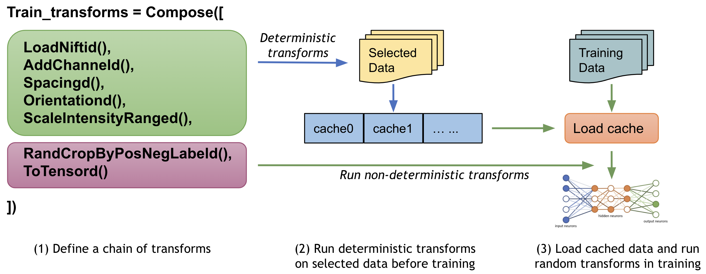
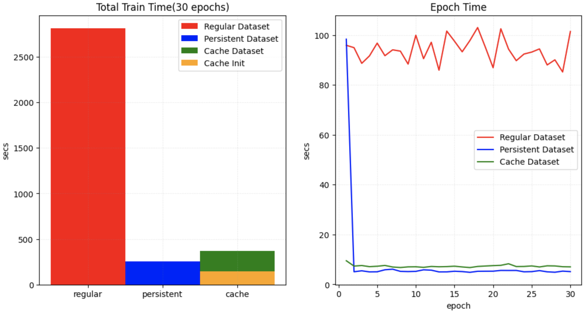

# Fast training guide

Typically, `training` is the most time-consuming step during the deep learning development, especially in medical imaging tasks, because medical image volumes are usually large (in multi-dimensional arrays), which leads to much more CPU or GPU operations. Even with powerful hardware devices (latest CPU, GPU, large memory, etc.), it's not easy to fully leverage them to achieve best performance. And if we can't apply suitable network, loss function, optimizer, etc. algorithms to the training dataset, the training progress may be very long and hard to converge quickly.

To provide a overall summary of the techniques to achieve fast training in our practice, this document introduces details of how to profile the training pipeline, how to analyze the dataset and select suitable algorithms, and how to optimize GPU utilization in single GPU, multi-GPUs or even multi-nodes.

* [Profile pipeline](#profile-pipeline)
* [Analyze dataset and select algorithms](#analyze-dataset-and-select-algorithms)
* [Optimize GPU utilization](#optimize-gpu-utilization)
* [Leverage multi-GPUs](#leverage-multi-gpus)
* [Leverage multi-nodes distributed training](#leverage-multi-nodes-distributed-trainings)
* [Examples](#examples)

## Profile pipeline
{placeholder}

### 1. DLProfile
- {placeholder}
- {placeholder}

{placeholder}

### 2. Nsight
{placeholder}

### 3. NVTX
{placeholder}

## Analyze dataset and select algorithms
{placeholder}
### 1. Cache IO and transforms data to accelerate training
Users often need to train the model with many (potentially thousands of) epochs over the data to achieve the desired model quality. A native PyTorch implementation may repeatedly load data and run the same preprocessing steps for every epoch during training, which can be time-consuming and unnecessary, especially when the medical image volumes of the dataset are large.

MONAI provides a multi-thread `CacheDataset` and `LMDBDataset` to accelerate these transformation steps during training by storing the intermediate outcomes before the first randomized transform in the transform chain. Enabling this feature could potentially give 10x training speedups in the [Datasets experiment](https://github.com/Project-MONAI/tutorials/blob/master/acceleration/dataset_type_performance.ipynb).


### 2. Cache intermediate outcomes into persistent storage
The `PersistentDataset` is similar to the CacheDataset, where the intermediate cache values are persisted to disk storage or LMDB for rapid retrieval between experimental runs (as is the case when tuning hyperparameters), or when the entire size of the dataset exceeds available memory. The `PersistentDataset` could achieve similar performance when comparing to `CacheDataset` in [Datasets experiment](https://github.com/Project-MONAI/tutorials/blob/master/acceleration/dataset_type_performance.ipynb).
 with SSD storage hardware.

### 3. SmartCache mechanism for big datasets
During training with large volume dataset, another efficient approach is to only train with a subset of the dataset in an epoch and dynamically replace part of the subset in every epoch. It's the `SmartCache` mechanism in [NVIDIA Clara-train SDK](https://docs.nvidia.com/clara/tlt-mi/clara-train-sdk-v3.0/nvmidl/additional_features/smart_cache.html#smart-cache).

MONAI provides a PyTorch version `SmartCache` as `SmartCacheDataset`. In each epoch, only the items in the cache are used for training, at the same time, another thread is preparing replacement items by applying the transform sequence to items not in the cache. Once one epoch is completed, `SmartCache` replaces the same number of items with replacement items.

For example, if we have 5 images: `[image1, image2, image3, image4, image5]`, and `cache_num=4`, `replace_rate=0.25`. So the actual training images cached and replaced for every epoch are as below:
```
epoch 1: [image1, image2, image3, image4]
epoch 2: [image2, image3, image4, image5]
epoch 3: [image3, image4, image5, image1]
epoch 3: [image4, image5, image1, image2]
epoch N: [image[N % 5] ...]
```
Full example of `SmartCacheDataset` is available at [Distributed training with SmartCache](https://github.com/Project-MONAI/tutorials/blob/master/acceleration/distributed_training/unet_training_smartcache.py).

### 4. {placeholder}

## Optimize GPU utilization
{placeholder}

## Leverage multi-GPUs
{placeholder}

## Leverage multi-nodes distributed training
{placeholder}

## Examples
{placeholder}
### 1. Spleen segmentation task
{placeholder}

More details is available at [Fast training tutorial](https://github.com/Project-MONAI/tutorials/blob/master/acceleration/fast_training_tutorial.ipynb).

### 2. Brain tumor segmentation task
{placeholder}
