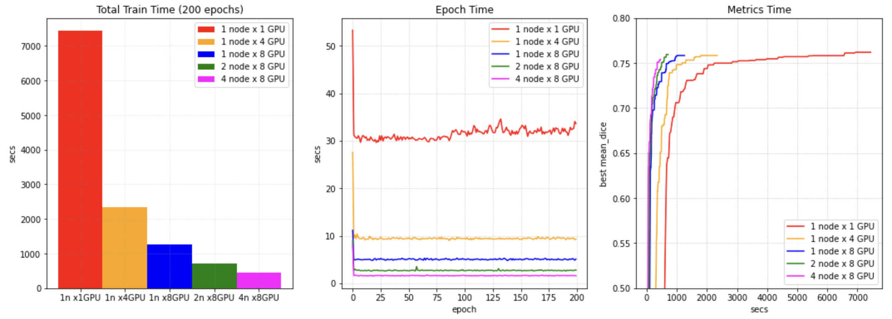
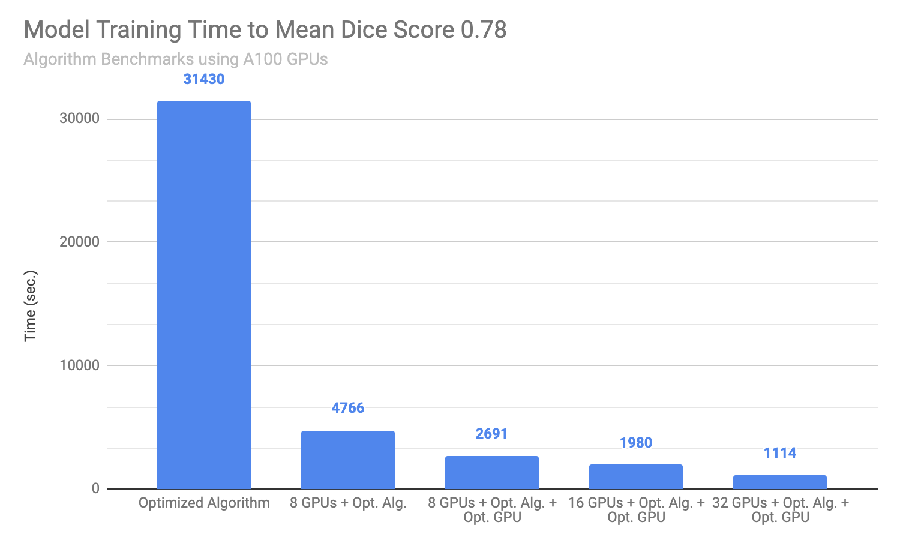

# Fast training guide

Typically, `training` is the most time-consuming step during the deep learning development, especially in medical imaging tasks, because medical image volumes are usually large (in multi-dimensional arrays), which leads to much more CPU or GPU operations. Even with powerful hardware devices (latest CPU, GPU, large memory, etc.), it's not easy to fully leverage them to achieve best performance. And if we can't apply suitable network, loss function, optimizer, etc. algorithms to the training dataset, the training progress may be very long and hard to converge quickly.

To provide a overall summary of the techniques to achieve fast training in our practice, this document introduces details of how to profile the training pipeline, how to analyze the dataset and select suitable algorithms, and how to optimize GPU utilization in single GPU, multi-GPUs or even multi-nodes.

* [Profile pipeline](#profile-pipeline)
* [Analyze dataset and select algorithms](#analyze-dataset-and-select-algorithms)
* [Optimize GPU utilization](#optimize-gpu-utilization)
* [Leverage multi-GPUs](#leverage-multi-gpus)
* [Leverage multi-nodes distributed training](#leverage-multi-nodes-distributed-training)
* [Examples](#examples)

## Profile pipeline
{placeholder}

### 1. DLProfile
- {placeholder}
- {placeholder}

{placeholder}

### 2. Nsight
{placeholder}

### 3. NVTX
{placeholder}

## Analyze dataset and select algorithms
{placeholder}
### 1. Cache IO and transforms data to accelerate training
Users often need to train the model with many (potentially thousands of) epochs over the data to achieve the desired model quality. A native PyTorch implementation may repeatedly load data and run the same preprocessing steps for every epoch during training, which can be time-consuming and unnecessary, especially when the medical image volumes of the dataset are large.

MONAI provides a multi-thread `CacheDataset` and `LMDBDataset` to accelerate these transformation steps during training by storing the intermediate outcomes before the first randomized transform in the transform chain. Enabling this feature could potentially give 10x training speedups in the [Datasets experiment](https://github.com/Project-MONAI/tutorials/blob/master/acceleration/dataset_type_performance.ipynb).


### 2. Cache intermediate outcomes into persistent storage
The `PersistentDataset` is similar to the CacheDataset, where the intermediate cache values are persisted to disk storage or LMDB for rapid retrieval between experimental runs (as is the case when tuning hyperparameters), or when the entire size of the dataset exceeds available memory. The `PersistentDataset` could achieve similar performance when comparing to `CacheDataset` in [Datasets experiment](https://github.com/Project-MONAI/tutorials/blob/master/acceleration/dataset_type_performance.ipynb).
 with SSD storage hardware.

### 3. SmartCache mechanism for big datasets
During training with large volume dataset, another efficient approach is to only train with a subset of the dataset in an epoch and dynamically replace part of the subset in every epoch. It's the `SmartCache` mechanism in [NVIDIA Clara-train SDK](https://docs.nvidia.com/clara/tlt-mi/clara-train-sdk-v3.0/nvmidl/additional_features/smart_cache.html#smart-cache).

MONAI provides a PyTorch version `SmartCache` as `SmartCacheDataset`. In each epoch, only the items in the cache are used for training, at the same time, another thread is preparing replacement items by applying the transform sequence to items not in the cache. Once one epoch is completed, `SmartCache` replaces the same number of items with replacement items.

For example, if we have 5 images: `[image1, image2, image3, image4, image5]`, and `cache_num=4`, `replace_rate=0.25`. So the actual training images cached and replaced for every epoch are as below:
```
epoch 1: [image1, image2, image3, image4]
epoch 2: [image2, image3, image4, image5]
epoch 3: [image3, image4, image5, image1]
epoch 3: [image4, image5, image1, image2]
epoch N: [image[N % 5] ...]
```
Full example of `SmartCacheDataset` is available at [Distributed training with SmartCache](https://github.com/Project-MONAI/tutorials/blob/master/acceleration/distributed_training/unet_training_smartcache.py).

### 4. `ThreadDataLoader` vs `DataLoader`
If the transforms are light-weight, especially when we already cache all the data in memory to avoid IO operations, the `multi-processing` execution of PyTorch `DataLoader` may cause unnecessary IPC time. MONAI provides `ThreadDataLoader` which execute transforms in a separate thread instead of `multi-processing` execution:


### 5. {placeholder}

## Optimize GPU utilization
NVIDIA GPUs have been widely applied in many areas of deep learning training and evaluation, and the CUDA parallel computation shows obvious acceleration when comparing to traditional computation methods. To fully leverage GPU features, many popular mechanisms raised, like automatic mixed precision (AMP), distributed data parallel, etc. MONAI can support these features and provides rich examples.

### 1. Auto mixed precision(AMP)
In 2017, NVIDIA researchers developed a methodology for mixed-precision training, which combined single-precision (FP32) with half-precision (e.g. FP16) format when training a network, and it achieved the same accuracy as FP32 training using the same hyperparameters.

For the PyTorch 1.6 release, developers at NVIDIA and Facebook moved mixed precision functionality into PyTorch core as the AMP package, `torch.cuda.amp`.

MONAI workflows can easily set `amp=True/False` in `SupervisedTrainer` or `SupervisedEvaluator` during training or evaluation to enable/disable AMP. And we tried to compare the training speed of spleen segmentation task if AMP ON/OFF on NVIDIA V100 GPU with CUDA 11, obtained some benchmark results:


### 2. Execute transforms on GPU device
From MONAI v0.7 we introduced PyTorch `Tensor` based computation in transforms, many transforms already support `Tensor` data. To accelerate the high-computation transforms, users can first convert input data into GPU Tensor by `ToTensor` or `EnsureType` transform, then the following transforms can execute on GPU device based on PyTorch `Tensor` APIs.

### 3. Cache IO and transforms data to GPU device
Even with `CacheDataset`, we usually need to copy the same data to GPU memory for GPU random transforms or network computation in every epoch. As the memory size of new GPU devices are big enough now, an efficient approach is to cache the data to GPU memory directly, then every epoch can start from GPU computation immediately.

For example:
```py
train_transforms = [
    LoadImaged(...),
    AddChanneld(...),
    Spacingd(...),
    Orientationd(...),
    ScaleIntensityRanged(...),
    CropForegroundd(...),
    FgBgToIndicesd(...),
    EnsureTyped(..., data_type="tensor"),
    ToDeviced(..., device="cuda:0")
    RandCropByPosNegLabeld(...)
)
dataset = CacheDataset(..., transform=train_trans)
```
Here we convert to PyTorch `Tensor` with `EnsureTyped` transform, and move data to GPU device with `ToDeviced` transform. `CacheDataset` caches the transform results until `ToDeviced`, so it's in GPU memory. Then every epoch will fetch cache data from GPU memory and only execute the random transform `RandCropByPosNegLabeld` on GPU device directly.

## Leverage multi-GPUs
When we already fully leveraged single GPU during training, a natrual optimization idea is to partition dataset and execute on multi-GPUs in parallel.

Additionally, with more GPU devices, we can achieve more benefits:
- Some training algorithms can converge faster with a bigger batch size and the training progress is more stable.
- If caching data in GPU memory, every GPU only needs to cache a partition, so we can use bigger cache-rate to cache more data in total to accelerate training.

For example, during the training of brain tumor segmentation task, with 8 GPUs, we can cache all the data in GPU memory directly and execute following transforms on GPU deivce, so it's more than `10x` faster than single GPU training.

## Leverage multi-nodes distributed training
Distributed data parallel is an important feature of PyTorch to connect multiple GPU devices in multiple nodes to train or evaluate models, it can continuously improve the training speed when we already fully leveraged multiple GPUs in single node.

The distributed data parallel APIs of MONAI are compatible with native PyTorch distributed module, pytorch-ignite distributed module, Horovod, XLA, and the SLURM platform. MONAI provides rich demos for reference: train/evaluate with `PyTorch DDP`, train/evaluate with `Horovod`, train/evaluate with `Ignite DDP`, partition dataset and train with `SmartCacheDataset`, as well as a real world training example based on Decathlon challenge Task01 - Brain Tumor segmentation.

We obtained UNet performance benchmarks of Brain tumor segmentation task for reference (based on CUDA 11, NVIDIA V100 GPUs):


## Examples
With all the above skills, here we introduce how to apply them into real-world solutions to obviously improve the training speed of target metric.
### 1. Spleen segmentation task
- Algorithm experiments based on dataset analysis. (1) As a binary segmentation task, we replaced the `Dice` loss of baseline with `DiceCE` loss, it can help converge much faster. To get same target metric (mean dice = 0.95) it decreased the training epochs from 200 to 50. (2) As the training curve is stable and smooth, we tried several other optimizers, finally replaced the `Adam` optimizer of baseline with `Novograd` optimizer, which continuously decreased the training epochs from 50 to 30.
- Optimize GPU utilization. (1) With `AMP ON`, the training speed significantly improved and got almost same validation metric as `AMP OFF`. (2) The deterministic transforms result of all the spleen dataset is around 8GB, which can be easily cached in a V100 GPU memory. So we cached all the data in GPU memory and executed the following transforms in GPU directly.
- Replace `DataLoader` with `ThreadDataLoader`. As we already cached all the data in GPU memory, the computation of random transforms are on GPU and light-weight, `ThreadDataLoader` avoided the IPC cost of multi-processing in `DataLoader` and avoided the drop of GPU utilization after every epoch.

In summay, with a V100 GPU, we are able to achieve the training converges at a validation mean dice of `0.95` within 1 minute(`52s` on V100 GPU, `41s` on A100 GPU), it's approximately `200x` speedup compared with the Pytorch regular implementation when achieving same metric. And every epoch is `20x` faster than regular training.


More details is available at [Spleen fast training tutorial](https://github.com/Project-MONAI/tutorials/blob/master/acceleration/fast_training_tutorial.ipynb).

### 2. Brain tumor segmentation task
- Algorithm experiments based on dataset analysis. (1) `SegResNet` can get better accuracy than `UNet`, so we chose it in the baseline. (2) Brain tumor segmentation task has 3 classes, and the prediction of every class is independent, so we replaced the `Dice` loss of baseline with `DiceFocal` loss. (3) And as the training curve of baseline is smooth, `Novograd` optimizer with a bigger learning rate can converge faster than the `Adam` optimizer of baseline. (4) Some labels are small in image, a bigger `overlap` of `sliding window` improved inference result (with guarantee of boundary smoothness). (5) And also tried experiments with different parameters of random transforms and network, etc. Finally, to get same target metric (mean dice = 0.78), the training epochs decreased from 110 to 80.
- Optimize GPU utilization. (1) Single GPU can’t cache all the data in memory, so we split dataset into 8 parts and cache the deterministic transforms result in 8 GPU memory to avoid duplicated deterministic transforms and `CPU->GPU sync` in every epoch, every GPU caches 16GB. (2) And we also executed all the random transforms in GPU directly with the `ThreadDataLoader` as spleen segmentation task. The GPU utilization of all the 8 GPUs is always almost `100%` during training:

(3) As we already fully leveraged the 8 GPUs, we continuously optimize the training with multi-nodes (32 V100 GPUs in 4 nodes). The GPU utilization of all the 32 GPUs is always `97%` during training.

In summary, with all the optimization, the training time of 8 V100 GPUs to achieve validation mean dice of `0.78` is around `40` minutes, which is `13x` faster than the baseline on single GPU. And the training time of 32 V100 GPUs is around `13` mins, which is `40x` faster than the baseline.


More details is available at [Brats distributed training tutorial](https://github.com/Project-MONAI/tutorials/blob/master/acceleration/distributed_training/brats_training_ddp.py).
