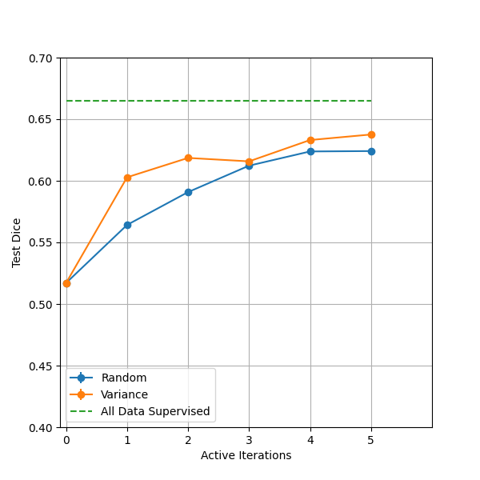

# Active Learning Simulation Tutorial For Liver & Tumor Segmentation

Active learning (AL) is a machine learning framework that can serve as a data selection engine given an unlabeled pool of data. Active learning provides uncertainty estimation capabilities for trained deep learning models. In brief the models are able to assess which predictions they are under or over confident. Based on the confidence the most relevant data for annotation can be selected. Thereafter annotation of the labeled data is added to the training pool of data for the model.

This tutorial provides a toy example of active learning for liver and tumor segmentation from 3D CT volumes. Exploratory notebooks on how to visualize uncertainty/confidence of model as provided as well.

### Steps to run the tutorial

1.) Download the data from [here](http://medicaldecathlon.com/#tasks), the liver and tumor dataset is Task 03 of medical segmentation decathlon

2.) To just launch the active learning script with 'variance' acquisition function, launch the code with the below command: `python active_learning.py --base_dir /to/be/defined --data_root /to/be/defined --json_path /to/be/defined --seed 3840 --active_iters 6 --dropout_ratio 0.2 --mc_number 10 --initial_pool 5 --queries 5 --strategy variance --steps 2000 --val_interval 5 --batch_size 1 --val_batch_size 1 --lr 1e-4`

3.) For executing the active learning acquisition functions of random, variance and the full dataset baseline, execute the ./runner.sh after defining the required paths. DATA_ROOT, JSON_PATH and LOG_DIR need to be defined.

4.) Once all scripts finish running, to analyze results, launch the jupyter notebook [results_uncertainty_analysis.ipynb](results_uncertainty_analysis.ipynb). The second part particularly will visualize the below shown plot in the results. The first part of the notebook is an exploration of uncertainty spatial maps.

### 1. Data

[MSD Liver & Tumor dataset](http://medicaldecathlon.com/#tasks) [1] has been used for the purpose of this tutorial. The dataset consists of 131 labeled 3D CT volumes where the liver and tumor have been annotated as separate classes and the remainder of the image is treated as the background.

For purpose of experimentation the data was split into 93 volumes for unlabeled/training, 26 volumes for validation and 12 for testing. Please note the validation and testing sets were kept consistent for all active iterations.

References:

1.) Antonelli, M., Reinke, A., Bakas, S., Farahani, K., Kopp-Schneider, A., Landman, B. A., ... & Cardoso, M. J. (2022). The medical segmentation decathlon. Nature communications, 13(1), 4128.

### 2. Active Learning Hyper-parameters

Active learning iterations: 6
Monte-Carlo simulations: 10
Initial training pool: 5
Queries per active iteration: 5

### 3. Training Hyper-parameters

Steps per active iteration: 2000
Batch-size: 1
Learning Rate: 1
Optimizer: Adam
Loss: DiceCELoss

### 4. Results & Discussion

It can be observed that active learning strategy can lead to higher performance with lesser usage of annotated data

If you find the tutorial helpful in your work, please support us by citing the following works:

1.) Nath, Vishwesh, Dong Yang, Bennett A. Landman, Daguang Xu, and Holger R. Roth. "Diminishing uncertainty within the training pool: Active learning for medical image segmentation." IEEE Transactions on Medical Imaging 40, no. 10 (2020): 2534-2547.

2.) Nath, Vishwesh, Dong Yang, Holger R. Roth, and Daguang Xu. "Warm start active learning with proxy labels and selection via semi-supervised fine-tuning." In Medical Image Computing and Computer Assisted Intervention–MICCAI 2022: 25th International Conference, Singapore, September 18–22, 2022, Proceedings, Part VIII, pp. 297-308. Cham: Springer Nature Switzerland, 2022.
