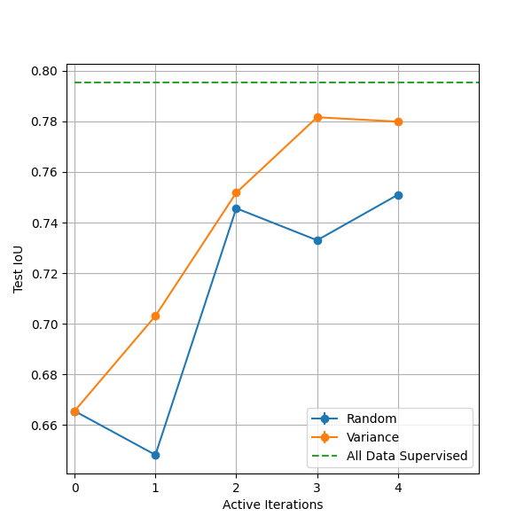

# Active Learning Simulation Tutorial For Surgical Tool Segmentation

Active learning (AL) is a machine learning framework that can serve as a data selection engine given an unlabeled pool of data. Active learning provides uncertainty estimation capabilities for trained deep learning models. In brief the models are able to assess for particular data samples whether the predictions are under or over confident, this assessment is known as acquisition function. Based on the confidence the most relevant data for annotation can be selected. Thereafter annotation of the labeled data is added to training pool of data for the model.

An Acquisition function is the strategy that active learning utilizes to select data. For e.g variance of 'N' predictions is a well-known acquisition function where the samples with the highest variance would be considered as the samples that the model is most uncertain about.

This tutorial provides a toy example of active learning for surgical tool task segmentation. Exploratory notebooks on how to visualize uncertainty/confidence of model as provided as well

### Steps to run the tutorial
1. Download the data from [here](https://www.synapse.org/#!Synapse:syn22427422)
2. To just launch the active learning script with 'variance' acquisition function, launch the code with the below command: `python active_learning.py --base_dir /to/be/defined --data_root /to/be/defined --json_path /to/be/defined --seed 120 --active_iters 6 --dropout_ratio 0.2 --mc_number 10 --initial_pool 15 --queries 15 --strategy variance --steps 2000 --val_interval 1 --batch_size 1 --val_batch_size 1 --lr 1e-4`
3. For executing the active learning acquisition functions of `random`, `variance` and the `full dataset` baseline, execute the `./runner.sh`
4. Once all scripts finish running, to analyze results, launch the jupyter notebook `results_uncertainty.ipynb`. The second part particularly will visualize the below shown plot in the results. The first part of the notebook is an exploration of uncertainty spatial maps.

### 1. Data

[RoboTool dataset](https://www.synapse.org/#!Synapse:syn22427422) [1] has been used for the purpose of this tutorial. The dataset consists of 514 labeled 2D frames where the surgical tool has been annotated as the foreground mask and the rest of the image has been treated as the background.

For purpose of experimentation the data was split into 360 images for unlabeled/training, 77 images for validation and 77 for testing. Please note the validation and testing sets were kept consistent at all active iterations.

Reference:

1.) Garcia-Peraza-Herrera, Luis C., Lucas Fidon, Claudia D’Ettorre, Danail Stoyanov, Tom Vercauteren, and Sebastien Ourselin. "Image compositing for segmentation of surgical tools without manual annotations." IEEE transactions on medical imaging 40, no. 5 (2021): 1450-1460.

### 2. Active Learning Hyper-parameters

Active learning iterations: 6 \
Monte-Carlo simulations: 10 \
Initial training pool: 15 \
Queries per active iteration: 15

### 3. Training Hyper-parameters

Steps per active iteration: 2000 \
Batch-size: 1 \
Learning Rate: 1 \
Optimizer: Adam \
Loss: DiceLoss

### 4. Results & Discussion

It can be observed that active learning strategy can lead to higher performance with lesser usage of annotated data

### References

If you find the tutorial helpful in your work, please support us by citing the following works:

1.) Nath, Vishwesh, Dong Yang, Bennett A. Landman, Daguang Xu, and Holger R. Roth. "Diminishing uncertainty within the training pool: Active learning for medical image segmentation." IEEE Transactions on Medical Imaging 40, no. 10 (2020): 2534-2547.

2.) Nath, Vishwesh, Dong Yang, Holger R. Roth, and Daguang Xu. "Warm start active learning with proxy labels and selection via semi-supervised fine-tuning." In Medical Image Computing and Computer Assisted Intervention–MICCAI 2022: 25th International Conference, Singapore, September 18–22, 2022, Proceedings, Part VIII, pp. 297-308. Cham: Springer Nature Switzerland, 2022.
