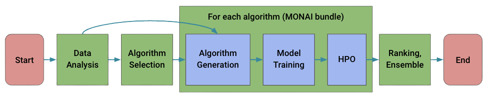

<h1 align="center"> Auto3DSeg </h1>

<div align="center">  </div>

## Introduction

**Auto3DSeg** is a comprehensive solution for large-scale 3D medical image segmentation. It leverages the latest advances in **MONAI** and GPUs to efficiently develop and deploy algorithms with state-of-the-art performance for beginners or advanced researchers in the field. 3D medical image segmentation is an important task with great potential for clinical understanding, disease diagnosis, and surgical planning. According to the statistics of the recent [MICCAI](http://www.miccai.org/) conferences, more than 60% of the papers are applications of segmentation algorithms, and more than half of them use 3D datasets. After working in this field for many years, we have released the state-of-the-art segmentation solution **Auto3DSeg**, which requires minimal user input (e.g., data root and list). The solution offers different levels of user experience for beginners and advanced researchers. It has been tested on large-scale 3D medical imaging datasets in several different modalities.

<details open>
<summary>Major features</summary>

- **Unified Framework**

  **Auto3DSeg** is a self-contained solution for 3D medical image segmentation with minimal user input.

- **Flexible Modular Design**

  **Auto3DSeg** components can be used independently to meet different needs of users.

- **Support of Bring-Your-Own-Algorithm (BYOA)**

  We have introduced an efficient way to introduce users' own algorithms into the **Auto3DSeg** framework.

- **High Accuracy and Efficiency**

  **Auto3DSeg** achieves state-of-the-art performance in most applications of 3D medical image segmentation.

</details>

## What's New

v0.1.0 was released in 9/12/2022:

- Initiaze repository with complete functionalities
- Add four default algorithms for segmentation

Please refer to [changelog.md](docs/changelog.md) for details and release history.

## Installation

**Auto3DSeg** is a GPU based application. The minimum requirement is a single GPU with more than 16GB RAM, which supports PyTorch version 1.7+.

**Auto3DSeg** is a direct application of the MONAI library. To use **Auto3DSeg**, MONAI needs to be installed following the [official instructions](https://docs.monai.io/en/stable/installation.html). Alternatively, user can run scripts inside the [MONAI docker container](https://hub.docker.com/r/projectmonai/monai). Meanwhile, additional Python libraries need to be installed as well with the following command.

```bash
pip install nibabel==4.0.2 fire==0.4.0 scikit-image==0.19.3
```

## Get Started

We offer users different ways to use **Auto3DSeg** to suit their needs.

### 1. Run with Minimal Input

The user needs to provide a data list (".json" file) for the new task and data root. A typical data list is as this [example](tasks/msd/Task05_Prostate/msd_task05_prostate_folds.json). After creating the data list, the user can create a simple "task.yaml" file (shown below) as the minimum input for **Auto3DSeg**.

```
modality: CT
datalist: "./task.json"
dataroot: "/workspace/data/task"
```

User needs to define the modality of data. Currently **Auto3DSeg** supports both CT and MRI (single- or multi-modality MRI). Then user can run the pipeline further from start to finish using the following simple bash command.

```bash
python run_auto3dseg.py --input "task.yaml"
```

An example with detailed description is discussed in this [tutorial](docs/run_with_minimal_input.md).

### 2. Run with Components

We demonstrate the entire pipeline with all necessary componets in the [tutorial notebooks](notebooks/pipeline.ipynb). And each component can be individually used for different purposes. And functions/methods in the components can be customized by users.

- [Data analyzer](notebooks/data_analyzer.ipynb)
	- Bring-Your-Own-Components (BYOC)
- Algorithm generation
- Unified algorithm API
- Model training, validation, and inference
	- Customized training options
	- BYOC
- Hyper-parameter optimization
- Model ensemble
	- BYOC

### 3. Run with Customization / Bring-Your-Own-Algorithm (BYOA)

We also give users the option to bring their own segmentation algorithm to **Auto3DSeg**. Users can add custom algorithms or custom algorithm templates.

## Benchmarks

Some benchmark results of public datasets are described in the [tasks](tasks) folder.

## FAQ

Please refer to [FAQ](docs/faq.md) for frequently asked questions.

## Work-in-Progress

- [ ] A
- [ ] B

## Contributing

## Acknowledgement

## Citation

If you find this project useful in your research, please consider cite:

```bibtex
@inproceedings{myronenko20183d,
  title={3D MRI brain tumor segmentation using autoencoder regularization},
  author={Myronenko, Andriy},
  booktitle={International MICCAI Brainlesion Workshop},
  pages={311--320},
  year={2018},
  organization={Springer}
}

@inproceedings{he2021dints,
  title={Dints: Differentiable neural network topology search for 3d medical image segmentation},
  author={He, Yufan and Yang, Dong and Roth, Holger and Zhao, Can and Xu, Daguang},
  booktitle={Proceedings of the IEEE/CVF Conference on Computer Vision and Pattern Recognition},
  pages={5841--5850},
  year={2021}
}

@inproceedings{tang2022self,
  title={Self-supervised pre-training of swin transformers for 3d medical image analysis},
  author={Tang, Yucheng and Yang, Dong and Li, Wenqi and Roth, Holger R and Landman, Bennett and Xu, Daguang and Nath, Vishwesh and Hatamizadeh, Ali},
  booktitle={Proceedings of the IEEE/CVF Conference on Computer Vision and Pattern Recognition},
  pages={20730--20740},
  year={2022}
}
```
