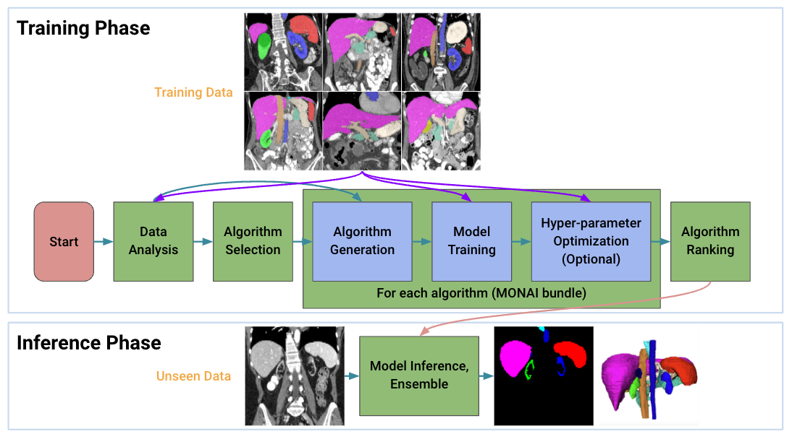

<h1 align="center"> Auto3DSeg </h1>

<div align="center">  </div>

## Introduction

**Auto3DSeg** is a comprehensive solution for large-scale 3D medical image segmentation. It leverages the latest advances in **MONAI** and GPUs to efficiently develop and deploy algorithms with state-of-the-art performance for beginners or advanced researchers in the field. 3D medical image segmentation is an important task with great potential for clinical understanding, disease diagnosis, and surgical planning. According to the statistics of the recent [MICCAI](http://www.miccai.org/) conferences, more than 60% of the papers are applications of segmentation algorithms, and more than half of them use 3D datasets. After working in this field for many years, we have released the state-of-the-art segmentation solution **Auto3DSeg**, which requires minimal user input (e.g., data root and list).

**Auto3DSeg** first analyzes the global information such as intensity, data size, and data spacing of the dataset, and then generates algorithm folders in MONAI bundle format based on data statistics and algorithm templates. Next, all algorithms initiate model training to obtain checkpoints with the best validation accuracy. Finally, the ensemble module selects the algorithms via ranking trained checkpoints and creates ensemble predictions. Meanwhile, the solution offers different levels of user experience for beginners and advanced researchers. It has been tested on large-scale 3D medical imaging datasets in several different modalities.

<details open>
<summary>Major features</summary>

- **Unified Framework**

  **Auto3DSeg** is a self-contained solution for 3D medical image segmentation with minimal user input.

- **Flexible Modular Design**

  **Auto3DSeg** components can be used independently to meet different needs of users.

- **Support of Bring-Your-Own-Algorithm (BYOA)**

  We have introduced an efficient way to introduce users' own algorithms into the **Auto3DSeg** framework.

- **High Accuracy and Efficiency**

  **Auto3DSeg** achieves state-of-the-art performance in most applications of 3D medical image segmentation.

</details>

## Auto3DSeg Leaderboard Performance

- **Auto3DSeg** won 1st place in MICCAI 2022 challenge **[HECKTOR 2022: Head and neck tumor segmentation and outcome prediction in PET/CT images](https://hecktor.grand-challenge.org/)**
  - 1st place  (segmentation task)
- **Auto3DSeg** got 2nd place in MICCAI 2022 challenge **[INSTANCE22: The 2022 Intracranial Hemorrhage Segmentation Challenge on Non-Contrast head CT (NCCT)](https://instance.grand-challenge.org/)**
  - 1st rank in terms of Dice score
- **Auto3DSeg** got 2nd place in MICCAI 2022 challenge **[ISLES'22: Ischemic Stroke Lesion Segmentation Challenge](https://isles22.grand-challenge.org/)**
  - 1st rank in terms of Dice score

We have demonstrated preliminary results of public datasets are described in the [tasks](tasks) folder.

- [HECKTOR22](tasks/hecktor22/README.md)
- [INSTANCE22](tasks/instance22/README.md)
- [Beyond the Cranial Vault (BTCV) Abdomen Dataset](tasks/btcv/README.md)
- Medical Segmentation Decathlon (MSD) Dataset
        - [Task04 Task04_Hippocampus](tasks/msd/Task04_Hippocampus/README.md)
	- [Task05 Prostate](tasks/msd/Task05_Prostate/README.md)
	- [Task09 Spleen](tasks/msd/Task09_Spleen/README.md)

## A Two-Minute "Hello-World" Example

We provide [a two-minute example](notebooks/auto3dseg_hello_world.ipynb) for users to get initial impressions of **Auto3DSeg**. The example covers the entire pipeline from start to finish, and can be done in two minutes using a single GPU (GPU RAM >= 8GB). Each fold of cross validation consumes about 1.2 GB of disk space, and in this example, about 2.4 GB in total. All the results will be written to user's working directory.

## A "Real-World" Example

To further demonstrate the capabilities of **Auto3DSeg**, [here](tasks/instance22) is the detailed performance of the algorithm in **Auto3DSeg**, which won 2nd place in the MICCAI 2022 challenge** [INSTANCE22: The 2022 Intracranial Hemorrhage Segmentation Challenge on Non-Contrast Head CT (NCCT)](https://instance.grand-challenge.org/)**

## Reference Python APIs for Auto3DSeg

**Auto3DSeg** offers users different levels of APIs to run pipelines that suit their needs.

### 1. Run with Minimal Input using ```AutoRunner```

The user needs to provide a data list (".json" file) for the new task and data root. A typical data list is as this [example](tasks/msd/Task05_Prostate/msd_task05_prostate_folds.json). A sample datalist for an existing MSD formatted dataset can be created using [this notebook](notebooks/msd_datalist_generator.ipynb). After creating the data list, the user can create a simple "task.yaml" file (shown below) as the minimum input for **Auto3DSeg**.

```
modality: CT
datalist: "./task.json"
dataroot: "/workspace/data/task"
```

User needs to define the modality of data. Currently **Auto3DSeg** supports both CT and MRI (single- or multi-modality MRI). Then user can run the pipeline further from start to finish using the following simple bash command with the ```AutoRunner``` class.

```bash
python -m monai.apps.auto3dseg AutoRunner run --input='./task.yaml'
```

An example with detailed description is discussed [here](docs/run_with_minimal_input.md). And we demonstrate the entire pipeline with all necessary components in this example [notebook](notebooks/auto_runner.ipynb) using the AutoRunner class.

### 2. Run with Module APIs

**Auto3DSeg** offers the one-stop AutoRunner API to execute the pipeline, as well as the APIs to access the underlying components built to support the AutoRunner. In this [notebook](notebooks/auto3dseg_autorunner_ref_api.ipynb), AutoRunner is broken down by the step-by-step and we will introduce the API calls in Python and CLI commands. Particularly, we will map the AutoRunner commands and configurations to each of the **Auto3DSeg** module APIs.

## Demystifying Auto3DSeg Components

Each module of **Auto3DSeg** in different steps can be individually used for different purposes. And functions/methods in the components can be customized by users.

- Step 1: [Data analyzer](docs/data_analyzer.md)
- Step 2: [Algorithm generation](docs/algorithm_generation.md)
- Step 3: [Model training, validation, and inference](docs/bundle.md)
- Step 4: [Hyper-parameter optimization](docs/hpo.md)
- Step 5: [Model ensemble](docs/ensemble.md)

## FAQ

Please refer to [FAQ](docs/faq.md) for frequently asked questions.
