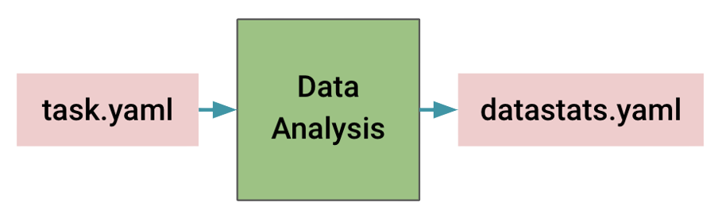

## Algorithm Generation

<div align="center">  </div>

<div align="center">  </div>

The module of algorithm generation is to create self-contained algorithm folders for further model training, inference, and validation with various neural network architectures and training recipes. This module takes input configuration ".yaml" files (shown below), dataset summaries (e.g. "data_stats.yaml") from our provided data analysis tools, and algorithm templates. And it outputs different algorithm folders under cross-validation. In the default design, the generated algorithm folders follow the designs of the [MONAI bundle](https://docs.monai.io/en/latest/mb_specification.html). Users can run model training, inference, and validation inside those self-contained folders.

```
modality: CT
datalist: "./task.json"
dataroot: "/workspace/data/task"
```

The input configuration files and dataset summaries are critical for algorithm generation. For example, the data modality is important for intensity normalization strategies, average image shape determines image region-of-interest (ROI) cropping, and input/output channels decide the first/last layers of the network.

### Algorithms

The default algorithms are based on three different networks, [DiNTS](https://openaccess.thecvf.com/content/CVPR2021/html/He_DiNTS_Differentiable_Neural_Network_Topology_Search_for_3D_Medical_Image_CVPR_2021_paper.html), (2D/3D) [SegResNest](https://arxiv.org/abs/1810.11654), and [SwinUNETR](https://arxiv.org/abs/2201.01266), with their well-tuned training recipes.

| **Algorithm** | **DiNTS**  | **2D SegResNet**  | **SegResNet**  | **SwinUNETR**  |
| ------------ | ------------ | ------------ | ------------ | ------------ |
| **Network** | Densely-connected lattice-based network | U-shape network architecture with 2D residual blocks | U-shape network architecture with 3D residual blocks | U-shape network architecture with Swin-Transformer based encoder |
| **Training Recipes** | Model Input: <br /> - 96 x 96 x 96 for training <br /> - 96 x 96 x 96 for inference <br /> AMP: True <br /> Optimizer: SGD <br /> Initial learning Rate: 0.2 <br /> Loss: DiceFocalLoss | Model Input: <br /> - 320 x 320 for training <br /> - 320 x 320 for inference <br /> AMP: True <br /> Optimizer: SGD <br /> Initial learning Rate: 0.2 <br /> Loss: DiceFocalLoss | Model Input: <br /> - 224 x 224 x 144 for training <br /> - 224 x 224 x 144 for inference <br /> AMP: True <br /> Optimizer: AdamW <br /> Initial learning Rate: 0.0002 <br /> Loss: DiceCELoss | Model Input: <br /> - 96 x 96 x 96 for training <br /> - 96 x 96 x 96 for inference <br /> AMP: True <br /> Optimizer: AdamW <br /> Initial learning Rate: 0.0001 <br /> Loss: DiceCELoss |
| **Transforms**  |  - Intensity Normalization <br /> - Random ROI cropping <br /> - Random rotation <br /> - Random zoom <br /> - Random Gaussian smoothing <br /> - Random intensity scaling <br /> - Random intensity shifting <br /> - Random Gaussian noising <br /> - Random flipping | - Intensity Normalization <br /> - Random ROI cropping <br /> - Random rotation <br /> - Random zoom <br /> - Random Gaussian smoothing <br /> - Random intensity scaling <br /> - Random intensity shifting <br /> - Random Gaussian noising <br /> - Random flipping | - Intensity Normalization <br /> - Random ROI cropping <br /> - Random affine transformation <br /> - Random Gaussian smoothing <br /> - Random intensity scaling <br /> - Random intensity shifting <br /> - Random Gaussian noising <br /> - Random flipping | - Intensity Normalization <br /> - Random ROI cropping <br /> - Random rotation <br /> - Random intensity shifting <br /> - Random flipping |

For model inference, we use a sliding-window scheme to generate probability maps for output classes/channels through a softmax/sigmoid layer. The overlap for sliding window inference is more than 25\% of the window size. The probability map is re-sampled back to its original spacing through each class channel. Next, a segmentation mask is generated using the `argmax` or thresholding operation on the channel dimension (with or without model ensemble) and saved with the original affine matrix.

### Python Command

The following Python script shows how to generate algorithm bundles using the Python class **BundleGen**.

```python
## algorithm generation
import os
from monai.apps.auto3dseg import BundleGen

work_dir = "./work_dir"
data_output_yaml = os.path.join(work_dir, "data_stats.yaml")
data_src_cfg = "./task.yaml"

bundle_generator = BundleGen(
    algo_path=work_dir,
    data_stats_filename=data_output_yaml,
    data_src_cfg_name=data_src_cfg,
)

bundle_generator.generate(work_dir, num_fold=5)
```

The code block would generate multiple algorithm bundles as follows. The folder name suffix indicates the ```i```th fold of ```N```-fold cross-validation.

```
./workdir/
├── dints_0
├── dints_1
...
├── dints_4
├── segresnet_0
...
├── segresnet_4
├── segresnet2d_0
...
```

### Algorithm Templates

The Python class **BundleGen** utilizes [the default algorithm templates](https://github.com/Project-MONAI/research-contributions/tree/main/auto3dseg) implicitly. The default algorithms are based on four established works (DiNTS, SegResNet, SegResNet2D, and SwinUNETR). They support both 3D CT and MR image segmentation. In the template, some items are empty or null, and they will be filled together with dataset information. The part of the configuration file "hyper_parameters.yaml" is shown below. In the configuration, the items (like "bundle_root", "data_file_base_dir", and "patch_size") will be filled up automatically with any user interaction.

```
bundle_root: null
ckpt_path: "$@bundle_root + '/model_fold' + str(@training#fold)"
data_file_base_dir: null
data_list_file_path: null

training:
  # hyper-parameters
  amp: true
  determ: false
  fold: 0
  input_channels: null
  learning_rate: 0.2
  num_images_per_batch: 2
  num_iterations: 40000
  num_iterations_per_validation: 500
  num_patches_per_image: 1
  num_sw_batch_size: 2
  output_classes: null
  overlap_ratio: 0.625
  patch_size: null
  patch_size_valid: null
  softmax: true

  loss:
    _target_: DiceFocalLoss
    include_background: true
...
```

The actual template filling is done using the "fill_template_config" function in the "Algo" class of the script "scripts/algo.py". The "algo.py" of different algorithms is located inside their bundle templates.

```python
class DintsAlgo(BundleAlgo):
    def fill_template_config(self, data_stats_file, output_path, **kwargs):
			...
            patch_size = [128, 128, 96]
            max_shape = data_stats["stats_summary#image_stats#shape#max"]
            patch_size = [
                max(32, shape_k // 32 * 32) if shape_k < p_k else p_k for p_k, shape_k in zip(patch_size, max_shape)
            ]

            input_channels = data_stats["stats_summary#image_stats#channels#max"]
            output_classes = len(data_stats["stats_summary#label_stats#labels"])

            hyper_parameters.update({"data_file_base_dir": os.path.abspath(data_src_cfg["dataroot"])})
            hyper_parameters.update({"data_list_file_path": os.path.abspath(data_src_cfg["datalist"])})

            hyper_parameters.update({"training#patch_size": patch_size})
            hyper_parameters.update({"training#patch_size_valid": patch_size})
            hyper_parameters.update({"training#input_channels": input_channels})
            hyper_parameters.update({"training#output_classes": output_classes})

            hyper_parameters_search.update({"searching#patch_size": patch_size})
            hyper_parameters_search.update({"searching#patch_size_valid": patch_size})
            hyper_parameters_search.update({"searching#input_channels": input_channels})
            hyper_parameters_search.update({"searching#output_classes": output_classes})

            modality = data_src_cfg.get("modality", "ct").lower()
            spacing = data_stats["stats_summary#image_stats#spacing#median"]

            intensity_upper_bound = float(data_stats["stats_summary#image_foreground_stats#intensity#percentile_99_5"])
            intensity_lower_bound = float(data_stats["stats_summary#image_foreground_stats#intensity#percentile_00_5"])

            ct_intensity_xform = {
                "_target_": "Compose",
                "transforms": [
                    {
                        "_target_": "ScaleIntensityRanged",
                        "keys": "@image_key",
                        "a_min": intensity_lower_bound,
                        "a_max": intensity_upper_bound,
                        "b_min": 0.0,
                        "b_max": 1.0,
                        "clip": True,
                    },
                    {"_target_": "CropForegroundd", "keys": ["@image_key", "@label_key"], "source_key": "@image_key"},
                ],
            }

            mr_intensity_transform = {
                "_target_": "NormalizeIntensityd",
                "keys": "@image_key",
                "nonzero": True,
                "channel_wise": True,
            }

            transforms_train.update({'transforms_train#transforms#3#pixdim': spacing})
            transforms_validate.update({'transforms_validate#transforms#3#pixdim': spacing})
            transforms_infer.update({'transforms_infer#transforms#3#pixdim': spacing})

            if modality.startswith("ct"):
                transforms_train.update({'transforms_train#transforms#5': ct_intensity_xform})
                transforms_validate.update({'transforms_validate#transforms#5': ct_intensity_xform})
                transforms_infer.update({'transforms_infer#transforms#5': ct_intensity_xform})
            else:
                transforms_train.update({'transforms_train#transforms#5': mr_intensity_transform})
                transforms_validate.update({'transforms_validate#transforms#5': mr_intensity_transform})
                transforms_infer.update({'transforms_infer#transforms#5': mr_intensity_transform})
			...
        return fill_records
```
