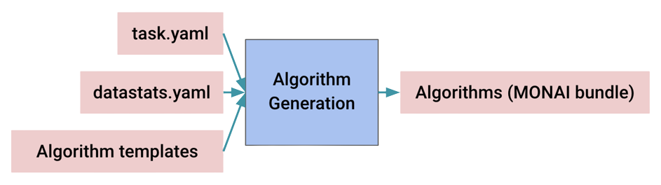

## Algorithm Generation

<div align="center">  </div>

<div align="center">  </div>

The module of algorithm generation is to create self-contained algorithm folders for further model training, inference, and validation with various neural netwrok architecture and training recipes. This module takes input configuration ".yaml" files (shown below), dataset summaries (e.g. "datastats.yaml") from our provided data analysis tools, and algorithm templates. And it outputs different algorithm folders under cross-validation. In the default design, the generated algorithm folders follow the designs of [MONAI bundle](https://docs.monai.io/en/latest/mb_specification.html). User can run model training, inference, and validation inside those self-contained folders.

```
modality: CT
datalist: "./task.json"
dataroot: "/workspace/data/task"
```

The input configuration files and dataset summaries are critical for algorithm generation. For example, the data modality is important for intensity normalization strategies, average image shape determines image region-of-interest (ROI) cropping, and input/output channels decide first/last layers of network.

### Python Command

The follow Python script shows how to generate algorithm bundles using Python class **BundleGen**.

```python
## algorithm generation
from monai.apps.auto3dseg import BundleGen

work_dir = "./work_dir"
data_output_yaml = os.path.join(work_dir, "datastats.yaml")
data_src_cfg = "./task.yaml"

bundle_generator = BundleGen(
    algo_path=work_dir,
    data_stats_filename=data_output_yaml,
    data_src_cfg_name=data_src_cfg,
)

bundle_generator.generate(work_dir, num_fold=5)
```

The code block would generate multiple algorithm bundles as follows. The folder name suffix indictes the ```i```th fold of ```N```-fold cross-validation.

```
./workdir/
├── dints_0
├── dints_1
...
├── dints_4
├── segresnet_0
...
├── segresnet_4
├── segresnet2d_0
...
```

### Algorithm Templates

The Python class **BundleGen** utilize [the default algorithm templates](https://github.com/Project-MONAI/research-contributions/tree/main/auto3dseg) implicitly. The default algorithms are based on four established works (DiNTS, SegResNet, SegResNet2D, SwinUNETR). They supports both 3D CT and MR image segmentation. In the template, some items are empty or null, and they will be filled together with dataset information. The part of configuration file "hyper_parameters.yaml" is shown below. In the configuration, the items (like "bundle_root", "data_file_base_dir", "patch_size") will be filled up automatically with any user interaction.

```
bundle_root: null
ckpt_path: "$@bundle_root + '/model_fold' + str(@training#fold)"
data_file_base_dir: null
data_list_file_path: null

training:
  # hyper-parameters
  amp: true
  determ: false
  fold: 0
  input_channels: null
  learning_rate: 0.2
  num_images_per_batch: 2
  num_iterations: 40000
  num_iterations_per_validation: 500
  num_patches_per_image: 1
  num_sw_batch_size: 2
  output_classes: null
  overlap_ratio: 0.625
  patch_size: null
  patch_size_valid: null
  softmax: true

  loss:
    _target_: DiceFocalLoss
    include_background: true
...
```

The actual template filling is done using the "fill_template_config" function in the "Algo" class of the script "scripts/algo.py". The "algo.py" of different algorithms are located inside their bundle templates.

```python
class DintsAlgo(BundleAlgo):
    def fill_template_config(self, data_stats_file, output_path, **kwargs):
			...
            patch_size = [128, 128, 96]
            max_shape = data_stats["stats_summary#image_stats#shape#max"]
            patch_size = [
                max(32, shape_k // 32 * 32) if shape_k < p_k else p_k for p_k, shape_k in zip(patch_size, max_shape)
            ]

            input_channels = data_stats["stats_summary#image_stats#channels#max"]
            output_classes = len(data_stats["stats_summary#label_stats#labels"])

            hyper_parameters.update({"data_file_base_dir": os.path.abspath(data_src_cfg["dataroot"])})
            hyper_parameters.update({"data_list_file_path": os.path.abspath(data_src_cfg["datalist"])})

            hyper_parameters.update({"training#patch_size": patch_size})
            hyper_parameters.update({"training#patch_size_valid": patch_size})
            hyper_parameters.update({"training#input_channels": input_channels})
            hyper_parameters.update({"training#output_classes": output_classes})

            hyper_parameters_search.update({"searching#patch_size": patch_size})
            hyper_parameters_search.update({"searching#patch_size_valid": patch_size})
            hyper_parameters_search.update({"searching#input_channels": input_channels})
            hyper_parameters_search.update({"searching#output_classes": output_classes})

            modality = data_src_cfg.get("modality", "ct").lower()
            spacing = data_stats["stats_summary#image_stats#spacing#median"]

            intensity_upper_bound = float(data_stats["stats_summary#image_foreground_stats#intensity#percentile_99_5"])
            intensity_lower_bound = float(data_stats["stats_summary#image_foreground_stats#intensity#percentile_00_5"])

            ct_intensity_xform = {
                "_target_": "Compose",
                "transforms": [
                    {
                        "_target_": "ScaleIntensityRanged",
                        "keys": "@image_key",
                        "a_min": intensity_lower_bound,
                        "a_max": intensity_upper_bound,
                        "b_min": 0.0,
                        "b_max": 1.0,
                        "clip": True,
                    },
                    {"_target_": "CropForegroundd", "keys": ["@image_key", "@label_key"], "source_key": "@image_key"},
                ],
            }

            mr_intensity_transform = {
                "_target_": "NormalizeIntensityd",
                "keys": "@image_key",
                "nonzero": True,
                "channel_wise": True,
            }

            transforms_train.update({'transforms_train#transforms#3#pixdim': spacing})
            transforms_validate.update({'transforms_validate#transforms#3#pixdim': spacing})
            transforms_infer.update({'transforms_infer#transforms#3#pixdim': spacing})

            if modality.startswith("ct"):
                transforms_train.update({'transforms_train#transforms#5': ct_intensity_xform})
                transforms_validate.update({'transforms_validate#transforms#5': ct_intensity_xform})
                transforms_infer.update({'transforms_infer#transforms#5': ct_intensity_xform})
            else:
                transforms_train.update({'transforms_train#transforms#5': mr_intensity_transform})
                transforms_validate.update({'transforms_validate#transforms#5': mr_intensity_transform})
                transforms_infer.update({'transforms_infer#transforms#5': mr_intensity_transform})
			...
        return fill_records
```
