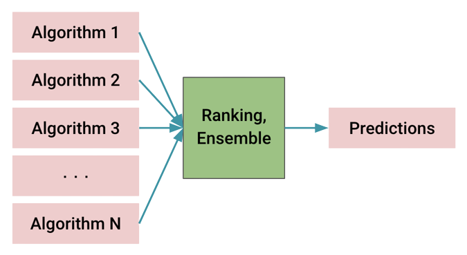

## Model Ensemble

<div align="center">  </div>

To achieve robust predictions for unseen data, the **auto3dseg** provide a model ensemble module to summarize predictions from various trained models. The module firstly ranks checkpoints of different algorithms based on validation accuracy in each fold of ```N```-fold cross-valition, picks the top-```M``` algorithms from each fold, and creates ensemble predictions using ```MN``` checkpoints. The default ensemble algorithm averages the probability maps (from softmax/sigmoid activations) of candidate predictions.

### How to Run Model Ensemble Independently

The follow Python script shows how to ensemble predictions from various algorithms using Python class **AlgoEnsembleBuilder**.

```python
from monai.apps.auto3dseg import (
    BundleGen,
    AlgoEnsembleBestN,
    AlgoEnsembleBuilder,
)
from monai.apps.auto3dseg.ensemble_builder import AlgoEnsembleKeys

work_dir = "./work_dir"
data_output_yaml = os.path.join(work_dir, "datastats.yaml")
data_src_cfg = "./task.yaml"

## algorithm generation
bundle_generator = BundleGen(
    algo_path=work_dir,
    data_stats_filename=data_output_yaml,
    data_src_cfg_name=data_src_cfg,
)

bundle_generator.generate(work_dir, num_fold=5)
history = bundle_generator.get_history()

## model ensemble
n_best = 1
builder = AlgoEnsembleBuilder(history, data_src_cfg)
builder.set_ensemble_method(AlgoEnsembleBestN(n_best=n_best))
ensemble = builder.get_ensemble()
pred = ensemble()
print("ensemble picked the following best {0:d}:".format(n_best))
for algo in ensemble.get_algo_ensemble():
    print(algo[AlgoEnsembleKeys.ID])
```

### Customization

**Auto3DSeg** also provides the API for users to use their own customized ensemble algorithm as shown in this [notebook](../notebooks/ensemble_byoc.ipynb).

### Essential Component for General Algorithm/Mdoel Ensemble

The essential component for model ensemble is the "infer()" function in the "InferClass" class of the script "scripts/infer.py". After class initializaiton of the "InferClass", "infer()" takes image file names as input, and outputs multi-channel probablity maps. And the "infer.py" of different algorithms are located inside their bundle templates. In general, the ensemble module would work for any algorithms as long as the "infer()" function is provided with proper setup.

```python
class InferClass:
    ...
    @torch.no_grad()
    def infer(self, image_file):
        self.model.eval()

        batch_data = self.infer_transforms(image_file)
        batch_data = list_data_collate([batch_data])
        infer_image = batch_data["image"].to(self.device)

        with torch.cuda.amp.autocast():
            batch_data["pred"] = sliding_window_inference(
                infer_image,
                self.patch_size_valid,
                self.num_sw_batch_size,
                self.model,
                mode="gaussian",
                overlap=self.overlap_ratio,
            )

        batch_data = [self.post_transforms(i) for i in decollate_batch(batch_data)]

        return batch_data[0]["pred"]
	...
```
