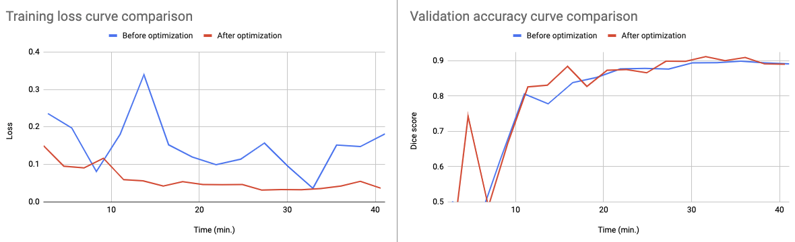

## GPU Utlization Optimization

### Introduction

We introduced an automated solution to optimize the GPU usage of algorithms in Auto3DSeg.
Typically, the most time-consuming process in Auto3DSeg is model training.
Sometimes the low GPU utilization is because that GPU capacities is not fully utilized with fixed hyperparameters.
Our proposed solution is capable to automatically estimate hyper-parameters in model training configurations maximizing utilities of the available GPU capacities.
The solution is leveraging hyper-parameter optimization algorithms to search for optimital hyper-parameters with any given GPU devices.

The following hyper-paramters in model training configurations are optimized in the process.

1. **num_images_per_batch:** Batch size determines how many images are in each mini-batch and how many training iterations per epoch. Large batch size can reduce training time per epoch and increase GPU memory usage with decent CPU capacities for I/O;
2. **num_sw_batch_size:** Batch size in sliding-window inference directly relates to how many patches are in one pass of model feedforward operation. Large batch size in sliding-window inference can reduce overall inference time and increase GPU memory usage;
3. **validation_data_device:** Validation device indicates if the volume is stored on GPU or CPU. Ideally, it would be fast to store input volumes onto GPU for inference. However, if 3D volumes are very large and GPU memory is limited, we have to store the image arrays on CPU (instead of GPU) and put patches of volumes on GPU for inference;
4. **num_trials:** The trial number defines the time length of the optimization process. The larger the number of trials, the longer the optimization process.

### Usage

User can follow the [tutorial](../notebooks/auto3dseg_autorunner_ref_api.ipynb) for experiments, and modify the cell of algorithm generation with the following scripts.
And we allow the user to define the scope of the hyper-parameter optimization process instead of using default settings.
If the key in `gpu_customization_specs` is `universal`, it means that the range settings will apply to all algorithms; if the keys are algorithm names, then the ranges correspond to different algorithms respectively.

As shown in the following code snippet, the user can select the algorithm to use.
If `algos` is a dictionary, it outlines the algorithm to use.
If `algos` is a list or a string, defines a subset of names of the algorithms to use, e.g. (`segresnet`, `dints`) out of the full set of algorithm templates provided by templates_path_or_url. Defaults value of `algos` is None which means using all available algorithms.

```python
bundle_generator = BundleGen(
    algo_path=work_dir,
    algos="dints",
    data_stats_filename=datastats_file,
    data_src_cfg_name=input,
)

gpu_customization_specs = {
    "universal": {"num_trials": 20, "range_num_images_per_batch": [1, 20], "range_num_sw_batch_size": [1, 40]}
}
bundle_generator.generate(
    work_dir,
    num_fold=5,
    gpu_customization=True,
    gpu_customization_specs=gpu_customization_specs,
)
```

### Effect

We take the `DiNTS` algorithm in `MSD Task02_Heart` as an example, and compare the training process of one model before and after GPU opmization when using an 80GB A100 GPU.
And training loss curves and validation accuracy curvers are compared between the training processes with and without GPU opmization.
After GPU optimization, the batch size is increased from 1 to 8, batch size in sliding-window inference is increased to 14, and validation device is GPU.
From the following figure, we can see that model converge faster when using GPU optimization, and validation accuracies becomes better on average.
The improvement is primarily to take advantage of the more GPU capacity available on the A100.

<div align="center">  </div>
