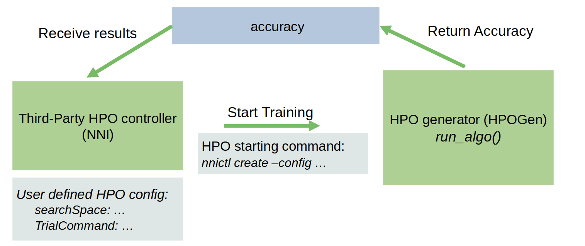
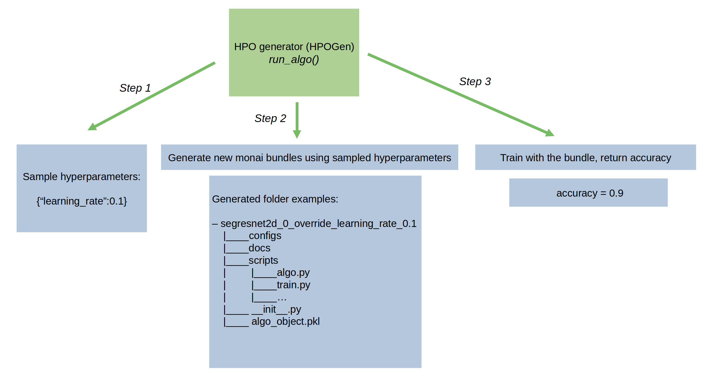

## Hyperparameter Optimization (HPO)
We provide a base HPO generator class `HPOGen` to support the interactions between our Algorithm and third-party
HPO packages like Microsoft Neural Network Intelligence [NNI](https://nni.readthedocs.io/en/stable/). Child classes of HPOGen, including `NNIGen` and `OptunaGen`, are provided to support NNI hyperparameter optimization and Optuna for our algorithms.

> NOTE: We only provide API for interaction between our algorithm and 3rd party HPO packages. The running and configuration of 3rd party packages should be done by users. It can support general HPO algorithms like random search, grid search, and simple bayesian optimization. More advanced HPO algorithms (methods with early stopping, BOHB, PBT, evolution, etc.) may require user modifications to the generated bundle code and the NNIGen/OptunaGen code.

### Concepts
The basic workflow is shown in
<div align="center">  </div>
<div align="center">  </div>
The HPOGen class has a `run_algo()` function, which will be used by the third-party HPO packages. `run_algo()` has three steps: hyperparameter sampling (by calling functions provided by 3rd party packages), generates monai bundle folders, and performs training. The validation accuracy will be returned to the third-party package package.

### Usage
The tutorial on how to use NNIGen is [here](../notebooks/hpo_nni.ipynb) and the tutorial for OptunaGen is [here](../notebooks/hpo_optuna.ipynb). The list of HPO algorithms in NNI and Optuna can be found on [the NNI GitHub page](https://github.com/microsoft/nni) and [Optuna documentation](https://optuna.readthedocs.io/en/stable/reference/samplers/index.html).
For demonstration purposes, both of our tutorials use a grid search HPO algorithm to optimize the learning rate in training. Users can be easily modified to random search and bayesian based methods for more hyperparameters.

### Override Specific Parameters in the Algorithms before HPO
Users can change **Auto3DSeg** algorithms in HPO by providing a set of overriding parameters.
For example, to reduce the training epochs/iterations, the users can modify `num_epochs` or `num_iterations`, based on the algorithms of choice.
The `BundleAlgo` algorithms in **Auto3DSeg** follow MONAI bundle formats.
So the users can provide keys to modify the value in the bundle config.


Below are examples to reduce the epochs/iterations for each of the existing algorithms in the algorithm template.

#### SegResNet2D

```python
override_param = {
    "num_iterations": <n_iter>,
    "num_iterations_per_validation": <n_iter_val>,
}
```

#### SegResNet

```python
override_param = {
    "num_epochs": <num_epoch>,
    "num_epochs_per_validation": <num_epoch_val>,
}
```

#### SwinUNETR

```python
override_param = {
    "num_iterations": <n_iter>,
    "num_iterations_per_validation": <n_iter_val>,
}
```

#### DINTS

> Note: DINTS has two phases: search and training. Additionally, there is a warmup process in the search phase.
> To correctly override the parameters in DINTS, the users have to consider if the parameters are applied to search, training, or both.

```python
override_param = {
    "training#num_iterations": <train_n_iter>,
    "training#num_iterations_per_validation": <train_n_iter_val>,
    "searching#num_iterations": <search_n_iter>,
    "searching#num_iterations_per_validation": <search_n_iter_val>,
    "searching#num_warmup_iterations": <search_n_warmup>,
}
```

Finally, to override HPO paramater for all algorithms, users can merge all parameters in one dictionary, as long as the parameters are not contracting with each other.

> Note: the algorithm will skip the parameter if its config files do not contain the key.
> For example, SegResNet will ignore `num_iterations`

```python
override_param = {
    "num_epochs": <num_epoch>,
    "num_epochs_per_validation": <num_epoch_val>,
    "num_iterations": <n_iter>,
    "num_iterations_per_validation": <n_iter_val>,
    "training#num_iterations": <train_n_iter>,
    "training#num_iterations_per_validation": <train_n_iter_val>,
    "searching#num_iterations": <search_n_iter>,
    "searching#num_iterations_per_validation": <search_n_iter_val>,
    "searching#num_warmup_iterations": <search_n_warmup>,
}
```
