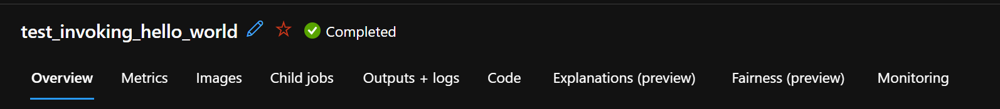

# Training Auto3dSeg in AzureML

It is possible to train Auto3dSeg using the Azure Cloud. This page documents the minimal set up required to utilise Azure Machine Learning (AzureML) to run your Auto3dSeg training tasks.

## AzureML Setup

Before being able to train in the cloud you will need to have your AzureML resources set up properly. If you have not already completed this, please follow [this tutorial](https://hi-ml.readthedocs.io/en/latest/azure_setup.html) from Microsoft's Medical Imaging research team.

### Graphical Processing Unit (GPU) requirements

The GPU requirements needed to successfully run Auto3dSeg depend on the size of your data. For running the data used by the [Hello World Example](https://github.com/Project-MONAI/tutorials/blob/main/auto3dseg/notebooks/auto3dseg_hello_world.ipynb) then a single GPU with 8GB VRAM is sufficient. The GPU nodes you have available in AzureML will depend upon your region and Azure subscription. For larger datasets it is highly recommended to use nodes with multiple GPUs and more VRAM (4 GPUs with >= 16GB).

## Configuration

### Pre-requisites

As well as the requirements outlined in the [tutorials README](https://github.com/Project-MONAI/tutorials), you will need to install [hi-ml-azure](https://pypi.org/project/hi-ml-azure/) in your environment by running the following command:

- `pip install "hi-ml-azure>=0.2.19"`

### Configure environment - `environment(-azure).yaml`

- WIP -> hoping to have a Docker image integrated into ACR for this.

### Empty directory

When hi-ml-azure starts your AutoRunner in AzureML, it copies *all* files in your current working directory and uploads them to Azure. To avoid uploading unnecessary files, create an empty directory and navigate into it by using the following command:

```shell
mkdir azure_work_dir && cd azure_work_dir
```

**Note:** The directory can be named anything you like, but for this tutorial we will use the directory above, `azure_work_dir`.

### Configure AzureML connection - `config.json`

To connect Auto3dSeg to your AzureML workspace you will need to download the configuration file associated with that workspace by following the instructions [here](https://hi-ml.readthedocs.io/en/latest/azure_setup.html#accessing-the-workspace). Place this file in your new directory:

```shell
.
└── azure_work_dir/
    └── config.json
```

### Configure data - `datalist.json`

The same as when running Auto3dSeg locally, you will need to define a `datalist.json` file for your data and place it in your directory. Check out the [tasks folder](https://github.com/Project-MONAI/tutorials/tree/main/auto3dseg/tasks) for example datalists. Make sure that all paths are relative to the head of your Azure storage blob that contains your dataset.

Your directory should now look like so:

```shell
.
└── azure_work_dir/
    ├── config.json
    └── datalist.json
```

### Configure Auto3dSeg - `task.yaml`

All arguments passed to the Auto3dSeg autorunner and the AzureML submission will need to be defined in a configuration file. Create a new `task.yaml` file from this template:

```yaml
name: <your_task_name>
task: segmentation

modality: <MRI or CT>
datalist: <your_new_datalist>.json
dataroot: /path/to/local/data # Only necessary if you also want to run locally

multigpu: <True/False> # set to true if you want to use multiple GPUs for training

azureml_config:
  compute_cluster_name: "<name of your compute cluster>"
  input_datasets:
  - "<name of your AzureML data asset>" # currently only 1 input dataset is supported
  default_datastore: "<name of your AzureML datastore>"
```

Your directory should now look like this:

```dir
.
└── azure_work_dir/
    ├── config.json
    ├── datalist.json
    └── task.yaml
```

## Running

Once the above configuration is completed, to run the Auto3dSeg AutoRunner in AzureML simply use the following command (`cd azure_work_dir` first if you haven't already):

```python
python -m monai.apps.auto3dseg AzureMLAutoRunner run --input='./task.yaml`
```

Make sure to follow any instructions in the terminal regarding authenticating on AzureML. After the job is successfully uploaded, you should see the following output:

```shell
URL to job: https://ml.azure.com/runs/<run_id>?wsid=/subscriptions/<subscription_id>/resourcegroups/<resource_group>/workspaces/<workspace>&tid=<tenant_id>
```

Following this link will take you to your AzureML job where the AutoRunner is running. Below the job name you will see the following tabs, the most important of which are explained below.



### Outputs + logs

Under the outputs and logs tabs you will be able to see all of the outputs produced by your Auto3dSeg run. After a successful run you should see the following folders:

```shell
.
├── outputs/
│   ├── ...
│   ├── ensemble_output/
│   ├── datastats.yaml
│   └── input.yaml
├── system_logs/
└── user_logs/
    ├── mpi_log.txt
    └── std_log_process_0.txt
```

- `outputs/` contains all the files generated by Auto3dSeg for training the various architectures, the best checkpoints for each architecture and fold, as well as:
  - The `ensemble_output/` folder, where the predictions from the final ensemble model on the test data are stored.
  - A copy of your `task.yaml` (renamed to `input.yaml`)
  - The results of the [Data Analyzer](./data_analyzer.md) in `datastats.yaml`
- `system_logs/` contains AzureML-related outputs such as Docker image building. It is unlikely you will ever need to access files in this folder.
- `user_logs/` contains all captured standard outputs (i.e. anything output by `print()` statements or loggers). All AutoRunner logs can be found in `std_log_process_0.txt`.

### Metrics

Integration with the Metrics tab is currently not supported by MONAI but is a work in progress.

### Monitoring

Under the monitoring tab you can view metrics for all the hardware being used for your AutoRunner job, including, but not limited to:

- CPU/GPU Utilization
- CPU/GPU Memory Usage
- GPU Energy Usage
- Network and Disk I/O

## Additional Configuration Options

The [hi-ml package](https://hi-ml.readthedocs.io) allows for many additional configuration when deploying to AzureML. These can all be accessed via the `azureml_config` tag in your [`input.yaml`](#configure-auto3dseg---taskyaml) file. For a full list of options, please review the documentation [here](https://hi-ml.readthedocs.io/en/latest/api/health_azure.submit_to_azure_if_needed.html). To override the defaults on these values, simply specify the parameter name you wish to set under the `azureml_config` tag, followed by the value for that parameter, e.g.:

```yaml
azureml_config:
  compute_cluster_name: "<name of your compute cluster>"
  input_datasets:
  - "<name of your AzureML data asset>" # currently only 1 input dataset is supported
  default_datastore: "<name of your AzureML datastore>"
  experiment_name: "my new experiment"
  wait_for_completion: True
  display_name: "The_name_of_the_new_run
  <any_other_optional_parameter>: <value_of_the_apprpriate_data_type>
```
