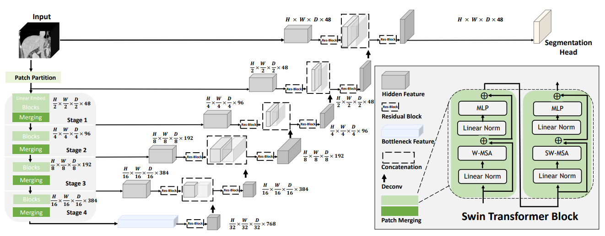

# Description

A 3D Swin Transformer-based algorithm for volumetric segmentation of medical images integrated with Auto3dSeg pipeline.

# Model Overview

This model is the auto 3d implementation [1] with Beyond the Cranial Vault (BTCV) Segmentation Challenge and the "Medical Segmentation Decathlon Challenge 2018" data.



## Training configuration

The training was performed with at least 16GB-memory GPUs.

## commands example


Execute model training:

```
python -m scripts.train run --config_file configs/algo_config.yaml
```

Execute multi-GPU model training (recommended):

```
torchrun --nnodes=1 --nproc_per_node=8 -m scripts.train run --config_file configs/algo_config.yaml
```

Execute validation:

```
python -m scripts.validate run --config_file configs/algo_config.yaml
```

Execute inference:

```
python -m scripts.infer run --config_file configs/algo_config.yaml
```

# Disclaimer

This is an example, not to be used for diagnostic purposes.

# References

[1]: Tang, Y., Yang, D., Li, W., Roth, H.R., Landman, B., Xu, D., Nath, V. and Hatamizadeh, A., 2022. Self-supervised pre-training of swin transformers for 3d medical image analysis. In Proceedings of the IEEE/CVF Conference on Computer Vision and Pattern Recognition (pp. 20730-20740).

[2]: Hatamizadeh, A., Nath, V., Tang, Y., Yang, D., Roth, H. and Xu, D., 2022. Swin UNETR: Swin Transformers for Semantic Segmentation of Brain Tumors in MRI Images. arXiv preprint arXiv:2201.01266.
