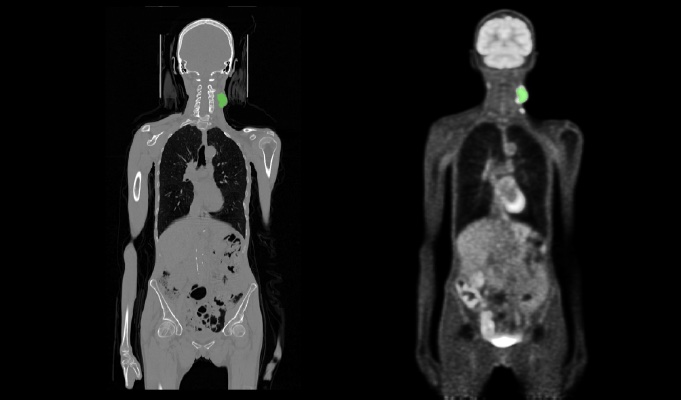

# HECKTOR22


The HECKTOR22 dataset is from MICCAI 2022 challenge **[HEad and NeCK TumOR Segmentation and Outcome Prediction (HECKTOR22)](https://hecktor.grand-challenge.org)**. The solution described here won the 1st place in the HECKTOR22 challenge [(NVAUTO team)](https://hecktor.grand-challenge.org/final-leaderboard/):

Andriy Myronenko, Md Mahfuzur Rahman Siddiquee, Dong Yang, Yufan He and Daguang Xu: "Automated head and neck tumor segmentation from 3D PET/CT". In MICCAI (2022). [arXiv](https://arxiv.org/abs/2209.10809)



## Task overview

The task is to segment 3D Head and Neck (H&N) tumors and lymph nodes classes from a pair of 3D CT and PET images.  The ground truth labels are provided for 524 cases with average 3D CT size of 512x512x200 voxels at 0.98x0.98x3 mm average resolution, and with average 3D PET size of 200x200x200 voxels at 4x4x4 mm. The CT and PET images where rigidly aligned to a common origin, but remain at different sizes and resolutions.


## Auto3DSeg

The HECKTOR22 tutorial is only supported for **SegResNet** algo (since currently it is the only algo with support of multi-resolution input images, such as CT and PET).
Auto3DSeg runs a full workflow including data analysis, and multi-fold training. Please download the dataset into /data/hecktor22 folder first.


### Running based on the input config

The Auto3DSeg can be run using a config **input.yaml**

```bash
python -m monai.apps.auto3dseg AutoRunner run --input='./input.yaml' --algos='segresnet'
```

### Running from python

Alternatively you can also run Auto3DSeg from a python script, where you can customize more options. Please see the comments in **hecktor22.py**
```bash
python hecktor22.py
```


## Validation performance: NVIDIA DGX-1 (8x V100 16G)

The validation results can be obtained by running the training script with MONAI 1.1.0 on NVIDIA DGX-1 with (8x V100 16GB) GPUs. The results below are in terms of **Aggregated Dice**, which was used as the key metric in the challenge [1,2]. The values of the Aggregated Dice slightly differ from a conventional average Dice (which is used by Auto3DSeg by default for all tasks).


| | Fold 0 | Fold 1 | Fold 2 | Fold 3 | Fold 4 | Avg |
|:------:|:------:|:------:|:------:|:------:|:------:|:---:|
| SegResNet | 0.7933 | 0.7862 | 0.7816 |0.8275 | 0.8059 | 0.7989 |


## Data

The HECKTOR22 challenge dataset [2,3] can be downloaded from [here](https://hecktor.grand-challenge.org) after the registration. Each user is responsible for checking the content of the datasets and the applicable licenses and determining if suitable for the intended use. The license for the HECKTOR22 dataset is different than MONAI license.

## References
[1] Andriy Myronenko, Md Mahfuzur Rahman Siddiquee, Dong Yang, Yufan He and Daguang Xu: "Automated head and neck tumor segmentation from 3D PET/CT". In MICCAI (2022). https://arxiv.org/abs/2209.10809

[2] Andrearczyk, V., Oreiller, V., Boughdad, S., Rest, C.C.L., Elhalawani, H., Jreige, M., Prior, J.O., Valli`eres, M., Visvikis, D., Hatt, M., Depeursinge, A.: Overview of the HECKTOR Challenge at MICCAI 2022: Automatic Head and Neck Tumor Segmentation and Outcome Prediction in PET/CT (2023), https://arxiv.org/abs/2201.04138

[3] Oreiller, V., Andrearczyk, V., Jreige, M., Boughdad, S., Elhalawani, H., Castelli, J., Valli`eres, M., Zhu, S., Xie, J., Peng, Y., Iantsen, A., Hatt, M., Yuan, Y., Ma, J., Yang, X., Rao, C., Pai, S., Ghimire, K., Feng, X. Naser, M.A., Fuller, C.D., Yousefirizi, F., Rahmim, A., Chen, H., Wang, L., Prior, J.O., Depeursinge, A.: Head and neck tumor segmentation in PET/CT: The HECKTOR challenge. Medical Image Analysis 77, 102336 (2022)
