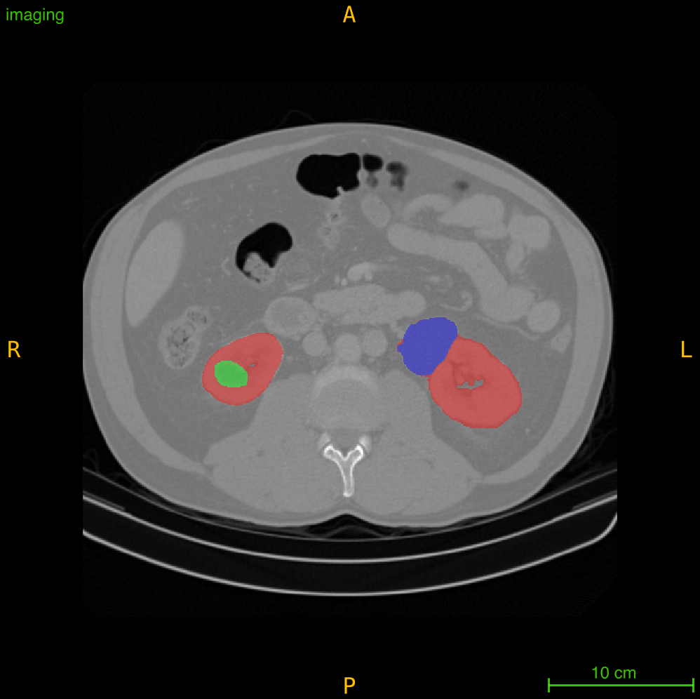

# KiTS23



This tutorial shows how to use Auto3DSeg with KiTS 2023 dataset from the MICCAI 2023 challenge **[The 2023 Kidney and Kidney Tumor Segmentation Challenge (KiTS23)](https://kits-challenge.org/kits23/)**.
The example is based on the 1st place solution in the KiTS challenge [(NVAUTO team)](https://kits-challenge.org/kits23/#kits23-official-results):

Andriy Myronenko, Dong Yang, Yufan He and Daguang Xu: "Automated 3D Segmentation of Kidneys and Tumors in MICCAI KiTS 2023 Challenge". In MICCAI (2023). [arXiv](https://arxiv.org/abs/2310.04110)


## Task overview

The task is to segment kidneys, tumors and cysts from 3D CTs. The dataset contains 489 cases with resolutions ranging between 0.39x0.39x0.5 and 1x1x5 mm.
Please download the KiTS23 [dataset](https://kits-challenge.org/kits23/#) and place it in the "/data/kits23" folder to follow this tutorial.

## Auto3DSeg

With Auto3DSeg most segmentation parameters are automatically determined.  In this tutorial, we start from a basic automated example, then show how different options can be adjusted if necessary.  We use only the  **SegResNet** algo here for simplicity, which is a training recipe based on the [segresnet](https://docs.monai.io/en/latest/networks.html#segresnetds).


### Running based on the input config (one-liner)

The Auto3DSeg can be run using a config **input.yaml**

```bash
python -m monai.apps.auto3dseg AutoRunner run --input=./input.yaml --algos=segresnet
```

This one line of code will run the full training workflow, including data analysis, multi-fold training, ensembling. The system will adjust parameters based on the data and your available GPU (or multi-GPU) hardware configuration.
Here we explicitly specified to use only segresnet algo, for other possible parameters of the AutoRunner please see the [monai docs](https://github.com/Project-MONAI/MONAI/blob/main/monai/apps/auto3dseg/auto_runner.py).

The [input.yaml](./input.yaml) describes the dataset (KiTS23) task, and must include at least 3 mandatory fields: modality (CT), dataset location (here it's /data/kits23) and the dataset manifest json file [kits23_folds.json](./kits23_folds.json).
Other parameters can be also added to the input.yaml config.   For KiTS23 dataset specifically, we include the "class_names" key to indicate label grouping for the 3 output classes that KiTS23 challenge requires (which is something specific for the KiTS task)

### Running from the code

If you prefer running from the code (which will allow more customizations), you can create a python file "example.py" and simply run it as
```bash
python example.py
```
```python
# example.py file content

from monai.apps.auto3dseg import AutoRunner

def main():
    runner = AutoRunner(input='./input.yaml', algos = 'segresnet')
    runner.run()

if __name__ == '__main__':
  main()
```
this is exactly equivalent to the one-liner command line call.

### Running from the code (more options)

AutoRunner class of Auto3DSeg is very flexible, and accepts parameters in various forms. For example instead of providing yaml file location (input.yaml) we can provide a dictionary directly, e.g.

```bash
python example2.py
```
```python
# example2.py file content

from monai.apps.auto3dseg import AutoRunner

def main():

    input_dict = {
      "modality" : "CT",
      "dataroot" : "/data/kits23",
      "datalist" : "kits23_folds.json",
      "sigmoid" : True,
      "class_names":[
          { "name": "kidney_and_mass", "index": [1,2,3] },
          { "name": "mass", "index": [2,3] },
          { "name": "tumor", "index": [2] }
       ]
    }
    runner = AutoRunner(input=input_dict, algos = 'segresnet')
    runner.set_num_fold(1) # to train only 1 fold (instead of 5)
    runner.run()

if __name__ == '__main__':
  main()
```

The dictionary form of the input config is equivalent to the input.yaml. Notice, here we also added "runner.set_num_fold(1)" to train only 1 fold. By default the system determines the number of folds based on the datalist.json file, which is 5 folds in this case, and trains 5 models using cross-validation. However, one can opt to train only 1 model (fold 0), which is much faster if only 1 output model is sufficient.

 ### Input.yaml options

 Regardless if you prefer to use the yaml file or a dictionary config form, you can add many options to override the automatic defaults. For example consider the following input.yaml file.
```yaml
# input2.yaml file content example with more options

# KiTS23 Auto3DSeg user input

modality: CT
dataroot: /data/kits23
datalist: kits23_folds.json
class_names:
  - { name: kidney_and_mass, index: [1,2,3] }
  - { name: mass, index: [2,3] }
  - { name: tumor, index: [2] }
sigmoid: true

# additional options (OPTIONAL)
auto_scale_allowed: false         # disable auto scaling of some parameters to your GPU
num_epochs: 600                   # manually set number of training epochs to 600 (otherwise it's determined automatically)
resample: true                    # explicitly set to resample images to the resample_resolution (for KiTS it's already auto-detected to resample)
resample_resolution: [0.78125, 0.78125, 0.78125] #set the resample resolution manually (the automated default here is 0.78x0.78x1)
roi_size: [336, 336, 336]         # set the cropping ROI size (for this large ROI, you may need a GPU with >40GB capacity), try smaller for your GPU
loss: {_target_: DiceLoss}        # change loss to be pure Dice (default is DiceCELoss)
batch_size: 1                     # batch size is automatically determined according to your GPU, but you can manually set it
augment_mode: ct_ax_1             # change the default augmentation transform sequence to an alternative (with only inplane/axial spatial rotations and scaling)

```
Here we added more optional options to manually fine-tune the performance.   The full list of the available "self-explanatory" options can be found [here](https://github.com/Project-MONAI/research-contributions/blob/main/auto3dseg/algorithm_templates/segresnet/configs/hyper_parameters.yaml).

 ### Input.yaml options and AutoRunner options combined

In the previous sections, we showed how to manually provide various input config options related to **training**.  In the same file, one can also add AutoRunner related options, consider the following input3.yaml config
```yaml
# input3.yaml file content example with more options

# KiTS23 Auto3DSeg user input

modality: CT
dataroot: /data/kits23
datalist: kits23_folds.json
class_names:
  - { name: kidney_and_mass, index: [1,2,3] }
  - { name: mass, index: [2,3] }
  - { name: tumor, index: [2] }
sigmoid: true

# additional options (OPTIONAL)
num_epochs: 600                   # manually set number of training epochs to 600 (otherwise it's determined automatically)

# additional AutoRunner options (OPTIONAL)
algos: segresnet
num_fold: 1
ensemble: false
work_dir: tmp/tutorial_kits23

```
Here we indicated to use only "segresnet" algo, and only 1 fold training, skip ensembling (since we train 1 model anyway), and change the default working directory. We can run it as
```bash
python -m monai.apps.auto3dseg AutoRunner run --input=./input3.yaml
```
One may prefer this format, if they want to put all options in a single file, instead of having training options vs AutoRunner options separatelly. The end results will be the same.

 ### Command line options overrides

 Finally,  the command line form (one-liner) accepts arbitrary number of command line extra options (which will override the ones in the input.yaml file), for instance:
 ```bash
python -m monai.apps.auto3dseg AutoRunner run --input=./input3.yaml --work_dir=tmp/another --dataroot=/myown/kits/location --num_epochs=10
```
here the "work_dir", "dataroot", "num_epochs" options will override any defaults or any input.yaml provided options.

 ### KiTS 2023 specific options

All the configurations here include some KiTS 2023 specific options below
```yaml
class_names:
  - { name: kidney_and_mass, index: [1,2,3] }
  - { name: mass, index: [2,3] }
  - { name: tumor, index: [2] }
sigmoid: true

```
In KiTS 2023 challenge, the task is to segment 3 specific subregions: a) the first one must include all labels (kidneys, tumors, cysts) b) the second one is a union of tumors and cysts b) the third one is a tumor only region.
Thus the "class_names" options indicates which label indices to merge together to create these 3 subregions. The "name" keys are used in Tensorboard for convenience (you can use your own names).
Since, the 3 sub-regions are overlapping the segmentation task is a multi-label task, where each voxel can potentially be assigned to several regions. A common formulation of such task is to use the final network activation a "sigmoid", instead of the default "softmax" for mutually exclusive label classes. The config options "sigmoid: true" explicitly indicates that we are going to use the final sigmoid activation (for the multi-label segmentation). Strictly speaking it's not necessary to add this option here, the system will automatically figure it out after inspecting "class_names" having the overlapping indices.

Experimentally, you can remove these configs (class_names and sigmoid) completely to try a traditional segmentation (multi-class), to segment 3 mutually exclusive regions: a) kidneys without tumors or cysts b) tumors c) cysts. Generally, this is the default workflow for multi-organ segmentation (with non-overlaping classes). This sub-region grouping is just something specific for the KiTS 2023 challenge.

 ### Auto3DSeg code location

Advanced users may want to further build up upon Auto3DSeg code.  Currently the codebase is split in 2 repos: The high level AutoRunner related code is a part of [MONAI core](https://github.com/Project-MONAI/MONAI) and the algo specific code (including segresnet algo code) is part of the [MONAI research contributions](https://github.com/Project-MONAI/research-contributions/tree/main/auto3dseg/algorithm_templates/). Generally, if you would like to use your own network or different augmentation transforms, you would want to modify the segresnet algo code.  Currently, the easiest way to do it is to
 - clone the github repo of MONAI research contributions https://github.com/Project-MONAI/research-contributions or just download the [algorithm_templates](https://github.com/Project-MONAI/research-contributions/tree/main/auto3dseg/algorithm_templates) folder.
 - modify the algo related code, e.g. segmenter.py under segresnet algo
 - point AutoRunner to use your own algorithm_templates folder by setting the "templates_path_or_url" config option

```python
# example4.py file content with custom algo templates code

from monai.apps.auto3dseg import AutoRunner

def main():
    runner = AutoRunner(input='./input.yaml', algos = 'segresnet', templates_path_or_url='/your/location/algorithm_templates')
    runner.run()

if __name__ == '__main__':
  main()
```
or a one-liner comman line:
```bash
python -m monai.apps.auto3dseg AutoRunner run --input=./input.yaml --algos=segresnet --templates_path_or_url=/your/location/algorithm_templates
```


## Validation performance: NVIDIA DGX-1 (8x V100 32G)

Training this KiTS 2023 example on on 8 GPU V100 32GB DGX machine, one can expect to get an average Dice of 0.87-0.88 (for fold 0). The higher end of the accuracy range is obtained if you set the ROI size to larger (e.g. roi_size: [336, 336, 336]), but
this requires a large memory GPU device (such as Nvidia A100). Alternatively you can experiment with training longer, e.g. by setting num_epochs=1200.

## Differences with 1st place KiTS23 solution

The tutorial here is to demonstrate how to use Auto3DSeg in general, with various examples for KiTS23 dataset. It is based on the 1st place KiTS23 solution [1], with the main differences being in [1] the training was done in 2 stages: first the approximate Kidney region was detected (by training a model to segment the foreground), second an ensemble of models were trained to segment the 3 KiTS subregions using the "Kidney subregion" cropped CTs. In this tutorial, we train to segment KiTS subregions directly on the full CT for simplicity (which gives a slightly lower average dice, ~1\%). Another difference is that in [1], the ensemble of several models were trained which included both Segresnet and DiNTS models, whereas in this tutorial we focus only on Segresnet.

## Data

The KiTS23 challenge dataset [2,3] can be downloaded from [here](https://kits-challenge.org/kits23). Each user is responsible for checking the content of the datasets and the applicable licenses and determining if suitable for the intended use. The license for the KiTS23 dataset is different than the MONAI license.


## References
[1] Andriy Myronenko, Dong Yang, Yufan He and Daguang Xu: "Automated 3D Segmentation of Kidneys and Tumors in MICCAI KiTS 2023 Challenge". In MICCAI (2023). https://arxiv.org/abs/2310.04110


[2] Heller, N., Isensee, F., Maier-Hein, K.H., Hou, X., Xie, C., Li, F., Nan, Y., Mu, G., Lin, Z., Han, M., et al.: The state of the art in kidney and kidney tumor segmentation in contrast-enhanced ct imaging: Results of the kits19 challenge. Medical Image Analysis 67, 101821 (2021)

[3] Heller, N., Wood, A., Isensee, F., Radsch, T., Tejpaul, R., Papanikolopoulos, N.,Weight, C.: The 2023 kidney and kidney tumor segmentation challenge, https://kits-challenge.org/kits23/
