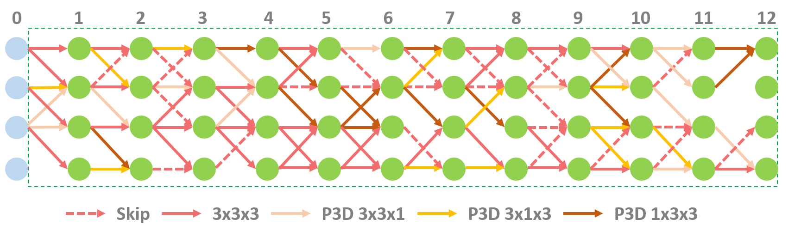
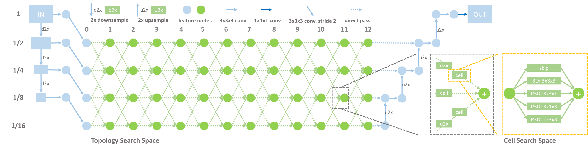
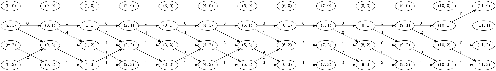
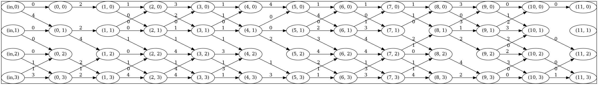
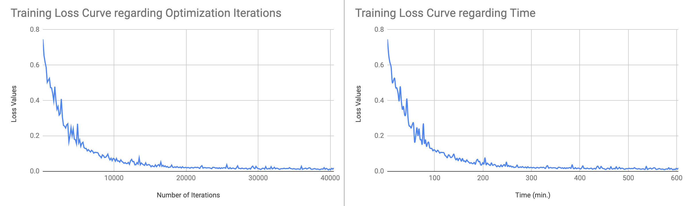
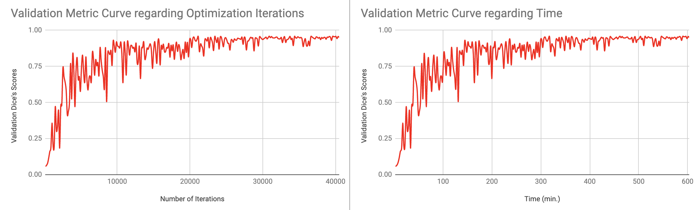

# Examples of DiNTS: Differentiable Neural Network Topology Search

In this tutorial, we present a novel neural architecture search algorithm for 3D medical image segmentation. The datasets used in this tutorial are Task07 Pancreas (CT images) and Task09 Spleen (CT images) from [Medical Segmentation Decathlon](http://medicaldecathlon.com/). The implementation is based on:

Yufan He, Dong Yang, Holger Roth, Can Zhao, Daguang Xu: "[DiNTS: Differentiable Neural Network Topology Search for 3D Medical Image Segmentation.](https://openaccess.thecvf.com/content/CVPR2021/papers/He_DiNTS_Differentiable_Neural_Network_Topology_Search_for_3D_Medical_Image_CVPR_2021_paper.pdf)" In Proceedings of the IEEE/CVF Conference on Computer Vision and Pattern Recognition, pp. 5841-5850. 2021.





## Dependencies and installation
The script is tested with: `Ubuntu 20.04` and  `CUDA 11`

You can use nvidia docker or conda environments to install the dependencies.
- ### Using Docker Image
1. #### Download and install Nvidia PyTorch Docker
```bash
docker pull nvcr.io/nvidia/pytorch:21.10-py3
```
2. #### Download the repository
```bash
git clone https://github.com/Project-MONAI/tutorials.git
```
3. #### Run into Docker
```
sudo docker run -it --gpus all --pid=host --shm-size 16G -v /location/to/tutorials/automl/DiNTS/:/workspace/DiNTS/  nvcr.io/nvidia/pytorch:21.10-py3
```
4. #### Install required package in docker
```bash
bash install.sh
```

- ### Using Conda
1. #### Install Pytorch >= 1.6
```bash
conda install pytorch torchvision torchaudio cudatoolkit=11.3 -c pytorch
```
2. #### Install MONAI and dependencies
```bash
bash install.sh
```
- ### Install [Graphviz](https://graphviz.org/download/) for visualization (needed in decode_plot.py)

## Data
[Spleen CT dataset](https://drive.google.com/drive/folders/1HqEgzS8BV2c7xYNrZdEAnrHk7osJJ--2) and [Pancreas MRI dataset](https://drive.google.com/drive/folders/1HqEgzS8BV2c7xYNrZdEAnrHk7osJJ--2)
from [Medical Segmentation Decathlon](http://medicaldecathlon.com/) is used for this tutorial. You can manually download it and save it to args.root. Or you can use the script `download_msd_datasets.py` to download the MSD datasets of 10 segmentation tasks.
```bash
python download_msd_datasets.py --msd_task "Task07_Pancreas" \
                                --root "/workspace/data_msd"
```

## Examples
The tutorial contains two stages: searching stage and training stage. An architecture is searched and saved into a `.pth` file using `search_dints.py`.
The searched architecture will be loaded by `train_dints.py` and re-trained for spleen segmentation.

Check all possible options:
```bash
cd ./DiNTS/
python search_dints.py -h
python train_dints.py -h
```

### Searching
- Add the following script to the commands of running into docker (optional)
```
-v /your_downloaded_data_root/Task07_Pancreas/:/workspace/data_msd/Task07_Pancreas/
```
- Change ``NUM_GPUS_PER_NODE`` to your number of GPUs.
- Run `bash search_dints.sh`
- Call the function in `decode_plot.py` to visualize the searched model in a vector image (graphvis needs to be installed).
The searched archtecture with ram cost 0.2 and 0.8 are shown below:



### Training
- Add the following script to the commands of running into docker (Optional)
```
-v /your_downloaded_data_root/Task09_Spleen/:/workspace/data_msd/Task09_Spleen/
```
- Change ``ARCH_CKPT`` to point to the architecture file (.pth) from the searching stage.
- Change ``NUM_GPUS_PER_NODE`` to your number of GPUs.
- Run `bash train_dints.sh`

Training loss and validation metric curves are shown as follows. The experiments utilized 8 NVIDIA A100 GPUs.





## Citation
If you use this code in your work, please cite:
```
@inproceedings{he2021dints,
  title={DiNTS: Differentiable Neural Network Topology Search for 3D Medical Image Segmentation},
  author={He, Yufan and Yang, Dong and Roth, Holger and Zhao, Can and Xu, Daguang},
  booktitle={Proceedings of the IEEE/CVF Conference on Computer Vision and Pattern Recognition},
  pages={5841--5850},
  year={2021}
}
```

## Questions and bugs

- For questions relating to the use of MONAI, please use our [Discussions tab](https://github.com/Project-MONAI/MONAI/discussions) on the main repository of MONAI.
- For bugs relating to MONAI functionality, please create an issue on the [main repository](https://github.com/Project-MONAI/MONAI/issues).
- For bugs relating to the running of a tutorial, please create an issue in [this repository](https://github.com/Project-MONAI/Tutorials/issues).
