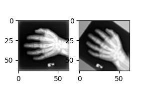

# An example of how to use the bundle config

```bash
python -m monai.bundle run display --config_file example.yaml
```

By running the command within the same directory of this readme file, an example MedNIST dataset (~60MB) will be downloaded
and a PyTorch-style `Dataset` will be created. The yaml config file also specifies the necessary commands to display the first pair of images in the dataset (shown in the figure).

<div>  </div>

More specifically:
- `python -m monai.bundle run` is the command [provided by the `monai.bundle` module](https://docs.monai.io/en/stable/bundle.html#monai.bundle.run). Apart from `run`, there are other actions available, such as `download` and `init_bundle`.
- `display` is a user-defined component name in the `example.yaml` config file.
- `--config_file example.yaml` specifies the config file describing the workflow, `monai.bundle` module supports both yaml and json formats ([syntax quick ref.](https://docs.monai.io/en/stable/config_syntax.html)).

The rest of the readme file will explain how the yaml config file is parsed in detail.

_Pre-requisites_

Installing MONAI (<https://docs.monai.io/en/stable/installation.html>) and basic knowledge of Python and Pytorch.

## Parsing the `example.yaml`

### Import modules

The bundle parser will first evaluate all the import statements such as `import package` and `from package import mod`.

```yaml
imports:
  - $import glob
  - $import matplotlib.pyplot as plt
```

These two statements will be evaluated and the imported modules will be available throughout the config file.
By default, the parser imports `monai`'s modules and `import numpy as np` for you, so you don't need to add them in the config file.

### Running the `display` component

After all the import statements are evaluated, the `display` component defined as follows will be evaluated:

```yaml
display:
  - _requires_: "@downloading"
  - $print("displaying images:")
  - $plt.subplot(1,2,1)
  - $plt.imshow(@first_pair['f_img'][0], cmap="gray")
  - $plt.subplot(1,2,2)
  - $plt.imshow(@first_pair['m_img'][0], cmap="gray")
  - $plt.show()
```

`_requires_` is a special key for the bundle parsing, it specifies the dependencies of the component. In this case, the `display` component requires the `downloading` component to be executed first.

The rest of the keys are the list of commands to be executed. The bundle parser will evaluate the commands in the order they are defined in the config file.

`$` is the prefix for the commands, it tells the parser to evaluate the following string as a Python expression.

The `@` prefix is used to refer to another component. In this case, the `display` component refers to the output of the `first_pair` component, which is a dictionary containing the first pair of images in the dataset.
At the runtime, the `@first_pair` will be replaced by the output of the `first_pair` component.

### Running the `first_pair` component

```yaml
first_pair: $@preprocessing(@paired_dataset[0])
```

The `first_pair` component is a simple Python expression, it refers to calling the `preprocessing` python instance with the first element of `paired_dataset`, which is a dictionary containing the first pair of images in the dataset.

### Defining the `preprocessing` component

```yaml
preprocessing:
  _target_: Compose
  transforms:

    - _target_: LoadImaged
      keys: [f_img, m_img]
      image_only: True

    - _target_: EnsureChannelFirstd
      keys: [f_img, m_img]

    - _target_: ScaleIntensityRanged
      keys: [f_img, m_img]
      a_min: 0.
      a_max: 255.
      b_min: 0.0
      b_max: 1.0

    - _target_: RandRotated
      keys: [m_img]
      range_x: $np.pi/4
      prob: 1.0
      mode: "bicubic"
      keep_size: True

    - _target_: RandZoomd
      keys: [m_img]
      min_zoom: 0.9
      max_zoom: 1.1
      prob: 1.0
      mode: "bicubic"
```

`_target_` is a special key for the bundle parsing, it specifies the class to be instantiated. In this case, the `preprocessing` component is a `Compose` object. `Compose` is resolved to `monai.transforms.Compose` by default, so you don't need to specify the full path.

`transforms` is the first argument to `monai.transforms.Compose`, it specifies the list of transforms to be added to the `Compose` object.

The rest of the keys are the arguments to the transforms. In this case, the `LoadImaged` transform is used to load the images from the file paths, `EnsureChannelFirstd` transform is used to ensure the image data is in channel-first format, `ScaleIntensityRanged` transform is used to scale the image intensity to `[0, 1]`. `RandRotated` transform is used to randomly rotate the moving image, and `RandZoomd` transform is used to randomly zoom the moving image.


_The equivalent Python code of the yaml config file as a comparison_

```py
import glob
import matplotlib.pyplot as plt
import monai
import monai.transforms as mt
import numpy as np

url = "https://github.com/Project-MONAI/MONAI-extra-test-data/releases/download/0.8.1/MedNIST.tar.gz"
monai.apps.utils.download_and_extract(url, './mednist.tar.gz')

dataset_dir = "MedNIST/Hand"
datalist = list(sorted(glob.glob(f"{dataset_dir}/*.jpeg")))
paired_dataset = [{"f_img": item, "m_img": item} for item in datalist]

preprocessing = mt.Compose(
    [
        mt.LoadImaged(keys=("f_img", "m_img"), image_only=True),
        mt.EnsureChannelFirstd(keys=("f_img", "m_img")),
        mt.ScaleIntensityRanged(
            keys=("f_img", "m_img"), a_min=0.0, a_max=255.0, b_min=0.0, b_max=1.0
        ),
        mt.RandRotated(
            keys=["m_img"], range_x=np.pi / 4, prob=1.0, mode="bicubic", keep_size=True
        ),
        mt.RandZoomd(keys=["m_img"], min_zoom=0.9, max_zoom=1.1, prob=1.0, mode="bicubic"),
    ]
)

first_pair = preprocessing(paired_dataset[0])
print("displaying images:")
plt.subplot(1, 2, 1)
plt.imshow(first_pair["f_img"][0], cmap="gray")
plt.subplot(1, 2, 2)
plt.imshow(first_pair["m_img"][0], cmap="gray")
plt.show()

```

## Topics not covered but possible in the config

- Running customized Python components (made available on the `PYTHONPATH`, more examples [in the model_zoo](https://github.com/Project-MONAI/model-zoo)).
- Overriding the component in `example.yaml` using, for example, `--id=new_value` in the command line.
- Multiple configuration files and cross-file references.
- Replacing in terms of plain texts instead of Python objects ([tutorial](https://github.com/Project-MONAI/tutorials/blob/main/bundle/get_started.ipynb)).
- The debugging mode to investigate the intermediate variables and results.
