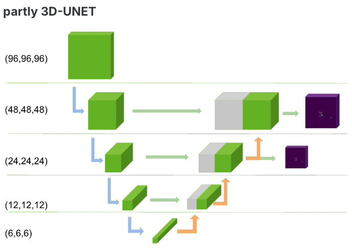

## Introduction

This tutorial illustrates how to use MONAI for cryo electron tomography. The pipeline and models were partly used to win the [Cryo-ET competition on kaggle](https://www.kaggle.com/competitions/czii-cryo-et-object-identification/overview). The tutorial was tested with nvidia/pytorch:24.08-py3 docker container and a single A100 GPU.

## What is Cryo-ET?

If you ask ChatGPT:

Cryo-ET (Cryo-Electron Tomography) is an advanced imaging technique that allows scientists to visualize biological structures in near-native states at high resolution. It combines cryogenic sample preservation with electron tomography to generate three-dimensional (3D) reconstructions of cellular structures, protein complexes, and organelles.

### How It Works
1. Cryo-Fixation: The sample (e.g., a cell or a purified macromolecular complex) is rapidly frozen using liquid ethane or similar methods to prevent ice crystal formation, preserving its natural state.
2. Electron Microscopy: The frozen sample is placed under a transmission electron microscope (TEM), where images are taken from multiple angles by tilting the sample.
3. Tomographic Reconstruction: Computational algorithms combine these 2D images to create a detailed 3D model of the structure.

### Applications
Studying cellular architecture at nanometer resolution.
Visualizing macromolecular complexes in their native environments.
Understanding interactions between viruses and host cells.
Investigating neurodegenerative diseases, cancer, and infectious diseases.
Cryo-ET is particularly powerful because it enables direct imaging of biological systems without the need for staining or chemical fixation, preserving their native conformation.

## Requirements

- docker
- git
- kaggle API credentials

# Running the tutorial

1. Download the tutorial code from the ProjectMONAI repository.

```bash
git clone https://github.com/Project-MONAI/tutorials.git
cd tutorials/competitions/kaggle/Cryo-ET/1st_place_solution/
```

2. Run container to start the tutorial.

```bash
docker run --gpus all --ipc=host --ulimit memlock=-1 --ulimit stack=67108864 -v $PWD:/workspace/ -it nvcr.io/nvidia/pytorch:24.08-py3 /bin/bash
```

if you want to use the kaggle API to download the data, you need to mount your kaggle.json file into the container. You can do this by adding the following flag to the docker run command:

```bash
docker run --gpus all --ipc=host --ulimit memlock=-1 --ulimit stack=67108864 -v $PWD:/workspace/ -v $HOME/.config/kaggle/:/root/.kaggle -it nvcr.io/nvidia/pytorch:24.08-py3 /bin/bash
```

3. Install necessary additional pip packages inside the container by running the following command on the prompt you get after running the previous command:


```bash
pip install -r requirements.txt
```

4. Download the data

This tutorial is build upon the official Cryo ET competition data.
It can be downloaded to a local ```DATA_FOLDER``` directly from kaggle (You will also need to follow the competition url and click "join competition" to accept the terms and conditions): https://www.kaggle.com/competitions/czii-cryo-et-object-identification/data .

Alternativly it can be downloaded using the kaggle API (which can be installed via ```pip install kaggle```). If you decide to use the Kaggle API you need to create a Kaggle account and configure your token as described [here](https://github.com/Kaggle/kaggle-api/blob/main/docs/README.md#api-credentials) and then be allowed to download the data with the following command:

```bash
export DATA_FOLDER=$PWD/data
mkdir -p $DATA_FOLDER
kaggle competitions download -c czii-cryo-et-object-identification -p $DATA_FOLDER
```

Unzip the competition dataset to DATA_FOLDER

```bash
cd $DATA_FOLDER
unzip czii-cryo-et-object-identification.zip -d czii-cryo-et-object-identification/
```

If you change the DATA_FOLDER location, have to adjust path to the `cfg.data_folder` data at `configs/common_config.py`.

## Training models

For the competition we created a cross-validation scheme by simply simply splitting the 7 training tomographs into 7 folds. I.e. we train on 6 tomographs and use the 7th as validation.
For convenience we provide a file ```train_folded_v1.csv``` which contains the original training annotations and was also extended by a column containing fold_ids.

We solve the competition with a 3D-segmentation approach leveraging [MONAI's FlexibleUNet](https://docs.monai.io/en/stable/networks.html#flexibleunet) architecture. Compared to the original implementation we adjusted the network to output more featuremap and enable deep-supervision. The following illustrates the resulting architecture at a high level:

<p align="center">
  

We provide three different configurations which differ only in the used backbone and output feature maps. The configuration files are .py files and located under ```configs``` and share all other hyper-parameters. Each hyperparameter can be overwriten by adding a flag to the training command. To train a resnet34 version of our segmentation model simply run

```bash
export RESULTS=$PWD/results
mkdir -p $RESULTS
python train.py -C cfg_resnet34 --output_dir $RESULTS
```

This will save checkpoints under the specified $RESULTS when training is finished.
By default models are trained using bfloat16 which requires a GPU capable of that. Alternatively you can set ```cfg.bf16=False``` or overwrite as flag ```--bf16 False``` when running ```train.py ```.

### Replicating 1st place solution (segmentation part)

To train checkpoints necessary for replicating the segmentation part of the 1st place solution run training of 2x fullfits for each model. Thereby ```cfg.fold = -1``` results in training on all data, and using ```fold 0``` as validation.
```
python train.py -C cfg_resnet34 --fold -1
python train.py -C cfg_resnet34 --fold -1
python train.py -C cfg_resnet34_ds --fold -1
python train.py -C cfg_resnet34_ds --fold -1
python train.py -C cfg_effnetb3 --fold -1
python train.py -C cfg_effnetb3 --fold -1
```

## Inference

Inference after models are converted with torch jit is shown in our 1st place submission kaggle kernel.

https://www.kaggle.com/code/christofhenkel/cryo-et-1st-place-solution?scriptVersionId=223259615
