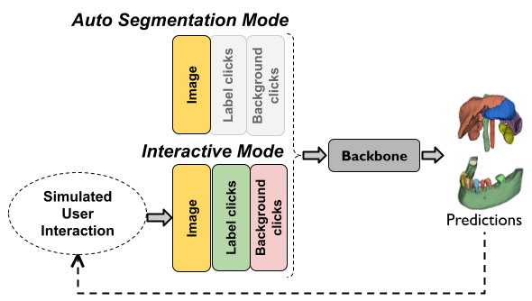

# DeepEdit Examples

This folder contains an example to train and test a DeepEdit model. It also has notebooks to run inference over a pre-trained model.

<p align="center">
  


### 1. Data

A DeepEdit model could be trained on any 3D medical image dataset.

For this tutorial we used the public available dataset (Task09_Spleen) that can be downloaded from [Medical Segmentation Decathlon](https://drive.google.com/drive/folders/1HqEgzS8BV2c7xYNrZdEAnrHk7osJJ--2)

### 2. Questions and bugs

- For questions relating to the use of MONAI, please us our [Discussions tab](https://github.com/Project-MONAI/MONAI/discussions) on the main repository of MONAI.

- For bugs relating to MONAI functionality, please create an issue on the [main repository](https://github.com/Project-MONAI/MONAI/issues).

- For bugs relating to the running of a tutorial, please create an issue in [this repository](https://github.com/Project-MONAI/Tutorials/issues).

### 3. List of notebooks and examples

#### Prepare Your Data

- Download the Task09_Spleen zip file
- Decompressed the file
- Write the full path in the **input** flag in the [train file](./train.py)


#### [DeepEdit Training](./train.py)

This is an extension for [train.py](./train.py) that redefines basic default arguments to run 3D training.

```bash
# Run to know all possible options
python ./train.py -h

# Train a DeepEdit model
python ./train_3d.py
    --input       deepedit/Task09_Spleen \
    --output      deepedit_model/ \
    --epochs      100

# After training to export/save as torch script model
python ./train.py
    --input       deepedit_model/model.pt \
    --output      deepedit_model/model.ts \
    --export      true
```

#### [DeepEdit Inference](./inference.ipynb)

This notebook helps to run any pre-transforms before running inference over a DeepEdit single label model.
It also helps to run post-transforms to get the final label mask.


#### DeepEdit Stats

By-default Tensorboard handlers are added as part of training/validation steps.
