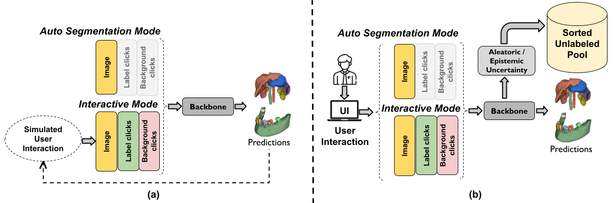

# DeepEdit


DeepEdit is a method that combines an automatic and a semi-automatic approach for 3D medical images into a
single deep learning-based model. DeepEdit has three working modes: first, it can be used in click-free
inference mode (similar to a regular segmentation network), providing fully-automatic segmentation predictions which
can be used as a form of initialisation; second, it allows users to provide clicks to initialise and guide
a semi-automatic segmentation model; lastly, given an initial segmentation, DeepEdit can be used to refine
and improve the initial prediction by providing editing clicks. DeepEdit training process is similar to the algorithm
proposed by **_Sakinis et al._** [DeepGrow](../../deepgrow/ignite) - Gaussian-smoothed clicks for all labels and background
are generated and added as input to the backbone CNN, but removes the minimum-click limitation of DeepGrow.
Contrary to DeepGrow, DeepEdit model allows the prediction of an automatic segmentation-based
initialisation without user-provided clicks, which can then be further edited by providing clicks. Additionally,
DeepEdit can also be used for multi-label segmentation problems, allowing the user to generate/segment
all labels simultaneously instead of one label at a time.

This tutorial contains an example to train a DeepEdit model and a notebook to run inference
over a pre-trained model. The train file reads images and labels folders (imagesTr, labelsTr) as they come in the
[Medical Segmentation Decathlon](https://msd-for-monai.s3-us-west-2.amazonaws.com/Task09_Spleen.tar).

More information about the transforms used in DeepEdit are also in the Notebook.

**_Important note:_**

This tutorial is intended to show how to train and test a DeepEdit model in MONAI Core library. Users may also find interesting
DeepEdit model working in [MONAI Label](https://github.com/Project-MONAI/MONAILabel/tree/main/sample-apps/radiology#deepedit)
platform. There you can find how DeepEdit works along with 3D Slicer and/or OHIF.

<p align="center">
  
</p>

**_Sakinis et al.,_** Interactive segmentation of medical images through
fully convolutional neural networks. (2019) https://arxiv.org/abs/1903.08205

### 1. Data

A DeepEdit model could be trained on any 3D medical image dataset.

For this tutorial we used the public available dataset (Task09_Spleen) that can be downloaded from [Medical Segmentation Decathlon](https://drive.google.com/drive/folders/1HqEgzS8BV2c7xYNrZdEAnrHk7osJJ--2)

### 2. Questions and bugs

- For questions relating to the use of MONAI, please us our [Discussions tab](https://github.com/Project-MONAI/MONAI/discussions) on the main repository of MONAI.

- For bugs relating to MONAI functionality, please create an issue on the [main repository](https://github.com/Project-MONAI/MONAI/issues).

- For bugs relating to the running of a tutorial, please create an issue in [this repository](https://github.com/Project-MONAI/Tutorials/issues).

### 3. List of notebooks and examples

#### Prepare Your Data

- Download the Task09_Spleen zip file
- Decompressed the file
- Write the full path in the **input** flag in the [train file](./train.py)


#### [DeepEdit Training](./train.py)

This is an extension for [train.py](./train.py) that redefines basic default arguments to run 3D training.

```bash
# Run to know all possible options
python ./train.py -h

# Train a DeepEdit model
python ./train_3d.py
    --input       deepedit/Task09_Spleen \
    --output      deepedit_model/ \
    --epochs      100

# After training to export/save as torch script model
python ./train.py
    --input       deepedit_model/model.pt \
    --output      deepedit_model/model.ts \
    --export      true
```

#### [DeepEdit Inference](./inference.ipynb)

This notebook helps to run any pre-transforms before running inference over a DeepEdit single label model.
It also helps to run post-transforms to get the final label mask.


#### DeepEdit Stats

By-default Tensorboard handlers are added as part of training/validation steps.
