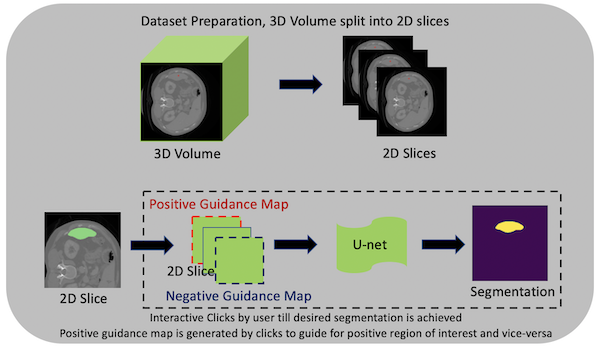

# Deepgrow Examples
This folder contains examples to run train and validate a deepgrow 2D/3D model.
It also has notebooks to run inference over trained model.
<p align="center">
  

implementation based on:

Sakinis et al., Interactive segmentation of medical images through
fully convolutional neural networks. (2019) https://arxiv.org/abs/1903.08205

### 1. Data

Training a deepgrow model requires data. Some public available datasets which are used in the examples can be downloaded from [Medical Segmentation Decathlon](https://drive.google.com/drive/folders/1HqEgzS8BV2c7xYNrZdEAnrHk7osJJ--2) or [Synapse](https://www.synapse.org/#!Synapse:syn3193805/wiki/217789).

### 2. Questions and bugs

- For questions relating to the use of MONAI, please us our [Discussions tab](https://github.com/Project-MONAI/MONAI/discussions) on the main repository of MONAI.
- For bugs relating to MONAI functionality, please create an issue on the [main repository](https://github.com/Project-MONAI/MONAI/issues).
- For bugs relating to the running of a tutorial, please create an issue in [this repository](https://github.com/Project-MONAI/Tutorials/issues).

### 3. List of notebooks and examples
#### [Prepare Your Data](./prepare_dataset.py)
This example is a standard PyTorch program and helps user to prepare training input for 2D or 3D.

```bash
# Run to know all possible options
python ./prepare_dataset.py -h

# Prepare dataset to train a 2D Deepgrow model
python ./prepare_dataset.py
    --dimensions   2 \
    --dataset_root MSD_Task09_Spleen \
    --dataset_json MSD_Task09_Spleen/dataset.json \
    --output       deepgrow/2D/MSD_Task09_Spleen

# Prepare dataset to train a 3D Deepgrow model
python ./prepare_dataset.py
    --dimensions   3 \
    --dataset_root MSD_Task09_Spleen \
    --dataset_json MSD_Task09_Spleen/dataset.json \
    --output       deepgrow/3D/MSD_Task09_Spleen
```

#### [Deepgrow 2D Training](./train.py)
This example is a standard PyTorch program and helps user to run training over pre-processed dataset for 2D.
```bash
# Run to know all possible options
python ./train.py -h

# Train a 2D Deepgrow model on single-gpu
python ./train.py
    --input       deepgrow/2D/MSD_Task09_Spleen/dataset.json \
    --output      models/2D \
    --epochs      50

# Train a 2D Deepgrow model on multi-gpu (NVIDIA)
python -m torch.distributed.launch \
    --nproc_per_node=`nvidia-smi -L | wc -l` \
    --nnodes=1 \
    --node_rank=0 \
    --master_addr="localhost" \
    --master_port=1234 \
    -m train \
    --multi_gpu true \
    --input       deepgrow/2D/MSD_Task09_Spleen/dataset.json \
    --output      models/2D \
    --epochs      50

# After training to export/save as torch script model
python ./train.py
    --input       models/2D/model.pt \
    --output      models/2D/model.ts \
    --export      true
```

#### [Deepgrow 2D Validation](./validate.py)
This example is a standard PyTorch program and helps user to run evaluation for a trained 2D model.
```bash
# Run to know all possible options
python ./validate.py -h

# Evaluate a 2D Deepgrow model
python ./validate.py
    --input       deepgrow/2D/MSD_Task09_Spleen/dataset.json \
    --output      eval/2D \
    --model_path  models/2D/model.pt
```

#### [Deepgrow 2D Inference](./inference.ipynb)
This notebook helps to run pre-transforms before running inference over a Deepgrow 2D model.
It also helps to run post-transforms to get the final label mask.


#### [Deepgrow 3D Training](./train_3d.py)
This is an extension for [train.py](./train.py) that redefines basic default arguments to run 3D training.
```bash
# Run to know all possible options
python ./train_3d.py -h

# Train a 3D Deepgrow model on single-gpu
python ./train_3d.py
    --input       deepgrow/3D/MSD_Task09_Spleen/dataset.json \
    --output      models/3D \
    --epochs      100

# Train a 3D Deepgrow model on multi-gpu (NVIDIA)
python -m torch.distributed.launch \
    --nproc_per_node=`nvidia-smi -L | wc -l` \
    --nnodes=1 \
    --node_rank=0 \
    --master_addr="localhost" \
    --master_port=1234 \
    -m train_3d \
    --multi_gpu true \
    --input       deepgrow/3D/MSD_Task09_Spleen/dataset.json \
    --output      models/3D \
    --epochs      100

# After training to export/save as torch script model
python ./train_3d.py
    --input       models/3D/model.pt \
    --output      models/3D/model.ts \
    --export      true
```

#### [Deepgrow 3D Validation](./validate_3d.py)
This is an extension for [validate.py](./validate.py) that redefines basic default arguments to run 3D validation.
```bash
# Run to know all possible options
python ./validate_3d.py -h

# Evaluate a 3D Deepgrow model
python ./validate_3d.py
    --input       deepgrow/3D/MSD_Task09_Spleen/dataset.json \
    --output      eval/3D \
    --model_path  models/3D/model.pt
```

#### [Deepgrow 3D Inference](./inference_3d.ipynb)
This notebook helps to run any pre-transforms before running inference over a Deepgrow 3D model.
It also helps to run post-transforms to get the final label mask.


#### [Deepgrow Stats](./handler.py)
It contains basic ignite handler to capture region/organ-wise statistics, save snapshots, outputs while running train/validation over a dataset that has multi-label mask.
By-default the handler is added as part of training/validation steps.


