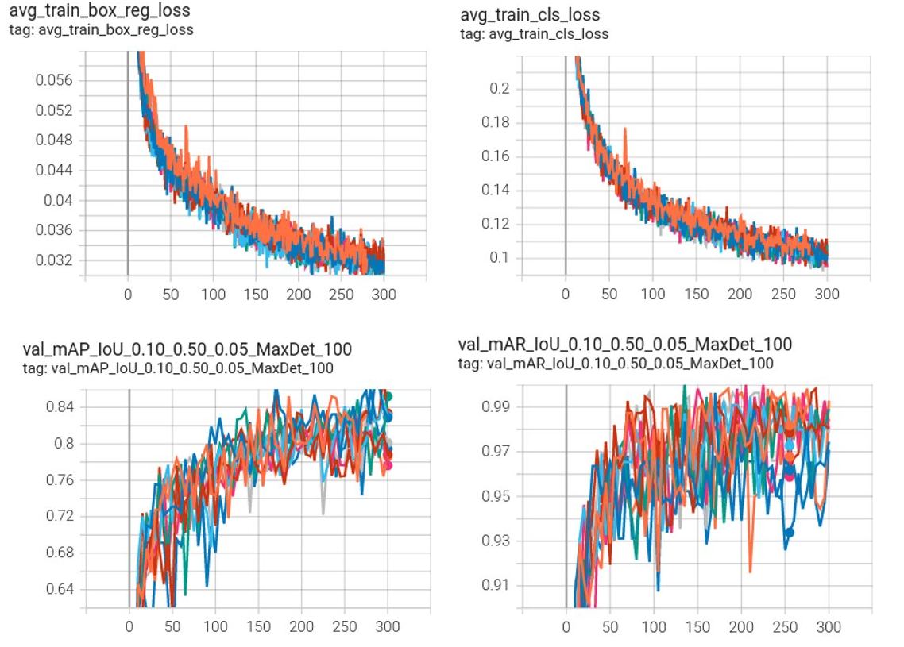

# Detection Example
This folder contains an example to train and validate a 3D detection RetinaNet model.
The workflow of MONAI detection module is shown in the following figure.
<p align="center">
  

MONAI detection implementation is based on the following papers:

[**RetinaNet:** Lin, Tsung-Yi, et al. "Focal loss for dense object detection." ICCV 2017.](https://arxiv.org/abs/1708.02002)

[**Implementation details:** Baumgartner and Jaeger et al. "nnDetection: A self-configuring method for medical object detection." MICCAI 2021.](https://arxiv.org/pdf/2106.00817.pdf)

[**ATSS Matcher:** Zhang, Shifeng, et al. "Bridging the gap between anchor-based and anchor-free detection via adaptive training sample selection." CVPR 2020.](https://openaccess.thecvf.com/content_CVPR_2020/papers/Zhang_Bridging_the_Gap_Between_Anchor-Based_and_Anchor-Free_Detection_via_Adaptive_CVPR_2020_paper.pdf)

### 1. Data

The dataset we are experimenting with in this example is [LUNA16](https://luna16.grand-challenge.org/Home/), which is based on [LIDC/IDRI database](https://wiki.cancerimagingarchive.net/pages/viewpage.action?pageId=1966254) [1,2,3].

LUNA16 is a public dataset of CT lung nodule detection. Using raw CT scans, the goal is to identify locations of possible nodules and to assign a probability for being a nodule to each location.

Disclaimer: We are not the host of the data. Please make sure to read the requirements and usage policies of the data and give credit to the authors of the dataset! We acknowledge the National Cancer Institute and the Foundation for the National Institutes of Health, and their critical role in the creation of the free publicly available LIDC/IDRI Database used in this study.

We follow the official 10-fold data splitting from the LUNA16 challenge and generate data-split JSON files using the script from [nnDetection](https://github.com/MIC-DKFZ/nnDetection/blob/main/projects/Task016_Luna/scripts/prepare.py).
The resulting JSON files can be downloaded from this [link](https://github.com/Project-MONAI/MONAI-extra-test-data/releases/download/0.8.1/LUNA16_datasplit-20220615T233840Z-001.zip).
In these files, the values of "box" are the ground truth boxes in world coordinates.

### 2. Questions and bugs

- For questions relating to the use of MONAI, please use our [Discussions tab](https://github.com/Project-MONAI/MONAI/discussions) on the main repository of MONAI.
- For bugs relating to MONAI functionality, please create an issue on the [main repository](https://github.com/Project-MONAI/MONAI/issues).
- For bugs relating to the running of a tutorial, please create an issue in [this repository](https://github.com/Project-MONAI/Tutorials/issues).

### 3. Run the example
#### 3.0 Setup environment
```bash
pip install -r requirements.txt
```

#### [3.1 Prepare Your Data](./luna16_prepare_images.py)
We provide [resampled Nifti images](https://drive.google.com/drive/folders/1JozrufA1VIZWJIc5A1EMV3J4CNCYovKK?usp=share_link) for users to download (recommended).
If you do this, please open [luna16_prepare_env_files.py](luna16_prepare_env_files.py), change the value of "raw_data_base_dir" and "resampled_data_base_dir" to the directory where you store the downloaded images, and the value of "downloaded_datasplit_dir" to where you downloaded the data split json files.

Then run the following command and go directly to Sec. 3.2.
```bash
python3 luna16_prepare_env_files.py
```

Alternatively, you can download the original data and resample them by yourself with the following steps. Users can either download 1) mhd/raw data from [LUNA16](https://luna16.grand-challenge.org/Home/) or its [copy](https://drive.google.com/drive/folders/1-enN4eNEnKmjltevKg3W2V-Aj0nriQWE?usp=share_link), or 2) DICOM data from [LIDC-IDRI](https://wiki.cancerimagingarchive.net/pages/viewpage.action?pageId=1966254) with [NBIA Data Retriever](https://wiki.cancerimagingarchive.net/display/NBIA/Downloading+TCIA+Images).

The raw CT images in LUNA16 have various voxel sizes. The first step is to resample them to the same voxel size, which is defined in the value of "spacing" in [./config/config_train_luna16_16g.json](./config/config_train_luna16_16g.json).

Then, please open [luna16_prepare_env_files.py](luna16_prepare_env_files.py), change the value of "raw_data_base_dir" to the directory where you store the downloaded images, the value of "downloaded_datasplit_dir" to where you downloaded the data-split JSON files, and the value of "resampled_data_base_dir" to the target directory where you will save the resampled images. If you are using DICOM data, please also provide path to "dicom_meta_data_csv" which can be found in the downloaded folder from LIDC-IDRI.

If you downloaded mhd/raw data, please resample the images by running
```bash
python3 luna16_prepare_env_files.py
python3 luna16_prepare_images.py -c ./config/config_train_luna16_16g.json
```

If you downloaded DICOM data, please resample the images by running
```bash
python3 luna16_prepare_env_files.py
python3 luna16_prepare_images_dicom.py -c ./config/config_train_luna16_16g.json
```
Note that for DICOM data, the data split json files are based on data downloaded with [NBIA Data Retriever](https://wiki.cancerimagingarchive.net/display/NBIA/Downloading+TCIA+Images).

The resampled images will be with Nifti format. The number of resampled images will be less than the original images, this is because LUNA16 annotation includes only nodules >= 3 mm accepted by at least 3 out of 4 radiologists, and excluded the images without such nodules.


#### [3.2 3D Detection Training](./luna16_training.py)

The LUNA16 dataset was split into 10-fold to run cross-fold training and inference.

Taking fold 0 as an example, run:
```bash
python3 luna16_training.py \
    -e ./config/environment_luna16_fold0.json \
    -c ./config/config_train_luna16_16g.json
```

This python script uses batch size and patch size defined in [./config/config_train_luna16_16g.json](./config/config_train_luna16_16g.json), which works for a 16G GPU.
If you have a different GPU memory size, please change "batch_size", "patch_size", and "val_patch_size" to fit the GPU you use.

For fold i, please run
```bash
python3 luna16_training.py \
    -e ./config/environment_luna16_fold${i}.json \
    -c ./config/config_train_luna16_16g.json
```
If you are tuning hyper-parameters, please also add `--verbose` flag.
Details about matched anchors during training will be printed out.

For each fold, 95% of the training data is used for training, while the rest 5% is used for validation and model selection.
The training and validation curves for 300 epochs of 10 folds are shown below. The upper row shows the training losses for box regression and classification. The bottom row shows the validation mAP and mAR for IoU ranging from 0.1 to 0.5.
<p align="center">
  

With a single DGX1V 16G GPU, it took around 55 hours to train 300 epochs for each data fold.

#### [3.3 3D Detection Inference](./luna16_testing.py)

If you have a different GPU memory size than 16G, please maximize "val_patch_size" in [./config/config_train_luna16_16g.json](./config/config_train_luna16_16g.json) to fit the GPU you use.

For fold i, please run
```bash
python3 luna16_testing.py \
    -e ./config/environment_luna16_fold${i}.json \
    -c ./config/config_train_luna16_16g.json
```

#### [3.4 LUNA16 Detection Evaluation](./run_luna16_offical_eval.sh)
Please download the official LUNA16 evaluation scripts from https://luna16.grand-challenge.org/Evaluation/,
and save it as ./evaluation_luna16. Note that the official LUNA16 evaluation scripts are based on python2.

To run it with python3, please 1) copy the files in ./evaluationScript_py3_update to replace the files in downloaded scripts in ./evaluation_luna16; 2) then run the following command to convert python2 code to python3 code: `python -m pip install future; futurize --stage1 -w evaluation_luna16/noduleCADEvaluationLUNA16.py; futurize --stage2 -w evaluation_luna16/noduleCADEvaluationLUNA16.py`;
3) In ./evaluation_luna16/noduleCADEvaluationLUNA16.py, replace `plt.xscale('log', basex=2)` with `plt.xscale('log', base=2)`.

./evaluation_luna16/noduleCADEvaluationLUNA16.py will be the main python script to generate evaluation scores.

To run evaluation, please first make sure the 10 resulted json files result_luna16_fold{i}.json are in ./result folder.
Then run:
```bash
./run_luna16_offical_eval.sh
```

This bash script first combines the 10 result JSON files from 10 folds into one CSV file,
then runs the official LUNA16 evaluation scripts saved in ./evaluation_luna16.

The evaluation scores will be stored in ./result/eval_luna16_scores

We got FROC result as shown in the table below. It is comparable with the result in [nnDetection](https://arxiv.org/pdf/2106.00817.pdf) Table 2.

| Methods             | 1/8   | 1/4   | 1/2   | 1     | 2     | 4     | 8     |
| :---:               | :---: | :---: | :---: | :---: | :---: | :---: | :---: |
| [Liu et al. (2019)](https://arxiv.org/pdf/1906.03467.pdf)   | **0.848** | 0.876 | 0.905 | 0.933 | 0.943 | 0.957 | 0.970 |
| [nnDetection (2021)](https://arxiv.org/pdf/2106.00817.pdf)  | 0.812 | **0.885** | 0.927 | 0.950 | 0.969 | 0.979 | 0.985 |
| MONAI detection     | 0.835 | **0.885** | **0.931** | **0.957** | **0.974** | **0.983** | **0.988** |

<center> Table 1. The FROC sensitivity values at the predefined false positive per scan thresholds of the LUNA16 challenge.</center>


#### 3.5 Comparison to nnDetection
This MONAI example uses similar training and inference workflows as [nnDetection](https://github.com/MIC-DKFZ/nnDetection) LUNA16, with the same hyper-parameters and data augmentation pipeline.

The major differences are as follows:
- We use a different learning rate scheduler than nnDetection.
- We train 300 epochs (around 150k iterations), while nnDetection trains 125k iterations.
- During training, we run validation with 5% of the training data and save the best model, while nnDetection directly saves the model from the last iteration for inference.
- When the input image is too large to fit in the GPU memory, the inference is performed on patches. We do sliding window aggregation on the predicted class logits and box regression, while nnDetection uses a different aggregation strategy from [Jaeger et al.](http://proceedings.mlr.press/v116/jaeger20a/jaeger20a.pdf).


Other differences that may have a minor impact on the performance:
- We use different network architectures. We use [RetinaNet](https://arxiv.org/abs/1708.02002) with ResNet as a backbone, while nnDetection uses [RetinaUnet](http://proceedings.mlr.press/v116/jaeger20a/jaeger20a.pdf) with U-net as backbone.
- We directly apply the trained model to the images/patches during inference, while nnDetection uses mirror aggregation by applying the trained model to the images/patches flipped in three axes and averaging the flipped-back results.
- We read in boxes from data loader and do data augmentation on boxes. nnDetection, on the other hand, reads in image masks with ellipsoid as foreground and does data augmentation on masks, then convert the masks to boxes to train the network.


### Acknowledgement
We greatly appreciate Michael Baumgartner, one of the main contributors of [nnDetection](https://github.com/MIC-DKFZ/nnDetection) project, for his vital cooperation and help in ensuring the successful completion of this MONAI detection module.

### Reference
[1] [Armato III, S. G., McLennan, G., Bidaut, L., McNitt-Gray, M. F., Meyer, C. R., Reeves, A. P., Zhao, B., Aberle, D. R., Henschke, C. I., Hoffman, E. A., Kazerooni, E. A., MacMahon, H., Van Beek, E. J. R., Yankelevitz, D., Biancardi, A. M., Bland, P. H., Brown, M. S., Engelmann, R. M., Laderach, G. E., Max, D., Pais, R. C. , Qing, D. P. Y. , Roberts, R. Y., Smith, A. R., Starkey, A., Batra, P., Caligiuri, P., Farooqi, A., Gladish, G. W., Jude, C. M., Munden, R. F., Petkovska, I., Quint, L. E., Schwartz, L. H., Sundaram, B., Dodd, L. E., Fenimore, C., Gur, D., Petrick, N., Freymann, J., Kirby, J., Hughes, B., Casteele, A. V., Gupte, S., Sallam, M., Heath, M. D., Kuhn, M. H., Dharaiya, E., Burns, R., Fryd, D. S., Salganicoff, M., Anand, V., Shreter, U., Vastagh, S., Croft, B. Y., Clarke, L. P. (2015). Data From LIDC-IDRI [Data set]. The Cancer Imaging Archive.](https://doi.org/10.7937/K9/TCIA.2015.LO9QL9SX)

[2] [Armato SG 3rd, McLennan G, Bidaut L, McNitt-Gray MF, Meyer CR, Reeves AP, Zhao B, Aberle DR, Henschke CI, Hoffman EA, Kazerooni EA, MacMahon H, Van Beeke EJ, Yankelevitz D, Biancardi AM, Bland PH, Brown MS, Engelmann RM, Laderach GE, Max D, Pais RC, Qing DP, Roberts RY, Smith AR, Starkey A, Batrah P, Caligiuri P, Farooqi A, Gladish GW, Jude CM, Munden RF, Petkovska I, Quint LE, Schwartz LH, Sundaram B, Dodd LE, Fenimore C, Gur D, Petrick N, Freymann J, Kirby J, Hughes B, Casteele AV, Gupte S, Sallamm M, Heath MD, Kuhn MH, Dharaiya E, Burns R, Fryd DS, Salganicoff M, Anand V, Shreter U, Vastagh S, Croft BY.  The Lung Image Database Consortium (LIDC) and Image Database Resource Initiative (IDRI): A completed reference database of lung nodules on CT scans. Medical Physics, 38: 915--931, 2011.](https://doi.org/10.1118/1.3528204)

[3] [Clark, K., Vendt, B., Smith, K., Freymann, J., Kirby, J., Koppel, P., Moore, S., Phillips, S., Maffitt, D., Pringle, M., Tarbox, L., & Prior, F. (2013). The Cancer Imaging Archive (TCIA): Maintaining and Operating a Public Information Repository. Journal of Digital Imaging, 26(6), 1045–1057.](https://doi.org/10.1007/s10278-013-9622-7)
