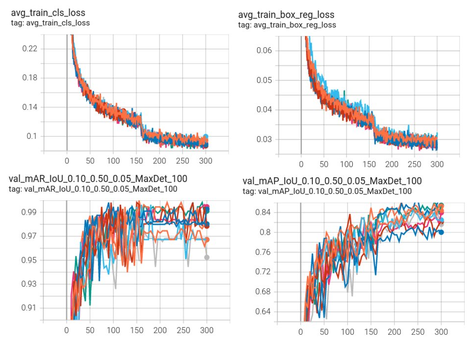

# Detection Example
This folder contains an example to run train and validate a 3D detection RetinaNet model.
The workflow of MONAI detection module is shown in the following figure.
<p align="center">
  

MONAI detection implementation is based on the following papers:

**RetinaNet:** Lin, Tsung-Yi, et al. "Focal loss for dense object detection." ICCV 2017. https://arxiv.org/abs/1708.02002

**Implementation details:** Baumgartner, Michael, et al. "nnDetection: A self-configuring method for medical object detection." MICCAI 2021. https://arxiv.org/pdf/2106.00817.pdf

**ATSS Matcher:** Zhang, Shifeng, et al. "Bridging the gap between anchor-based and anchor-free detection via adaptive training sample selection." CVPR 2020. https://openaccess.thecvf.com/content_CVPR_2020/papers/Zhang_Bridging_the_Gap_Between_Anchor-Based_and_Anchor-Free_Detection_via_Adaptive_CVPR_2020_paper.pdf

### 1. Data

The dataset we are experimenting in this example is LUNA16 (https://luna16.grand-challenge.org/Home/).
LUNA16 is a public dataset of CT lung nodule detection. Using raw CT scans, the goal is to identify locations of possible nodules, and to assign a probability for being a nodule to each location.

Disclaimer: We are not the host of the data. Please make sure to read the requirements and usage policies of the data and give credit to the authors of the dataset!

We follow the official 10-fold data splitting from LUNA16 challenge and generate data split json files using the script from [nnDetection](https://github.com/MIC-DKFZ/nnDetection/blob/main/projects/Task016_Luna/scripts/prepare.py).
The resulted json files can be downloaded from https://github.com/Project-MONAI/MONAI-extra-test-data/releases/download/0.8.1/LUNA16_datasplit-20220615T233840Z-001.zip.
In these files, the values of "box" are the ground truth boxes in world coordinate.

### 2. Questions and bugs

- For questions relating to the use of MONAI, please us our [Discussions tab](https://github.com/Project-MONAI/MONAI/discussions) on the main repository of MONAI.
- For bugs relating to MONAI functionality, please create an issue on the [main repository](https://github.com/Project-MONAI/MONAI/issues).
- For bugs relating to the running of a tutorial, please create an issue in [this repository](https://github.com/Project-MONAI/Tutorials/issues).

### 3. Run the example
#### [Prepare Your Data](./luna16_prepare_images.py)

The raw CT images in LUNA16 have various of voxel sizes. The first step is to resample them to the same voxel size, which is defined in the value of "spacing" in [./config/config_train_luna16_16g.json](./config/config_train_luna16_16g.json).

Then, please open [luna16_prepare_env_files.py](luna16_prepare_env_files.py), change the value of "raw_data_base_dir" to the directory where you store the downloaded images, the value of "downloaded_datasplit_dir" to where you downloaded the data split json files, and the value of "resampled_data_base_dir" to the target directory where you will save the resampled images.

Finally, resample the images by running
```bash
python3 luna16_prepare_env_files.py
python3 luna16_prepare_images.py -c ./config/config_train_luna16_16g.json
```

The original images are with mhd/raw format, the resampled images will be with Nifti format.

#### [3D Detection Training](./luna16_training.py)

The LUNA16 dataset was splitted into 10-fold to run cross-fold training and inference.

Taking fold 0 as an example, run:
```bash
python3 luna16_training.py \
    -e ./config/environment_luna16_fold0.json \
    -c ./config/config_train_luna16_16g.json
```

This python script uses batch size and patch size defined in [./config/config_train_luna16_16g.json](./config/config_train_luna16_16g.json), which works for a 16G GPU.
If you have a different GPU memory size, please change "batch_size", "patch_size", and "val_patch_size" to fit the GPU you use.

For fold i, please run
```bash
python3 luna16_training.py \
    -e ./config/environment_luna16_fold${i}.json \
    -c ./config/config_train_luna16_16g.json
```

For each fold, 95% of the training data is used for training, while the rest 5% is used for validation and model selection.
The training and validation curves for 300 epochs of 10 folds are shown as below. The upper row shows the training losses for box regression and classification. The bottom row shows the validation mAP and mAR for IoU ranging from 0.1 to 0.5.
<p align="center">
  

With a single DGX1V 16G GPU, it took around 55 hours to train 300 epochs for each data fold.

#### [3D Detection Inference](./luna16_testing.py)

If you have a different GPU memory size than 16G, please maximize "val_patch_size" in [./config/config_train_luna16_16g.json](./config/config_train_luna16_16g.json) to fit the GPU you use.

For fold i, please run
```bash
python3 luna16_testing.py \
    -e ./config/environment_luna16_fold${i}.json \
    -c ./config/config_train_luna16_16g.json
```

#### [LUNA16 Detection Evaluation](./run_luna16_offical_eval.sh)
Please download the official LUNA16 evaluation scripts from https://luna16.grand-challenge.org/Evaluation/,
and save it as ./evaluation_luna16

./evaluation_luna16/noduleCADEvaluationLUNA16.py will be the main python script to generate evaluation scores.

To run evaluation, please first make sure the 10 resulted json files result_luna16_fold{i}.json are in ./result folder.
Then run:
```bash
./run_luna16_offical_eval.sh
```

This bash script first combines the 10 result json files from 10 folds into one csv file,
then runs the official LUNA16 evaluation scripts saved in ./evaluation_luna16.

The evaluation scores will be stored in ./result/eval_luna16_scores

We got FROC result as shown in the table below. It is comparable with the result in [nnDetection](https://arxiv.org/pdf/2106.00817.pdf) Table 2.

| Methods             | 1/8   | 1/4   | 1/2   | 1     | 2     | 4     | 8     |
| :---:               | :---: | :---: | :---: | :---: | :---: | :---: | :---: |
| [Liu et al. (2019)](https://arxiv.org/pdf/1906.03467.pdf)   | **0.848** | 0.876 | 0.905 | 0.933 | 0.943 | 0.957 | 0.970 |
| [nnDetection (2021)](https://arxiv.org/pdf/2106.00817.pdf)  | 0.812 | **0.885** | 0.927 | 0.950 | 0.969 | 0.979 | 0.985 |
| MONAI detection     | 0.835 | **0.885** | **0.931** | **0.957** | **0.974** | **0.983** | **0.988** |

**Table 1**. The FROC sensitivity values at the predefined false positive per scan thresholds of the LUNA16 challenge.

This MONAI example uses similar training and inference workflows and same hyper-parameters as [nnDetection](https://github.com/MIC-DKFZ/nnDetection) LUNA16.

The major differences are:
1) we use a different learning rate scheduler,
2) during training, we run validation with 5% of the training data and select the best model for inference, while nnDetection directly uses the model from the last epoch for inference,
3) when input image is too large to fit in the GPU memory, inference is performed on patches. We do sliding window aggregation on the predicted class logits and box regression, while nnDetection uses a different aggregation stategy from [Jaeger et al.](http://proceedings.mlr.press/v116/jaeger20a/jaeger20a.pdf).


There are other differences that may have minor impact on the performance:
1) we use RetinaNet, while nnDetection uses [RetinaUnet](http://proceedings.mlr.press/v116/jaeger20a/jaeger20a.pdf),
2) we directly apply the trained model to the images/patches during inference, while nnDetection applies the model to the images/patches flipped in three axes and average the flipped-back results.


### Acknowledgement
We greatly appreciate Michael Baumgartner, one of the main contributor of [nnDetection](https://github.com/MIC-DKFZ/nnDetection) project, for his vital cooperation and help in ensuring the successful completion of this MONAI detection module.
