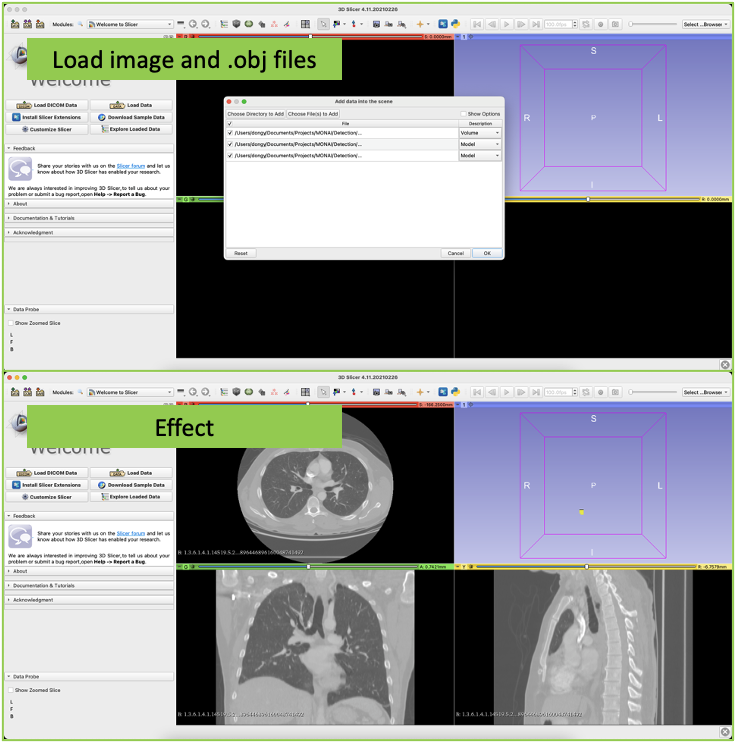
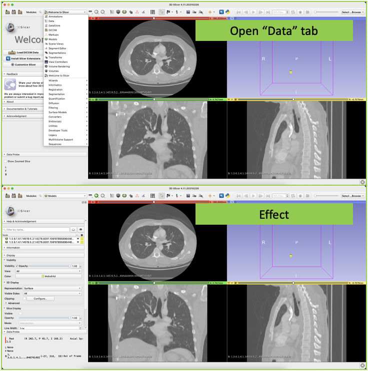
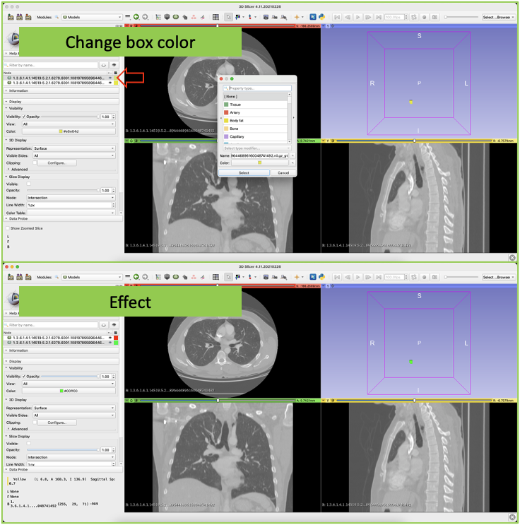
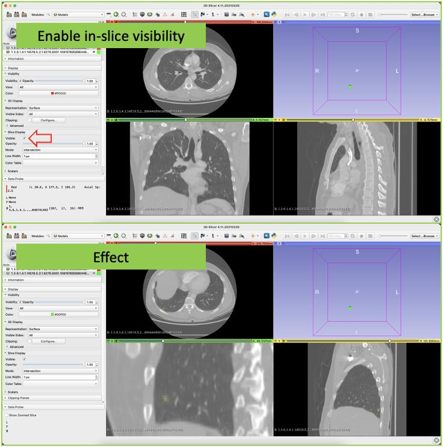

# Tutorial to visualize 3D (detection) boxes using 3D Slicer

Visualizing box prediction/annotation in 3D medical image detection is not straightforward. To better understand model predictions, we provide a way to further visualize detection results/ground truth using the free and open source software [3D Slicer](https://www.slicer.org/). 3D Slicer enables visualization of 3D images, 3D segmentation masks, and 3D meshes with 3D orthographic views. And we convert 3D box annotations/predictions into meshes that can be visualized by cross-sectional curves in three 2D planes.

## Prerequisite

- The Version of 3D Slicer should be **4.11.20210226** or later.
- Box information should be stored in a ".json" file. The "data\_sample.json" file is an example. The information of *N* boxes is stored under the key "box" as *N* lists. The six values are the *X*/*Y*/*Z* coordinates of the box center and the box length in the *X*/*Y*/*Z* axes. All the coordinate values are in the world coordinate system.

```
"box": [
    [
        -100.312255859375,
        67.529541015625,
        -231.97265625,
        6.328125,
        6.328125,
        6.4453125
    ],
    [
        -19.013427734375,
        10.576416015625,
        -48.28125,
        5.09765625,
        5.09765625,
        5.3125
    ]
]
```

## Steps

### 1. Create ".obj" file for predictions/annotation using the "save\_obj.sh" script.

```
#!/bin/bash

INPUT_DATASET_JSON="./data_sample.json"
OUTPUT_DIR="./out"

python save_obj.py  --input_dataset_json ${INPUT_DATASET_JSON} \
                    --output_dir ${OUTPUT_DIR}
```

### 2. Load the original 3D image and the resulting ".obj" file into 3D Slicer.

Image is visualized in 3 2D planes, while boxes are visualized in 3D space.



### 3. Opens the "Data" tab for box property editing.



### 4. Change the box color by double-clicking the color tab (for better visualization).



### 5. Enable in-plane visibility of the box by selecting the "Visible" option.

The following example shows predicted boxed (red) and ground truth boxes (green).



After completing these steps, the user can analyze the boxes using 3D Slicer's basic visualization capabilities (e.g., zoom in, zoom out).
