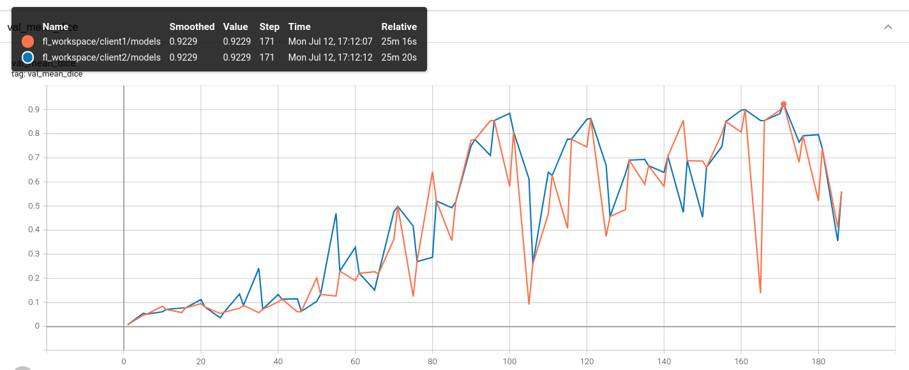

# Federated Learning with MONAI using NVFlare (without docker)
The purpose of this tutorial is to show how to run [NVFlare](https://pypi.org/project/nvflare) with MONAI on a local machine to simulate a FL setting (server and client communicate over localhost).
It is based on the [tutorial](../nvflare_example_docker) showing how to run FL with MONAI and NVFlare which using a docker container for the server and each client.

## Environment setup
(If needed) install pip and virtualenv (on macOS and Linux):
```
python3 -m pip install --user --upgrade pip
python3 -m pip install --user virtualenv
```
(If needed) make all shell scripts executable using
```
find . -name ".sh" -exec chmod +x {} \;
```
initialize virtual environment and set the current folder (see `projectpath` in `set_env.sh`).
```
source ./virtualenv/set_env.sh
```
install required packages
```
pip install --upgrade pip
pip install -r ${projectpath}/virtualenv/requirements.txt
```

## FL workspace preparation for NVFlare
NVFlare has a "provision" mechanism to automatically generate the fl workspace, see [here](https://docs.nvidia.com/clara/clara-train-sdk/federated-learning/fl_provisioning_tool.html) for details.

In this example, for convenience, we included a pregenerated workspace supporting up to 8 clients which needs to be extracted.
```
unzip ${projectpath}/fl_workspace_pregenerated.zip
```
*Note: (Optional)* If you need to modify the fl workspace (changing the number of max clients, client names, etc.), please follow the instructions [here](https://docs.nvidia.com/clara/clara-train-sdk/federated-learning/fl_provisioning_tool.html). We included the sample project.yml and authz_config.json files used for generating the 8-client workspace under `${projectpath}/fl_utils/workspace_gen`. After modification, the provisioning tool can be run as: `provision -p project.yml -a authz_config.json`

## Example task - spleen segmentation with MONAI
In this example, we used spleen segmentation task with a MONAI-based client trainer under `${projectpath}/spleen_example`
### Download the data
Download the Spleen segmentation task dataset from http://medicaldecathlon.com.
```
${projectpath}/spleen_example/data/download_dataset.sh
```
This will create a `${projectpath}/data` folder containing the dataset and pre-assigned 8-client datalists.

## Run federated learning
Two steps for running the federated learning using NVFlare+MONAI:
1. start the server, clients, and admin under NVFlare workspace
2. start the actual training process with MONAI implementation
### Start server and clients
To start the server and clients, run the following script (example with 2 clients).
```
export n_clients=2
${projectpath}/fl_utils/fl_run/start_fl.sh ${n_clients}
```
*Note:* Currently, `start_fl.sh` will run the clients on all available GPUs. For further control, modify `export CUDA_VISIBLE_DEVICES` command in `start_fl.sh` to set which GPU a client should run on. Note that multiple clients can run on a single GPU as long as the memory is sufficient.

### Start admin client
In new terminal, activate environment again
```
source ./virtualenv/set_env.sh
```
Then, start admin client
```
${projectpath}/fl_workspace/admin/startup/fl_admin.sh
```
*Note:* The user name is `admin@nvidia.com`.

Use the admin client to control the FL process:

(Optional) Check the server status
```
>  check_status server
```
Expected output
```
FL run number has not been set.
FL server status: training not started
Registered clients: 2
-------------------------------------------------------------------------------------------------
| CLIENT NAME | TOKEN                                | LAST ACCEPTED ROUND | CONTRIBUTION COUNT |
-------------------------------------------------------------------------------------------------
| client2     | 9d2c2d14-cefb-497d-bf13-042dd3e7965f |                     | 0                  |
| client1     | fd9a8872-2dba-4e25-829e-db0a524a66d6 |                     | 0                  |
-------------------------------------------------------------------------------------------------

```
(Optional) Check the client status
```
> check_status client
```
Expected output:
```
instance:client2 : client name: client2	token: 9d2c2d14-cefb-497d-bf13-042dd3e7965f	status: training not started
instance:client1 : client name: client1	token: fd9a8872-2dba-4e25-829e-db0a524a66d6	status: training not started
```
*Note:* For more details about the admin client and its commands, see [here](https://docs.nvidia.com/clara/clara-train-sdk/federated-learning/fl_admin_commands.html).

### Start FL training with spleen_example
Upload and deploy the training configurations.
Then in admin,
```
> set_run_number 1
> upload_folder ../../../spleen_example
> deploy spleen_example server
> deploy spleen_example client
```
*Note:* the upload_folder is expecting the config directory to be given either as absolute path or relative to the `fl_workspace/admin/transfer` folder as shown in the command above.

Inside the server/client terminal, deploy the training configurations that specify the data json for each client
```
${projectpath}/fl_utils/fl_run/deploy_train_configs.sh ${n_clients}
```
Next, you can start the FL server in the admin terminal and begin training:
```
> start server
> start client
```
(Optional) monitor the training progress

Server status:
```
> check_status server
FL run number:1
FL server status: training started
run number:1	start round:0	max round:200	current round:1
min_num_clients:2	max_num_clients:100
Registered clients: 2
Total number of clients submitted models for current round: 0
-------------------------------------------------------------------------------------------------
| CLIENT NAME | TOKEN                                | LAST ACCEPTED ROUND | CONTRIBUTION COUNT |
-------------------------------------------------------------------------------------------------
| client2     | 9d2c2d14-cefb-497d-bf13-042dd3e7965f | 0                   | 1                  |
| client1     | fd9a8872-2dba-4e25-829e-db0a524a66d6 | 0                   | 1                  |
-------------------------------------------------------------------------------------------------
```
Client status:
```
> check_status client
instance:client2 : client name: client2	token: 9d2c2d14-cefb-497d-bf13-042dd3e7965f	status: training started
instance:client1 : client name: client1	token: fd9a8872-2dba-4e25-829e-db0a524a66d6	status: training started

```
(Optional) shutdown FL system:
```
> shutdown client
admin@nvidia.com
> shutdown server
admin@nvidia.com
```
(Optional) clean up previous runs
```
${projectpath}/fl_utils/fl_run/clean_up.sh ${n_clients}
```

## Automate running FL
Alternatively, the following commands automate the above described steps. It makes use of NVFlare's AdminAPI. The script will automatically start the server and clients, upload the configuration folders and deploy them with the client-specific data list. It will also set the minimum number of clients needed for each global model update depending on the given argument.

*Note:* make sure there is no server or clients running. You can check if a NVFlare process is still running before starting a new experiment via `ps -as | grep nvflare`. Shut them down using the `shutdown` admin commands as described above if there are any.

First, start environment again (if not already activated)
```
source ./virtualenv/set_env.sh
```
Then, run the FL experiment as above automatically.
```
export n_clients=2
${projectpath}/fl_utils/fl_run_auto/run_fl.sh ${n_clients}
```
*Note:* This script will automatically shutdown the server and client in case of an error or misconfiguration. You can check if a NVFlare process is still running before starting a new experiment via `ps -as | grep nvflare`. It is best to not keep old processes running while trying to start a new experiment.

Here, you can also use the admin client as show above to monitor the automatically started FL experiment. Just open a terminal and execute
```
source ./virtualenv/set_env.sh
${projectpath}/fl_workspace/admin/startup/fl_admin.sh
```
(username: `admin@nvidia.com`)

## Visualize the training progress
To visualize the training progress, run tensorboard in the server/client terminal:
```
tensorboard --logdir="./" &
```
and point your browser to `http://localhost:6006/#scalars`. You should see the performance of the global model to be the same at the beginning of each round, as the clients in this example all share the same validation set.


## Further reading
For more details visit the [NVFlare documentation](https://pypi.org/project/nvflare).
For more examples using NVFlare, see [here](https://github.com/NVIDIA/clara-train-examples/tree/master/PyTorch/NoteBooks/FL).
