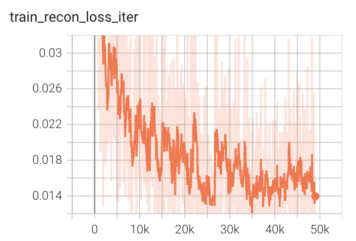
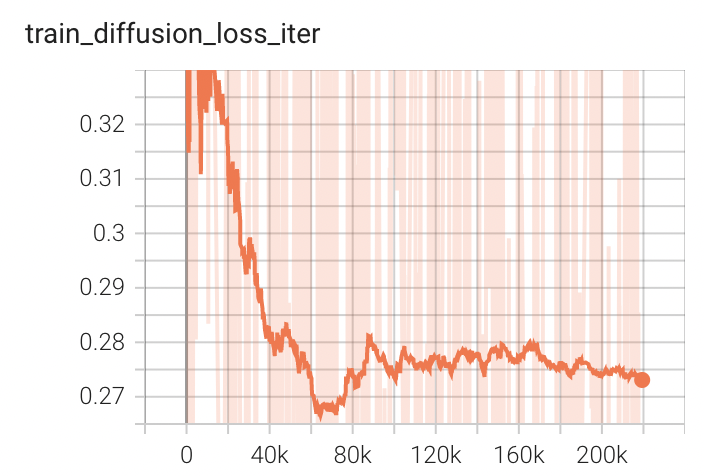

# 3D Latent Diffusion Example
This folder contains an example for training and validating a 3D Latent Diffusion Model on Brats data. The example includes support for multi-GPU training with distributed data parallelism based on a [tutorial designed for using single GPU](https://github.com/Project-MONAI/GenerativeModels/blob/main/tutorials/generative/3d_ldm/3d_ldm_tutorial.ipynb).

The workflow of the Latent Diffusion Model is depicted in the figure below. It begins by training an autoencoder in pixel space to encode images into latent features. Following that, it trains a diffusion model in the latent space to denoise the noisy latent features. During inference, it first generates latent features from random noise by applying multiple denoising steps using the trained diffusion model. Finally, it decodes the denoised latent features into images using the trained autoencoder.
<p align="center">
  

MONAI latent diffusion model implementation is based on the following papers:

[**Latent Diffusion:** Rombach, Robin, et al. "High-resolution image synthesis with latent diffusion models." CVPR 2022.](https://openaccess.thecvf.com/content/CVPR2022/papers/Rombach_High-Resolution_Image_Synthesis_With_Latent_Diffusion_Models_CVPR_2022_paper.pdf)

This network is designed as a demonstration to showcase the training process for this type of network using MONAI. To achieve optimal performance, it is recommended that users have a GPU with memory larger than 32G to accommodate larger networks and attention layers.

### 1. Data

The dataset we are experimenting with in this example is BraTS 2016 and 2017 data.

BraTS is a public dataset of brain MR images. Using these images, the goal is to generate images that look similar to the images in BraTS 2016 and 2017 dataset.

The data can be downloaded from [Medical Decathlon](http://medicaldecathlon.com/). By running the following command, the Brats data will be downloaded from [Medical Decathlon](http://medicaldecathlon.com/) and extracted to `$data_base_dir` in [./config/environment.json](./config/environment.json). You will see a subfolder `Task01_BrainTumour` under `$data_base_dir`. By default, you will see `./dataset/Task01_BrainTumour`.

```bash
python download_brats_data.py -e ./config/environment.json
```

Disclaimer: We are not the host of the data. Please make sure to read the requirements and usage policies of the data and give credit to the authors of the dataset!

### 2. Installation
Please refer to the [Installation of MONAI Generative Model](../README.md)

### 3. Run the example

#### [3.1 3D Autoencoder Training](./train_autoencoder.py)

The network configuration files are located in [./config/config_train_32g.json](./config/config_train_32g.json) for 32G GPU
and [./config/config_train_16g.json](./config/config_train_16g.json) for 16G GPU.
You can modify the hyperparameters in these files to suit your requirements.

The training script resamples the brain images based on the voxel spacing specified in the `"spacing"` field of the configuration files. For instance, `"spacing": [1.1, 1.1, 1.1]` resamples the images to a resolution of 1.1x1.1x1.1 mm. If you have a GPU with larger memory, you may consider changing the `"spacing"` field to `"spacing": [1.0, 1.0, 1.0]`.

The training script uses the batch size and patch size defined in the configuration files. If you have a different GPU memory size, you should adjust the `"batch_size"` and `"patch_size"` parameters in the `"autoencoder_train"` to match your GPU. Note that the `"patch_size"` needs to be divisible by 4.

Before you start training, please set the path in [./config/environment.json](./config/environment.json).

- `"model_dir"`: where it saves the trained models
- `"tfevent_path"`: where it saves the tensorboard events
- `"output_dir"`: where you store the generated images during inference.
- `"resume_ckpt"`: whether to resume training from existing checkpoints.
- `"data_base_dir"`: where you store the Brats dataset.

Below is the the training command for single GPU.

```bash
python train_autoencoder.py -c ./config/config_train_32g.json -e ./config/environment.json -g 1
```

The training script also enables multi-GPU training. For instance, if you are using eight 32G GPUs, you can run the training script with the following command:
```bash
export NUM_GPUS_PER_NODE=8
torchrun \
    --nproc_per_node=${NUM_GPUS_PER_NODE} \
    --nnodes=1 \
    --master_addr=localhost --master_port=1234 \
    train_autoencoder.py -c ./config/config_train_32g.json -e ./config/environment.json -g ${NUM_GPUS_PER_NODE}
```

<p align="center">
  
&nbsp; &nbsp; &nbsp; &nbsp;
  
</p>

With eight DGX1V 32G GPUs, it took around 55 hours to train 1000 epochs.

#### [3.2 3D Latent Diffusion Training](./train_diffusion.py)
The training script uses the batch size and patch size defined in the configuration files. If you have a different GPU memory size, you should adjust the `"batch_size"` and `"patch_size"` parameters in the `"diffusion_train"` to match your GPU. Note that the `"patch_size"` needs to be divisible by 16.

To train with single 32G GPU, please run:
```bash
python train_diffusion.py -c ./config/config_train_32g.json -e ./config/environment.json -g 1
```

The training script also enables multi-GPU training. For instance, if you are using eight 32G GPUs, you can run the training script with the following command:
```bash
export NUM_GPUS_PER_NODE=8
torchrun \
    --nproc_per_node=${NUM_GPUS_PER_NODE} \
    --nnodes=1 \
    --master_addr=localhost --master_port=1234 \
    train_diffusion.py -c ./config/config_train_32g.json -e ./config/environment.json -g ${NUM_GPUS_PER_NODE}
```
<p align="center">
  
&nbsp; &nbsp; &nbsp; &nbsp;
  
</p>

#### [3.3 Inference](./inference.py)
To generate one image during inference, please run the following command:
```bash
python inference.py -c ./config/config_train_32g.json -e ./config/environment.json --num 1
```
`--num` defines how many images it would generate.

An example output is shown below.
<p align="center">
  
&nbsp; &nbsp; &nbsp; &nbsp;
  
&nbsp; &nbsp; &nbsp; &nbsp;
  
</p>

### 4. Questions and bugs

- For questions relating to the use of MONAI, please use our [Discussions tab](https://github.com/Project-MONAI/MONAI/discussions) on the main repository of MONAI.
- For bugs relating to MONAI functionality, please create an issue on the [main repository](https://github.com/Project-MONAI/MONAI/issues).
- For bugs relating to the running of a tutorial, please create an issue in [this repository](https://github.com/Project-MONAI/Tutorials/issues).

### Reference
[1] [Rombach, Robin, et al. "High-resolution image synthesis with latent diffusion models." CVPR 2022.](https://openaccess.thecvf.com/content/CVPR2022/papers/Rombach_High-Resolution_Image_Synthesis_With_Latent_Diffusion_Models_CVPR_2022_paper.pdf)

[2] [Menze, Bjoern H., et al. "The multimodal brain tumor image segmentation benchmark (BRATS)." IEEE transactions on medical imaging 34.10 (2014): 1993-2024.](https://ieeexplore.ieee.org/document/6975210)

[3] [Pinaya et al. "Brain imaging generation with latent diffusion models"](https://arxiv.org/abs/2209.07162)
