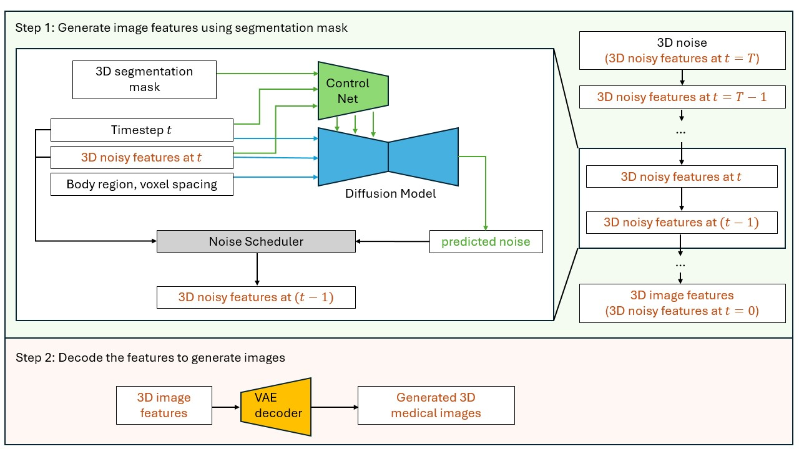

# Medical AI for Synthetic Imaging (MAISI)
This example demonstrates the applications of training and validating NVIDIA MAISI, a 3D Latent Diffusion Model (LDM) capable of generating large CT images accompanied by corresponding segmentation masks. It supports variable volume size and voxel spacing and allows for the precise control of organ/tumor size.

## MAISI Model Highlight
- A Foundation Variational Auto-Encoder (VAE) model for latent feature compression that works for both CT and MRI with flexible volume size and voxel size
- A Foundation Diffusion model that can generate large CT volumes up to 512 &times; 512 &times; 768 size, with flexible volume size and voxel size
- A ControlNet to generate image/mask pairs that can improve downstream tasks, with controllable organ/tumor size

## Example Results and Evaluation

We retrained several state-of-the-art diffusion model-based methods using our dataset. The results in the table and figure below show that our method outperforms previous methods on an unseen dataset ([autoPET 2023](https://www.nature.com/articles/s41597-022-01718-3)). Our method shows superior performance to previous methods based on all [Fréchet Inception Distance (FID)](https://papers.nips.cc/paper/2017/hash/8a1d694707eb0fefe65871369074926d-Abstract.html) scores on different 2D planes. Here we compared the generated images with real images of size 512 &times; 512 &times; 512 and spacing 1.0 &times; 1.0 &times; 1.0 mm<sup>3</sup>.

<div align="center">

| Method | FID (XY Plane) ↓ | FID (YZ Plane) ↓ | FID (ZX Plane) ↓ | FID (Average) ↓ |
|--------|:----------------:|:----------------:|:----------------:|:---------------:|
| [DDPM](https://proceedings.neurips.cc/paper_files/paper/2020/file/4c5bcfec8584af0d967f1ab10179ca4b-Paper.pdf)   |      18.524       |      23.696      |      25.604      |      22.608     |
| [LDM](https://openaccess.thecvf.com/content/CVPR2022/papers/Rombach_High-Resolution_Image_Synthesis_With_Latent_Diffusion_Models_CVPR_2022_paper.pdf)    |      16.853       |      10.191      |      10.093      |      12.379     |
| [HA-GAN](https://ieeexplore.ieee.org/document/9770375) |      17.432       |      10.266      |      13.572      |      13.757     |
| MAISI  |       3.301       |       5.838      |      9.109       |      6.083      |

**Table 1.** Comparison of Fréchet Inception Distance scores between our foundation model and retrained baseline methods<br>using the unseen public dataset [autoPET 2023](https://www.nature.com/articles/s41597-022-01718-3) as the reference.

</div>

<div align="center">


**Figure 1.** Qualitative comparison of generated images between baseline methods<br>(retrained using our large-scale dataset) and our method.

</div>

## MAISI Model Workflow
The training and inference workflows of MAISI are depicted in the figure below. It begins by training an autoencoder in pixel space to encode images into latent features. Following that, it trains a diffusion model in the latent space to denoise the noisy latent features. During inference, it first generates latent features from random noise by applying multiple denoising steps using the trained diffusion model. Finally, it decodes the denoised latent features into images using the trained autoencoder.
<p align="center">
  
  <br>
  <em>Figure 1: MAISI training scheme</em>
</p>

<p align="center">
  
  <em>Figure 2: MAISI inference scheme</em>
</p>
MAISI is based on the following papers:

[**Latent Diffusion:** Rombach, Robin, et al. "High-resolution image synthesis with latent diffusion models." CVPR 2022.](https://openaccess.thecvf.com/content/CVPR2022/papers/Rombach_High-Resolution_Image_Synthesis_With_Latent_Diffusion_Models_CVPR_2022_paper.pdf)

[**ControlNet:**  Lvmin Zhang, Anyi Rao, Maneesh Agrawala; “Adding Conditional Control to Text-to-Image Diffusion Models.” ICCV 2023.](https://openaccess.thecvf.com/content/ICCV2023/papers/Zhang_Adding_Conditional_Control_to_Text-to-Image_Diffusion_Models_ICCV_2023_paper.pdf)

### 1. Network Definition
Network definition is stored in [./configs/config_maisi.json](./configs/config_maisi.json). Training and inference should use the same [./configs/config_maisi.json](./configs/config_maisi.json).

### 2. Model Inference
#### Inference parameters:
The information for the inference input, like body region and anatomy to generate, is stored in [./configs/config_infer.json](./configs/config_infer.json). Please feel free to play with it. Here are the details of the parameters.

- `"num_output_samples"`: int, the number of output image/mask pairs it will generate.
- `"spacing"`: voxel size of generated images. E.g., if set to `[1.5, 1.5, 2.0]`, it will generate images with a resolution of 1.5x1.5x2.0 mm.
- `"output_size"`: volume size of generated images. E.g., if set to `[512, 512, 256]`, it will generate images with size of 512x512x256. They need to be divisible by 16. If you have a small GPU memory size, you should adjust it to small numbers. Note that `"spacing"` and `"output_size"` together decide the output field of view (FOV). For eample, if set them to `[1.5, 1.5, 2.0]`mm and `[512, 512, 256]`, the FOV is 768x768x512 mm. We recommend the FOV in x and y axis to be at least 256mm for head, and at least 384mm for other body regions like abdomen. There is no such restriction for z-axis.
- `"controllable_anatomy_size"`: a list of controllable anatomy and its size scale (0--1). E.g., if set to `[["liver", 0.5],["hepatic tumor", 0.3]]`, the generated image will contain liver that have a median size, with size around 50% percentile, and hepatic tumor that is relatively small, with around 30% percentile. The output will contain paired image and segmentation mask for the controllable anatomy.
- `"body_region"`: If "controllable_anatomy_size" is not specified, "body_region" will be used to constrain the region of generated images. It needs to be chosen from "head", "chest", "thorax", "abdomen", "pelvis", "lower".
- `"anatomy_list"`: If "controllable_anatomy_size" is not specified, the output will contain paired image and segmentation mask for the anatomy in "./configs/label_dict.json".
- `"autoencoder_sliding_window_infer_size"`: in order to save GPU memory, we use sliding window inference when decoding latents to image when `"output_size"` is large. This is the patch size of the sliding window. Small value will reduce GPU memory but increase time cost. They need to be divisible by 16.
- `"autoencoder_sliding_window_infer_overlap"`: float between 0 and 1. Large value will reduce the stitching artifacts when stitching patches during sliding window inference, but increase time cost. If you do not observe seam lines in the generated image result, you can use a smaller value to save inference time.

To generate images with substantial dimensions, such as 512 &times; 512 &times; 512 or larger, using GPUs with 80GB of memory, it is advisable to configure the `"num_splits"` parameter in [the auto-encoder configuration](./configs/config_maisi.json#L11-L37) to 16. This adjustment is crucial to avoid out-of-memory issues during inference.

#### Recommended spacing for different output sizes:

|`output_size`| Recommended `"spacing"`|
|:-----:|:-----:|
[256, 256, 256]  | [1.5, 1.5, 1.5] |
[512, 512, 128]  | [0.8, 0.8, 2.5] |
[512, 512, 512]  | [1.0, 1.0, 1.0] |

#### Execute Inference:
To run the inference script, please run:
```bash
export MONAI_DATA_DIRECTORY=<dir_you_will_download_data>
python -m scripts.inference -c ./configs/config_maisi.json -i ./configs/config_infer.json -e ./configs/environment.json --random-seed 0
```

Please refer to [maisi_inference_tutorial.ipynb](maisi_inference_tutorial.ipynb) for the tutorial for MAISI model inference.

#### Quality Check:
We have implemented a quality check function for the generated CT images. The main idea behind this function is to ensure that the Hounsfield units (HU) intensity for each organ in the CT images remains within a defined range. For each training image used in the Diffusion network, we computed the median value for a few major organs. Then we summarize the statistics of these median values and save it to [./configs/image_median_statistics.json](./configs/image_median_statistics.json). During inference, for each generated image, we compute the median HU values for the major organs and check whether they fall within the normal range.

### 3. Model Training
Training data preparation can be found in [./data/README.md](./data/README.md)

#### [3.1 3D Autoencoder Training](./maisi_train_vae_tutorial.ipynb)
The information for the training hyperparameters and data processing parameters, like learning rate and patch size, are stored in [./configs/config_maisi_vae_train.json](./configs/config_maisi_vae_train.json). The provided configuration works for 16G V100 GPU. Please feel free to tune the parameters for your datasets and device.

Dataset preprocessing:
- `"random_aug"`: bool, whether to add random data augmentation for training data.
- `"spacing_type"`: choose from `"original"` (no resampling involved), `"fixed"` (all images resampled to same voxel size), and `"rand_zoom"` (images randomly zoomed, valid when `"random_aug"` is True).
- `"spacing"`: None or list of three floats. If `"spacing_type"` is `"fixed"`, all the images will be interpolated to the voxel size of `"spacing"`.
- `"select_channel"`: int, if multi-channel MRI, which channel it will select.

Training configs:
- `"batch_size"`: training batch size. Please consider increasing it if GPU memory is larger than 16G.
- `"patch_size"`: training patch size. For the released model, we first trained the autoencoder with small patch size [64,64,64], then continued training with patch size of [128,128,128].
- `"val_patch_size"`: Size of validation patches. If None, will use the whole volume for validation. If given, will central crop a patch for validation.
- `"val_sliding_window_patch_size"`: if the validation patch is too large, will use sliding window inference. Please consider increasing it if GPU memory is larger than 16G.
- `"val_batch_size"`: validation batch size.
- `"perceptual_weight"`: perceptual loss weight.
- `"kl_weight"`: KL loss weight, important hyper-parameter. If too large, decoder cannot recon good results from latent space. If too small, latent space will not be regularized enough for the diffusion model.
- `"adv_weight"`: adversavarial loss weight.
- `"recon_loss"`: choose from 'l1' and l2'.
- `"val_interval"`:int, do validation every `"val_interval"` epoches.
- `"cache"`: float between 0 and 1, dataloader cache, choose small value if CPU memory is small.
- `"n_epochs"`: int, number of epochs to train. Please adjust it based on the size of your datasets. We used 280 epochs for the released model on 58k data.

Please refer to [maisi_train_vae_tutorial.ipynb](maisi_train_vae_tutorial.ipynb) for the tutorial for MAISI VAE model training.

#### [3.2 3D Latent Diffusion Training](./scripts/diff_model_train.py)

Please refer to [maisi_diff_unet_training_tutorial.ipynb](maisi_diff_unet_training_tutorial.ipynb) for the tutorial for MAISI diffusion model training.

#### [3.3 3D ControlNet Training](./scripts/train_controlnet.py)

We provide a [training config](./configs/config_maisi_controlnet_train.json) executing finetuning for pretrained ControlNet with a new class (i.e., Kidney Tumor).
When finetuning with other new class names, please update the `weighted_loss_label` in training config
and [label_dict.json](./configs/label_dict.json) accordingly. There are 8 dummy labels as deletable placeholders in default `label_dict.json` that can be used for finetuning. Users may apply any placeholder labels for fine-tuning purpose. If there are more than 8 new labels needed in finetuning, users can freely define numeric label indices less than 256. The current ControlNet implementation can support up to 256 labels (0~255).
Preprocessed dataset for ControlNet training and more details anout data preparation can be found in the [README](./data/README.md).

#### Training Configuration
The training was performed with the following:
- GPU: at least 60GB GPU memory for 512 &times; 512 &times; 512 volume
- Actual Model Input (the size of 3D image feature in latent space) for the latent diffusion model: 128 &times; 128 &times; 128 for 512 &times; 512 &times; 512 volume
- AMP: True

#### Execute Training:
To train with a single GPU, please run:
```bash
python -m scripts.train_controlnet -c ./configs/config_maisi.json -t ./configs/config_maisi_controlnet_train.json -e ./configs/environment_maisi_controlnet_train.json -g 1
```

The training script also enables multi-GPU training. For instance, if you are using eight GPUs, you can run the training script with the following command:
```bash
export NUM_GPUS_PER_NODE=8
torchrun \
    --nproc_per_node=${NUM_GPUS_PER_NODE} \
    --nnodes=1 \
    --master_addr=localhost --master_port=1234 \
    -m scripts.train_controlnet -c ./configs/config_maisi.json -t ./configs/config_maisi_controlnet_train.json -e ./configs/environment_maisi_controlnet_train.json -g ${NUM_GPUS_PER_NODE}
```
Please also check [maisi_train_controlnet_tutorial.ipynb](./maisi_train_controlnet_tutorial.ipynb) for more details about data preparation and training parameters.

### 4. License

The code is released under Apache 2.0 License.

The model weight is released under [NSCLv1 License](./LICENSE.weights).

### 5. Questions and Bugs

- For questions relating to the use of MONAI, please use our [Discussions tab](https://github.com/Project-MONAI/MONAI/discussions) on the main repository of MONAI.
- For bugs relating to MONAI functionality, please create an issue on the [main repository](https://github.com/Project-MONAI/MONAI/issues).
- For bugs relating to the running of a tutorial, please create an issue in [this repository](https://github.com/Project-MONAI/Tutorials/issues).
