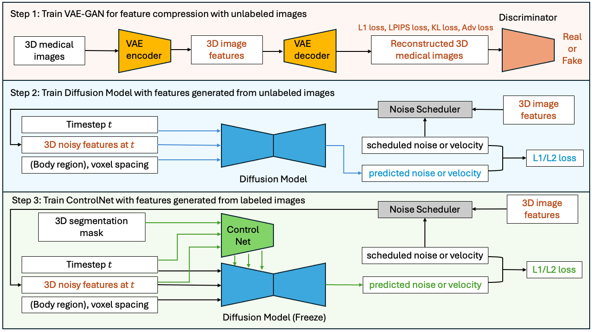

# Medical AI for Synthetic Imaging (MAISI)
This example demonstrates the applications of training and validating NVIDIA MAISI, a 3D Latent Diffusion Model (LDM) capable of generating large CT images accompanied by corresponding segmentation masks. It supports variable volume size and voxel spacing and allows for the precise control of organ/tumor size.

## MAISI Model Highlight
**Initial Version (August 2024):** First release `maisi3d-ddpm`.

- A Foundation Variational Auto-Encoder (VAE) model for latent feature compression that works for both CT and MRI with flexible volume size and voxel size. Tensor parallel is included to reduce GPU memory usage.
- A Foundation Diffusion model that can generate large CT volumes up to 512 &times; 512 &times; 768 size, with flexible volume size and voxel size
- A ControlNet to generate image/mask pairs that can improve downstream tasks, with controllable organ/tumor size

More details can be found in our WACV 2025 paper:

[Guo, P., Zhao, C., Yang, D., Xu, Z., Nath, V., Tang, Y., ... & Xu, D. (2024). MAISI: Medical AI for Synthetic Imaging. WACV 2025](https://arxiv.org/pdf/2409.11169)

🎉🎉🎉🎉🎉🎉**Release Note (March 2025):** 🎉🎉🎉🎉🎉🎉

We are excited to announce the new MAISI Version `maisi3d-rflow`. Compared with the previous version `maisi3d-ddpm`, **it accelerated latent diffusion model inference by 33x**. The MAISI VAE is not changed. The differences are:
- The maisi version `maisi3d-ddpm` uses basic noise scheduler DDPM. `maisi3d-rflow` uses Rectified Flow scheduler. The diffusion model inference can be 33 times faster.
- The maisi version `maisi3d-ddpm` requires training images to be labeled with body regions (`"top_region_index"` and `"bottom_region_index"`), while `maisi3d-rflow` does not have such requirement. In other words, it is easier to prepare training data for `maisi3d-rflow`.
- For the released model weights, `maisi3d-rflow` can generate images with better quality for head region and small output volumes than `maisi3d-ddpm`; they have comparable quality for other cases.
- `maisi3d-rflow` added a diffusion model input `modality`, which gives it flexibility to extend to other modalities. Currently it is set as always equal to 1 since this version only supports CT generation. We predefined some modalities in [./configs/modality_mapping.json](./configs/modality_mapping.json).

**GUI demo:** Welcome to try our GUI demo at [https://build.nvidia.com/nvidia/maisi](https://build.nvidia.com/nvidia/maisi).
The GUI is only a demo for toy examples. This Github repo is the full version.


## Minimum GPU requirement
GPU requirement depends on the size of the images. For example,
- for image size of 512x512x128, the minimum GPU memory requirement for training and inference is 16G.
- for image size of 512x512x512, the minimum GPU memory requirement for training is 40G, for inference is 24G.

## Example Results and Evaluation

We retrained several state-of-the-art diffusion model-based methods using our dataset. The results in the table and figure below show that our method outperforms previous methods on an unseen dataset ([autoPET 2023](https://www.nature.com/articles/s41597-022-01718-3)). Our method shows superior performance to previous methods based on all [Fréchet Inception Distance (FID)](https://papers.nips.cc/paper/2017/hash/8a1d694707eb0fefe65871369074926d-Abstract.html) scores on different 2D planes. Here we compared the generated images with real images of size 512 &times; 512 &times; 512 and spacing 1.0 &times; 1.0 &times; 1.0 mm<sup>3</sup>.

<div align="center">

| Method | FID (XY Plane) ↓ | FID (YZ Plane) ↓ | FID (ZX Plane) ↓ | FID (Average) ↓ |
|--------|:----------------:|:----------------:|:----------------:|:---------------:|
| [DDPM](https://proceedings.neurips.cc/paper_files/paper/2020/file/4c5bcfec8584af0d967f1ab10179ca4b-Paper.pdf)   |      18.524       |      23.696      |      25.604      |      22.608     |
| [LDM](https://openaccess.thecvf.com/content/CVPR2022/papers/Rombach_High-Resolution_Image_Synthesis_With_Latent_Diffusion_Models_CVPR_2022_paper.pdf)    |      16.853       |      10.191      |      10.093      |      12.379     |
| [HA-GAN](https://ieeexplore.ieee.org/document/9770375) |      17.432       |      10.266      |      13.572      |      13.757     |
| MAISI (`maisi3d-ddpm`)  |       3.301       |       5.838      |      9.109       |      6.083      |
| MAISI (`maisi3d-rflow`)  |       2.685       |       4.723      |      7.963       |      5.124      |

**Table 1.** Comparison of Fréchet Inception Distance scores between our foundation model and retrained baseline methods<br>using the unseen public dataset [autoPET 2023](https://www.nature.com/articles/s41597-022-01718-3) as the reference.

</div>

<div align="center">


**Figure 1.** Qualitative comparison of generated images between baseline methods<br>(retrained using our large-scale dataset) and our method. The MAISI here refers to `maisi3d-ddpm`.

</div>

| Dataset     | Model           | LPIPS ↓ | SSIM ↑ | PSNR ↑  | GPU ↓  |
|-------------|-----------------|----------|--------|---------|--------|
| MSD Task07  | MAIS VAE        | **0.038**| **0.978**|**37.266**| **0h** |
|             | Dedicated VAE   | 0.047    | 0.971  | 34.750  | 619h   |
| MSD Task08  | MAIS VAE        | 0.046    | 0.970  | 36.559  | **0h** |
|             | Dedicated VAE   | **0.041**|**0.973**|**37.110**| 669h   |
| Brats18     | MAIS VAE        | **0.026**|**0.977**| **39.003**| **0h** |
|             | Dedicated VAE   | 0.030    | 0.975 | 38.971  | 672h   |

**Table 2:** Performance comparison of the `MAIS VAE` model on out-of-distribution datasets (i.e., unseen during MAISI VAE training) versus `Dedicated VAE` models (i.e., train from scratch on in-distribution data). The “GPU” column shows additional GPU hours for training with one 32G V100 GPU. MAISI VAE model achieved comparable results without additional GPU resource expenditure on unseen datasets.


## Time Cost and GPU Memory Usage

### Inference Time Cost and GPU Memory Usage
| `output_size` | Peak Memory | VAE Time + DM Time (`maisi3d-ddpm`) | VAE Time + DM Time (`maisi3d-rflow`) | latent size | `autoencoder_sliding_window_infer_size` | `autoencoder_tp_num_splits` | VAE Time | DM Time (`maisi3d-ddpm`) | DM Time (`maisi3d-rflow`) |
|---------------|:-----------:|:------------------------:|:------------------------:|:--------------------------------------:|:--------------------------------------:|:---------------------------:|:--------:|:---------------:|:---------------:|
| [256x256x128](./configs/config_infer_16g_256x256x128.json)   | 15.0G      | 58s                      | 3s                       | 4x64x64x32 | >=[64,64,32], not used                 | 2                           | 1s       | 57s     | 2s               |
| [256x256x256](./configs/config_infer_16g_256x256x256.json)   | 15.4G      | 86s                      | 8s                       | 4x64x64x64 | [48,48,64], 4 patches                  | 4                           | 5s       | 81s     | 3s              |
| [512x512x128](./configs/config_infer_16g_512x512x128.json)   | 15.7G      | 146s                     | 13s                      | 4x128x128x32 | [64,64,32], 9 patches                  | 2                           | 8s       | 138s    | 5s              |
|               |            |                            |                            |                                        |                             |                             |         |               |                 |
| [256x256x256](./configs/config_infer_24g_256x256x256.json)   | 22.7G      | 83s                      | 5s                       | 4x64x64x64 | >=[64,64,64], not used                 | 4                           | 2s       | 81s     | 3s              |
| [512x512x128](./configs/config_infer_24g_512x512x128.json)   | 21.0G      | 144s                     | 11s                      | 4x128x128x32 | [80,80,32], 4 patches                  | 2                           | 6s       | 138s    | 5s              |
| [512x512x512](./configs/config_infer_24g_512x512x512.json)   | 22.8G      | 598s                     | 48s                      | 4x128x128x128 | [64,64,48], 36 patches                 | 2                           | 29s      | 569s    | 19s              |
|               |            |                            |                            |                                        |                             |                             |         |               |                 |
| [512x512x512](./configs/config_infer_32g_512x512x512.json)   | 28.4G      | 599s                     | 49s                      | 4x128x128x128 | [80,80,48], 16 patches                 | 4                           | 30s      | 569s    | 19s              |
|               |            |                            |                            |                                        |                             |                             |         |               |                 |
| [512x512x512](./configs/config_infer_80g_512x512x512.json)   | 45.3G      | 601s                     | 51s                      | 4x128x128x128 | [80,80,80], 8 patches                  | 2                           | 32s      | 569s    | 19s              |
| [512x512x768](./configs/config_infer_80g_512x512x768.json)   | 49.7G      | 961s                     | 87s                      | 4x128x128x192 | [80,80,96], 12 patches                 | 4                           | 57s      | 904s    | 30s              |

**Table 3:** Inference Time Cost and GPU Memory Usage. `DM Time` refers to the time required for diffusion model inference. `VAE Time` refers to the time required for VAE decoder inference. The total inference time is the sum of `DM Time` and `VAE Time`. The experiment was conducted on an A100 80G GPU.

During inference, the peak GPU memory usage occurs during the VAE's decoding of latent features.
To reduce GPU memory usage, we can either increase `autoencoder_tp_num_splits` or reduce `autoencoder_sliding_window_infer_size`.
Increasing `autoencoder_tp_num_splits` has a smaller impact on the generated image quality, while reducing `autoencoder_sliding_window_infer_size` may introduce stitching artifacts and has a larger impact on the generated image quality.

When `autoencoder_sliding_window_infer_size` is equal to or larger than the latent feature size, the sliding window will not be used, and the time and memory costs remain the same.


### Training GPU Memory Usage
The VAE is trained on patches and can be trained using a 16G GPU if the patch size is set to a small value, such as [64, 64, 64]. Users can adjust the patch size to fit the available GPU memory. For the released model, we initially trained the autoencoder on 16G V100 GPUs with a small patch size of [64, 64, 64], and then continued training on 32G V100 GPUs with a larger patch size of [128, 128, 128].

The DM and ControlNet are trained on whole images rather than patches. The GPU memory usage during training depends on the size of the input images. There is no big difference on memory usage between `maisi3d-ddpm` and `maisi3d-rflow`.

|  image size  |  latent size  | Peak Memory |
|--------------|:------------- |:-----------:|
| 256x256x128  | 4x64x64x32    |   5G        |
| 256x256x256  | 4x64x64x64    |   8G        |
| 512x512x128  | 4x128x128x32  |   12G       |
| 512x512x256  | 4x128x128x64  |   21G       |
| 512x512x512  | 4x128x128x128 |   39G       |
| 512x512x768  | 4x128x128x192 |   58G       |


## MAISI Model Workflow
The training and inference workflows of MAISI are depicted in the figure below. It begins by training an autoencoder in pixel space to encode images into latent features. Following that, it trains a diffusion model in the latent space to denoise the noisy latent features. During inference, it first generates latent features from random noise by applying multiple denoising steps using the trained diffusion model. Finally, it decodes the denoised latent features into images using the trained autoencoder.
<p align="center">
  
  <br>
  <em>Figure 1: MAISI training scheme</em>
</p>

<p align="center">
  
  <em>Figure 2: MAISI inference scheme</em>
</p>
MAISI is based on the following papers:

[**Latent Diffusion:** Rombach, Robin, et al. "High-resolution image synthesis with latent diffusion models." CVPR 2022.](https://openaccess.thecvf.com/content/CVPR2022/papers/Rombach_High-Resolution_Image_Synthesis_With_Latent_Diffusion_Models_CVPR_2022_paper.pdf)

[**ControlNet:**  Lvmin Zhang, Anyi Rao, Maneesh Agrawala; “Adding Conditional Control to Text-to-Image Diffusion Models.” ICCV 2023.](https://openaccess.thecvf.com/content/ICCV2023/papers/Zhang_Adding_Conditional_Control_to_Text-to-Image_Diffusion_Models_ICCV_2023_paper.pdf)

[**Rectified Flow:** Liu, Xingchao, Chengyue Gong, and Qiang Liu. "Flow straight and fast: Learning to generate and transfer data with rectified flow." ICLR 2023](https://arxiv.org/pdf/2209.03003).

### 1. Network Definition
Network definition is stored in [./configs/config_maisi.json](./configs/config_maisi.json). Training and inference should use the same [./configs/config_maisi.json](./configs/config_maisi.json).

### 2. Model Inference
#### Inference parameters:
The information for the inference input, such as the body region and anatomy to generate, is stored in [./configs/config_infer.json](./configs/config_infer.json). Feel free to experiment with it. Below are the details of the parameters:

- `"num_output_samples"`: An integer specifying the number of output image/mask pairs to generate.
- `"spacing"`: The voxel size of the generated images. For example, if set to `[1.5, 1.5, 2.0]`, it generates images with a resolution of 1.5x1.5x2.0 mm.
- `"output_size"`: The volume size of the generated images. For example, if set to `[512, 512, 256]`, it generates images of size 512x512x256. The values must be divisible by 16. If GPU memory is limited, adjust these to smaller numbers. Note that `"spacing"` and `"output_size"` together determine the output field of view (FOV). For example, if set to `[1.5, 1.5, 2.0]` mm and `[512, 512, 256]`, the FOV is 768x768x512 mm. We recommend the FOV in the x and y axes to be at least 256 mm for the head and at least 384 mm for other body regions like the abdomen. There is no restriction for the z-axis.
- `"controllable_anatomy_size"`: A list specifying controllable anatomy and their size scale (0–1). For example, if set to `[["liver", 0.5], ["hepatic tumor", 0.3]]`, the generated image will contain a liver of median size (around the 50th percentile) and a relatively small hepatic tumor (around the 30th percentile). The output will include paired images and segmentation masks for the controllable anatomy.
- `"body_region"`: For `maisi3d_rflow`, it is deprecated and can be set as `[]`. The output body region will be determined by `"anatomy_list"`. For `maisi3d_ddpm`, if `"controllable_anatomy_size"` is not specified, `"body_region"` will constrain the region of the generated images. It must be chosen from `"head"`, `"chest"`, `"thorax"`, `"abdomen"`, `"pelvis"`, or `"lower"`. Please set a reasonable `"body_region"` for the given FOV determined by `"spacing"` and `"output_size"`. For example, if FOV is only 128mm in z-axis, we should not expect `"body_region"` to contain all of [`"head"`, `"chest"`, `"thorax"`, `"abdomen"`, `"pelvis"`, `"lower"`].
- `"anatomy_list"`: If `"controllable_anatomy_size"` is not specified, the output will include paired images and segmentation masks for the anatomy listed in `"./configs/label_dict.json"`.
- `"autoencoder_sliding_window_infer_size"`: To save GPU memory, sliding window inference is used when decoding latents into images if `"output_size"` is large. This parameter specifies the patch size of the sliding window. Smaller values reduce GPU memory usage but increase the time cost. The values must be divisible by 16. If GPU memory is sufficient, select a larger value for this parameter.
- `"autoencoder_sliding_window_infer_overlap"`: A float between 0 and 1. Larger values reduce stitching artifacts when patches are stitched during sliding window inference but increase the time cost. If you do not observe seam lines in the generated image, you can use a smaller value to save inference time.
- `"autoencoder_tp_num_splits"`: An integer chosen from `[1, 2, 4, 8, 16]`. Tensor parallelism is used in the autoencoder to save GPU memory. Larger values reduce GPU memory usage. If GPU memory is sufficient, select a smaller value for this parameter.


#### Recommended spacing for different output sizes:
According to the statistics of the training data, we have recommended input parameters for the body region that are included in the training data.
The Recommended `"output_size"` is the median value of the training data, the Recommended `"spacing"` is the median FOV (the product of `"output_size"` and `"spacing"`) divided by the Recommended `"output_size"`.
|`"body_region"`   |percentage of training data |Recommended `"output_size"`| Recommended `"spacing"` [mm]|
|:--------------------------------------|:--------------------------|:----------------------|---------------------------:|
| ['chest', 'abdomen']                  |                      58.55% | [512, 512, 128]           | [0.781, 0.781, 2.981] |
| ['chest']                             |                      38.35% | [512, 512, 128]           | [0.684, 0.684, 2.422] |
| ['chest', 'abdomen', 'lower']         |                       1.42% | [512, 512, 256]           | [0.793, 0.793, 1.826] |
| ['lower']                             |                       0.61% | [512, 512, 384]           | [0.839, 0.839, 0.728] |
| ['abdomen', 'lower']                  |                       0.37% | [512, 512, 384]           | [0.808, 0.808, 0.729] |
| ['head', 'chest', 'abdomen']          |                       0.33% | [512, 512, 384]           | [0.977, 0.977, 2.103] |
| ['abdomen']                           |                       0.13% | [512, 512, 128]           | [0.723, 0.723, 1.182] |
| ['head', 'chest', 'abdomen', 'lower'] |                       0.13% | [512, 512, 384]           | [1.367, 1.367, 4.603] |
| ['head', 'chest']                     |                       0.10% | [512, 512, 128]           | [0.645, 0.645, 2.219] |

If users want to try different `"output_size"`, please adjust `"spacing"` to ensure a reasonable FOV, which is the product of `"output_size"` and `"spacing"`.
For example,

|`"output_size"`| Recommended `"spacing"`|
|:--------------------------------------|:--------------------------|
|[256, 256, 256]  | [1.5, 1.5, 1.5] |
|[512, 512, 128]  | [0.8, 0.8, 2.5] |
|[512, 512, 512]  | [1.0, 1.0, 1.0] |

#### Execute Inference:
To run the inference script with MAISI DDPM, please set `"num_inference_steps": 1000` in `./configs/config_infer.json`, and run:
```bash
export MONAI_DATA_DIRECTORY=<dir_you_will_download_data>
python -m scripts.inference -c ./configs/config_maisi3d-ddpm.json -i ./configs/config_infer.json -e ./configs/environment_maisi3d-ddpm.json --random-seed 0 --version maisi3d-ddpm
```

To run the inference script with MAISI RFlow, please set `"num_inference_steps": 30` in `./configs/config_infer.json`, and run:
```bash
export MONAI_DATA_DIRECTORY=<dir_you_will_download_data>
python -m scripts.inference -c ./configs/config_maisi3d-rflow.json -i ./configs/config_infer.json -e ./configs/environment_maisi3d-rflow.json --random-seed 0 --version maisi3d-rflow
```

If GPU OOM happens, please increase `autoencoder_tp_num_splits` or reduce `autoencoder_sliding_window_infer_size` in `./configs/config_infer.json`.
To reduce time cost, please reduce `autoencoder_sliding_window_infer_overlap` in `./configs/config_infer.json`, while monitoring whether stitching artifact occurs.

Please refer to [maisi_inference_tutorial.ipynb](maisi_inference_tutorial.ipynb) for the tutorial for MAISI model inference.


#### Accelerated Inference with TensorRT:
To run the inference script with TensorRT acceleration, please run:
```bash
export MONAI_DATA_DIRECTORY=<dir_you_will_download_data>
python -m scripts.inference -c ./configs/config_maisi3d-ddpm.json -i ./configs/config_infer.json -e ./configs/environment_maisi3d-ddpm.json -x ./configs/config_trt.json --random-seed 0 --version maisi3d-ddpm
```

```bash
export MONAI_DATA_DIRECTORY=<dir_you_will_download_data>
python -m scripts.inference -c ./configs/config_maisi3d-rflow.json -i ./configs/config_infer.json -e ./configs/environment_maisi3d-rflow.json -x ./configs/config_trt.json --random-seed 0 --version maisi3d-rflow
```
Extra config file,  [./configs/config_trt.json](./configs/config_trt.json) is using `trt_compile()` utility from MONAI to convert select modules to TensorRT by overriding their definitions from [./configs/config_infer.json](./configs/config_infer.json).


#### Quality Check:
We have implemented a quality check function for the generated CT images. The main idea behind this function is to ensure that the Hounsfield units (HU) intensity for each organ in the CT images remains within a defined range. For each training image used in the Diffusion network, we computed the median value for a few major organs. Then we summarize the statistics of these median values and save it to [./configs/image_median_statistics.json](./configs/image_median_statistics.json). During inference, for each generated image, we compute the median HU values for the major organs and check whether they fall within the normal range.

### 3. Model Training
Training data preparation can be found in [./data/README.md](./data/README.md)

#### [3.1 3D Autoencoder Training](./maisi_train_vae_tutorial.ipynb)
The information for the training hyperparameters and data processing parameters, like learning rate and patch size, are stored in [./configs/config_maisi_vae_train.json](./configs/config_maisi_vae_train.json). The provided configuration works for 16G V100 GPU. Please feel free to tune the parameters for your datasets and device.

Dataset preprocessing:
- `"random_aug"`: bool, whether to add random data augmentation for training data.
- `"spacing_type"`: choose from `"original"` (no resampling involved), `"fixed"` (all images resampled to same voxel size), and `"rand_zoom"` (images randomly zoomed, valid when `"random_aug"` is True).
- `"spacing"`: None or list of three floats. If `"spacing_type"` is `"fixed"`, all the images will be interpolated to the voxel size of `"spacing"`.
- `"select_channel"`: int, if multi-channel MRI, which channel it will select.

Training configs:
- `"batch_size"`: training batch size. Please consider increasing it if GPU memory is larger than 16G.
- `"patch_size"`: training patch size. For the released model, we first trained the autoencoder with small patch size [64,64,64], then continued training with patch size of [128,128,128].
- `"val_patch_size"`: Size of validation patches. If None, will use the whole volume for validation. If given, will central crop a patch for validation.
- `"val_sliding_window_patch_size"`: if the validation patch is too large, will use sliding window inference. Please consider increasing it if GPU memory is larger than 16G.
- `"val_batch_size"`: validation batch size.
- `"perceptual_weight"`: perceptual loss weight.
- `"kl_weight"`: KL loss weight, important hyper-parameter. If too large, decoder cannot recon good results from latent space. If too small, latent space will not be regularized enough for the diffusion model.
- `"adv_weight"`: adversavarial loss weight.
- `"recon_loss"`: choose from 'l1' and l2'.
- `"val_interval"`:int, do validation every `"val_interval"` epoches.
- `"cache"`: float between 0 and 1, dataloader cache, choose small value if CPU memory is small.
- `"n_epochs"`: int, number of epochs to train. Please adjust it based on the size of your datasets. We used 280 epochs for the released model on 58k data.

Please refer to [maisi_train_vae_tutorial.ipynb](maisi_train_vae_tutorial.ipynb) for the tutorial for MAISI VAE model training.

#### [3.2 3D Latent Diffusion Training](./scripts/diff_model_train.py)

Please refer to [maisi_train_diff_unet_tutorial.ipynb](maisi_train_diff_unet_tutorial.ipynb) for the tutorial for MAISI diffusion model training.

#### [3.3 3D ControlNet Training](./scripts/train_controlnet.py)

We provide a [training config](./configs/config_maisi_controlnet_train.json) executing finetuning for pretrained ControlNet with a new class (i.e., Kidney Tumor).
When finetuning with other new class names, please update the `weighted_loss_label` in training config
and [label_dict.json](./configs/label_dict.json) accordingly. There are 8 dummy labels as deletable placeholders in default `label_dict.json` that can be used for finetuning. Users may apply any placeholder labels for fine-tuning purpose. If there are more than 8 new labels needed in finetuning, users can freely define numeric label indices less than 256. The current ControlNet implementation can support up to 256 labels (0~255).
Preprocessed dataset for ControlNet training and more details anout data preparation can be found in the [README](./data/README.md).

#### Training Configuration
The training was performed with the following:
- GPU: at least 60GB GPU memory for 512 &times; 512 &times; 512 volume
- Actual Model Input (the size of 3D image feature in latent space) for the latent diffusion model: 128 &times; 128 &times; 128 for 512 &times; 512 &times; 512 volume
- AMP: True

#### Execute Training:
To train with a single GPU, please run:
```bash
python -m scripts.train_controlnet -c ./configs/config_maisi3d-ddpm.json -t ./configs/config_maisi_controlnet_train.json -e ./configs/environment_maisi_controlnet_train.json -g 1
```

```bash
python -m scripts.train_controlnet -c ./configs/config_maisi3d-rflow.json -t ./configs/config_maisi_controlnet_train.json -e ./configs/environment_maisi_controlnet_train.json -g 1
```

The training script also enables multi-GPU training. For instance, if you are using eight GPUs, you can run the training script with the following command:
```bash
export NUM_GPUS_PER_NODE=8
torchrun \
    --nproc_per_node=${NUM_GPUS_PER_NODE} \
    --nnodes=1 \
    --master_addr=localhost --master_port=1234 \
    -m scripts.train_controlnet -c ./configs/config_maisi3d-ddpm.json -t ./configs/config_maisi_controlnet_train.json -e ./configs/environment_maisi_controlnet_train.json -g ${NUM_GPUS_PER_NODE}
```

```bash
export NUM_GPUS_PER_NODE=8
torchrun \
    --nproc_per_node=${NUM_GPUS_PER_NODE} \
    --nnodes=1 \
    --master_addr=localhost --master_port=1234 \
    -m scripts.train_controlnet -c ./configs/config_maisi3d-rflow.json -t ./configs/config_maisi_controlnet_train.json -e ./configs/environment_maisi_controlnet_train.json -g ${NUM_GPUS_PER_NODE}
```
Please also check [maisi_train_controlnet_tutorial.ipynb](./maisi_train_controlnet_tutorial.ipynb) for more details about data preparation and training parameters.

### 4. FID Score Computation

We provide the `compute_fid_2-5d_ct.py` script that calculates the Frechet Inception Distance (FID) between two 3D medical datasets (e.g., **real** vs. **synthetic** images). It uses a **2.5D** feature-extraction approach across three orthogonal planes (XY, YZ, ZX) and leverages **distributed GPU processing** (via PyTorch’s `torch.distributed` and NCCL) for efficient, large-scale computations.

#### Key Features

- **Distributed Processing**
  Scales to multiple GPUs and larger datasets by splitting the workload across devices.

- **2.5D Feature Extraction**
  Uses a slice-based technique, applying a 2D model across all slices in each dimension.

- **Flexible Preprocessing**
  Supports optional center-cropping, padding, and resampling to target shapes or voxel spacings.

#### Usage Example

Suppose your **real** dataset root is `path/to/real_images`, and you have a `real_filelist.txt` that lists filenames line by line, such as:
```
case001.nii.gz
case002.nii.gz
case003.nii.gz
```
You also have a **synthetic** dataset in `path/to/synth_images` with a corresponding `synth_filelist.txt`. You can run the script as follows:

```bash
torchrun --nproc_per_node=2 compute_fid_2-5d_ct.py \
  --model_name "radimagenet_resnet50" \
  --real_dataset_root "path/to/real_images" \
  --real_filelist "path/to/real_filelist.txt" \
  --real_features_dir "datasetA" \
  --synth_dataset_root "path/to/synth_images" \
  --synth_filelist "path/to/synth_filelist.txt" \
  --synth_features_dir "datasetB" \
  --enable_center_slices_ratio 0.4 \
  --enable_padding True \
  --enable_center_cropping True \
  --enable_resampling_spacing "1.0x1.0x1.0" \
  --ignore_existing True \
  --num_images 100 \
  --output_root "./features/features-512x512x512" \
  --target_shape "512x512x512"
```

This command will:
1. Launch a distributed run with 2 GPUs.
2. Load each `.nii.gz` file from your specified `real_filelist` and `synth_filelist`.
3. Apply 2.5D feature extraction across the XY, YZ, and ZX planes.
4. Compute FID to compare **real** vs. **synthetic** feature distributions.

For more details, see the in-code docstring in [`compute_fid_2-5d_ct.py`](./scripts/compute_fid_2-5d_ct.py) or consult our documentation for a deeper dive into function arguments and the underlying implementation.

### 5. License

The code is released under Apache 2.0 License.

The model weight is released under [NSCLv1 License](./LICENSE.weights).

### 6. Questions and Bugs

- For questions relating to the use of MONAI, please use our [Discussions tab](https://github.com/Project-MONAI/MONAI/discussions) on the main repository of MONAI.
- For bugs relating to MONAI functionality, please create an issue on the [main repository](https://github.com/Project-MONAI/MONAI/issues).
- For bugs relating to the running of a tutorial, please create an issue in [this repository](https://github.com/Project-MONAI/Tutorials/issues).
