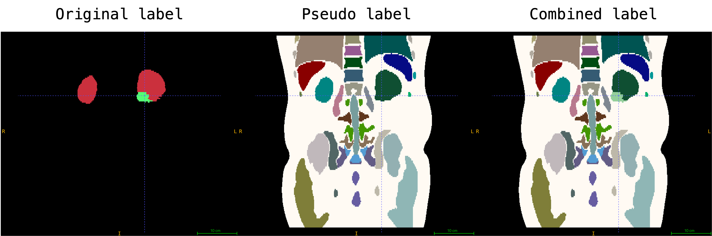

# Medical AI for Synthetic Imaging (MAISI) Data Preparation

Disclaimer: We are not the hosts of the data. Please make sure to read the requirements and usage policies of the data and give credit to the authors of the datasets!

### 1 VAE training Data
For the released Foundation autoencoder model weights in MAISI, we used 37243 CT training data and 1963 CT validation data from chest, abdomen, head and neck region; and 17887 MRI training data and 940 MRI validation data from brain, skull-stripped brain, chest, and below-abdomen region.  The training data come from [TCIA Covid 19 Chest CT](https://wiki.cancerimagingarchive.net/display/Public/CT+Images+in+COVID-19#70227107b92475d33ae7421a9b9c426f5bb7d5b3), [TCIA Colon Abdomen CT](https://wiki.cancerimagingarchive.net/pages/viewpage.action?pageId=3539213), [MSD03 Liver Abdomen CT](http://medicaldecathlon.com/), [LIDC chest CT](https://www.cancerimagingarchive.net/collection/lidc-idri/), [TCIA Stony Brook Covid Chest CT](https://www.cancerimagingarchive.net/collection/covid-19-ny-sbu/), [NLST Chest CT](https://www.cancerimagingarchive.net/collection/nlst/), [TCIA Upenn GBM Brain MR](https://wiki.cancerimagingarchive.net/pages/viewpage.action?pageId=70225642), [Aomic Brain MR](https://openneuro.org/datasets/ds003097/versions/1.2.1), [QTIM Brain MR](https://openneuro.org/datasets/ds004169/versions/1.0.7), [TCIA Acrin Chest MR](https://www.cancerimagingarchive.net/collection/acrin-contralateral-breast-mr/), [TCIA Prostate MR Below-Abdomen MR](https://wiki.cancerimagingarchive.net/pages/viewpage.action?pageId=68550661#68550661a2c52df5969d435eae49b9669bea21a6).

In total, we included:
| Index | Dataset Name                                   | Number of Training Data | Number of Validation Data |
|-------|------------------------------------------------|-------------------------|---------------------------|
| 1     | Covid 19 Chest CT                              | 722                     | 49                        |
| 2     | TCIA Colon Abdomen CT                          | 1522                    | 77                        |
| 3     | MSD03 Liver Abdomen CT                         | 104                     | 0                         |
| 4     | LIDC chest CT                                  | 450                     | 24                        |
| 5     | TCIA Stony Brook Covid Chest CT                | 2644                    | 139                       |
| 6     | NLST Chest CT                                  | 31801                   | 1674                      |
| 7     | TCIA Upenn GBM Brain MR (skull-stripped)       | 2550                    | 134                       |
| 8     | Aomic Brain MR                                 | 2630                    | 138                       |
| 9     | QTIM Brain MR                                  | 1275                    | 67                        |
| 10    | Acrin Chest MR                                 | 6599                    | 347                       |
| 11    | TCIA Prostate MR Below-Abdomen MR              | 928                     | 49                        |
| 12    | Aomic Brain MR, skull-stripped                 | 2630                    | 138                       |
| 13    | QTIM Brain MR, skull-stripped                  | 1275                    | 67                        |
|       | Total CT                                       | 37243                   | 1963                      |
|       | Total MRI                                      | 17887                   | 940                       |


### 2 Diffusion model training Data

The training dataset for the Diffusion model used in MAISI comprises 10,277 CT volumes from 24 distinct datasets, encompassing various body regions and disease patterns.

The table below provides a summary of the number of volumes for each dataset.

|Index| Dataset name|Number of volumes|
|:-----|:-----|:-----|
1  | AbdomenCT-1K | 789
2  | AeroPath | 15
3  | AMOS22 | 240
4  | autoPET23 | 200
5  | Bone-Lesion | 223
6  | BTCV | 48
7  | COVID-19 | 524
8  | CRLM-CT | 158
9  | CT-ORG | 94
10 | CTPelvic1K-CLINIC | 94
11 | LIDC | 422
12 | MSD Task03 | 88
13 | MSD Task06 | 50
14 | MSD Task07 | 224
15 | MSD Task08 | 235
16 | MSD Task09 | 33
17 | MSD Task10 | 87
18 | Multi-organ-Abdominal-CT | 65
19 | NLST | 3109
20 | Pancreas-CT | 51
21 | StonyBrook-CT | 1258
22 | TCIA_Colon | 1437
23 | TotalSegmentatorV2 | 654
24 | VerSe | 179

### 3 ControlNet model training Data

#### 3.1 Example preprocessed dataset

We provide the preprocessed subset of [C4KC-KiTS](https://www.cancerimagingarchive.net/collection/c4kc-kits/) dataset used in the finetuning config `environment_maisi_controlnet_train.json`. The [dataset](https://developer.download.nvidia.com/assets/Clara/monai/tutorials/model_zoo/model_maisi_C4KC-KiTS_subset.zip) and [corresponding JSON data](https://developer.download.nvidia.com/assets/Clara/monai/tutorials/model_zoo/model_maisi_C4KC-KiTS_subset.json) list can be downloaded and should be saved in `maisi/dataset/` folder.

The structure of example folder in the preprocessed dataset is:

```
            |-*arterial*.nii.gz               # original image
            |-*arterial_emb*.nii.gz           # encoded image embedding
KiTS-000* --|-mask*.nii.gz                    # original labels
            |-mask_pseudo_label*.nii.gz       # pseudo labels
            |-mask_combined_label*.nii.gz     # combined mask of original and pseudo labels
```

An example combined mask of original and pseudo labels is shown below:


Please note that the label of Kidney Tumor is mapped to index `129` in this preprocessed dataset. The encoded image embedding is generated by provided `Autoencoder` in `./models/autoencoder_epoch273.pt` during preprocessing to save memory usage for training. The pseudo labels are generated by [VISTA 3D](https://github.com/Project-MONAI/VISTA). In addition, the dimension of each volume and corresponding pseudo label is resampled to the closest multiple of 128 (e.g., 128, 256, 384, 512, ...).

The training workflow requires one JSON file to specify the image embedding and segmentation pairs. The example file is located in the `maisi/dataset/C4KC-KiTS_subset.json`.

The JSON file has the following structure:
```python
{
    "training": [
        {
            "image": "*/*arterial_emb*.nii.gz",  # relative path to the image embedding file
            "label": "*/mask_combined_label*.nii.gz",  # relative path to the combined label file
            "dim": [512, 512, 512],  # the dimension of image
            "spacing": [1.0, 1.0, 1.0],  # the spacing of image
            "top_region_index": [0, 1, 0, 0],  # the top region index of the image
            "bottom_region_index": [0, 0, 0, 1],  # the bottom region index of the image
            "fold": 0  # fold index for cross validation, fold 0 is used for training
        },

        ...
    ]
}
```

#### 3.2 Controlnet full training datasets
The ControlNet training dataset used in MAISI contains 6330 CT volumes (5058 and 1272 volumes are used for training and validation, respectively) across 20 datasets and covers different body regions and diseases.

The table below summarizes the number of volumes for each dataset.

|Index| Dataset name|Number of volumes|
|:-----|:-----|:-----|
1 | AbdomenCT-1K | 789
2 | AeroPath | 15
3 | AMOS22 | 240
4 | Bone-Lesion	| 237
5 | BTCV | 48
6 | CT-ORG | 94
7 | CTPelvic1K-CLINIC | 94
8 | LIDC | 422
9 | MSD Task03 | 105
10 | MSD Task06 | 50
11 | MSD Task07 | 225
12 | MSD Task08 | 235
13 | MSD Task09 | 33
14 | MSD Task10 | 101
15 | Multi-organ-Abdominal-CT | 64
16 | Pancreas-CT | 51
17 | StonyBrook-CT | 1258
18 | TCIA_Colon | 1436
19 | TotalSegmentatorV2 | 654
20| VerSe | 179

### 4. Questions and bugs

- For questions relating to the use of MONAI, please use our [Discussions tab](https://github.com/Project-MONAI/MONAI/discussions) on the main repository of MONAI.
- For bugs relating to MONAI functionality, please create an issue on the [main repository](https://github.com/Project-MONAI/MONAI/issues).
- For bugs relating to the running of a tutorial, please create an issue in [this repository](https://github.com/Project-MONAI/Tutorials/issues).

### Reference
[1] [Rombach, Robin, et al. "High-resolution image synthesis with latent diffusion models." CVPR 2022.](https://openaccess.thecvf.com/content/CVPR2022/papers/Rombach_High-Resolution_Image_Synthesis_With_Latent_Diffusion_Models_CVPR_2022_paper.pdf)
