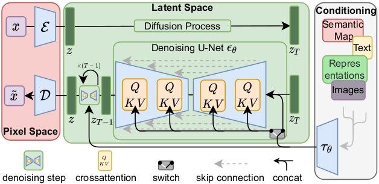

# 3D Latent Diffusion Example
This folder contains an example to train and validate a 3D latent diffusion model on Brats data using multi-gpu.

The workflow of latent diffusion model is shown in the following figure. It first trains an autoencoder in pixel space that can encode the images into latent features. Then it trains a diffusion model in latent space that can denoise the noisy latent features. During inference, it first generates latent features from random noise through multiple steps of denoising using the trained diffusion model, then decodes the latent features into images using the trained autoencoder.
<p align="center">
  

MONAI latent diffusion model implementation is based on the following papers:

[**Latent Diffusion:** Rombach, Robin, et al. "High-resolution image synthesis with latent diffusion models." CVPR 2022.](https://openaccess.thecvf.com/content/CVPR2022/papers/Rombach_High-Resolution_Image_Synthesis_With_Latent_Diffusion_Models_CVPR_2022_paper.pdf)

### 1. Data

The dataset we are experimenting with in this example is BraTS 2018 data (https://www.med.upenn.edu/sbia/brats2018.html).

BraTS 2018 is a public dataset of brain MR images. Using these images, the goal is to generate images that look similar to the images in BraTS 2018 dataset.

The data can be automatically downloaded at the beginning of training.

Disclaimer: We are not the host of the data. Please make sure to read the requirements and usage policies of the data and give credit to the authors of the dataset! We acknowledge the National Cancer Institute and the Foundation for the National Institutes of Health, and their critical role in the creation of the free publicly available LIDC/IDRI Database used in this study.

### 2. Questions and bugs

- For questions relating to the use of MONAI, please use our [Discussions tab](https://github.com/Project-MONAI/MONAI/discussions) on the main repository of MONAI.
- For bugs relating to MONAI functionality, please create an issue on the [main repository](https://github.com/Project-MONAI/MONAI/issues).
- For bugs relating to the running of a tutorial, please create an issue in [this repository](https://github.com/Project-MONAI/Tutorials/issues).

### 3. Run the example
#### 3.0 Setup environment
```
git clone https://github.com/Project-MONAI/GenerativeModels.git
cd GenerativeModels/
python setup.py install
cd ..
```
We also need
```
pip install lpips
```

#### [3.1 3D Autoencoder Training](./train_autoencoder.py)

The network configuration is in [./config/config_train_32g.json](./config/config_train_32g.json) for 32G GPU
and [./config/config_train_16g.json](./config/config_train_16g.json) for 16G GPU.
You may play with the hyper-parameters in these configuration files based on your needs.
The training python script resamples the brain images into the voxel spacing defined in `"spacing"` in the configuration files. Here we have `"spacing": [1.1, 1.1, 1.1]`, indicating the images are resampled to 1.1x1.1x1.1 mm.
If you have GPU with larger memory, you may consider changing it to `"spacing": [1.0, 1.0, 1.0]`.
The training python script uses batch size and patch size defined in the configuration files. If you have a different GPU memory size, please change `"batch_size"` and `"patch_size"` in `"autoencoder_train"` to fit the GPU you use. `"patch_size"` needs to be divisible by 4.

Before you start training, please set the path in [./config/environment.json](./config/environment.json).

- `"model_dir"`: where it saves the trained models
- `"tfevent_path"`: where it saves the tensorboard events
- `"resume_ckpt"`: whether to resume training from existing checkpoints.
- `"data_base_dir"`: where you store the Brats dataset.

If the Brats dataset is not downloaded, please add `--download_data` in training command, the Brats data will be downloaded from [Medical Decathlon](http://medicaldecathlon.com/) and extracted to `$data_base_dir/Task01_BrainTumour`. For example, this command is for running the training script with one 32G gpu.
```bash
python3 train_autoencoder.py -c ./config/config_train_32g.json -e ./config/environment.json -g 1 --download_data
```
If `$data_base_dir/Task01_BrainTumour` already exists, you may omit the downloading.
```bash
python3 train_autoencoder.py -c ./config/config_train_32g.json -e ./config/environment.json -g 1
```

The training script also supports multi-gpu training.
For example, if you are running the training script with eight 32G gpu, please run:
```bash
export NUM_GPUS_PER_NODE=8
torchrun \
    --nproc_per_node=${NUM_GPUS_PER_NODE} \
    --nnodes=1 \
    --master_addr=localhost --master_port=1234 \
    train_autoencoder.py -c ./config/config_train_32g.json -e ./config/environment.json -g ${NUM_GPUS_PER_NODE}
```

<p align="center">
  
&nbsp; &nbsp; &nbsp; &nbsp;
  
</p>

With eight DGX1V 32G GPU, it took around 55 hours to train 1000 epochs.

#### [3.2 3D Latent Diffusion Training](./train_diffusion.py)
The training python script uses batch size and patch size defined in the configuration files. If you have a different GPU memory size, please change `"batch_size"` and `"patch_size"` in `"diffusion_train"` to fit the GPU you use. `"patch_size"` needs to be divisible by 16.

To train with single 32G GPU, please run:
```bash
python3 train_diffusion.py -c ./config/config_train_32g.json -e ./config/environment.json -g 1
```

The training script also supports multi-gpu training.
For example, if you are running the training script with eight 32G gpu, please run:
```bash
export NUM_GPUS_PER_NODE=8
torchrun \
    --nproc_per_node=${NUM_GPUS_PER_NODE} \
    --nnodes=1 \
    --master_addr=localhost --master_port=1234 \
    train_diffusion.py -c ./config/config_train_32g.json -e ./config/environment.json -g ${NUM_GPUS_PER_NODE}
```
<p align="center">
  
&nbsp; &nbsp; &nbsp; &nbsp;
  
</p>

#### [3.3 Inference]()


### Acknowledgement


### Reference
[1] [Rombach, Robin, et al. "High-resolution image synthesis with latent diffusion models." CVPR 2022.](https://openaccess.thecvf.com/content/CVPR2022/papers/Rombach_High-Resolution_Image_Synthesis_With_Latent_Diffusion_Models_CVPR_2022_paper.pdf)

[2] [Menze, Bjoern H., et al. "The multimodal brain tumor image segmentation benchmark (BRATS)." IEEE transactions on medical imaging 34.10 (2014): 1993-2024.](https://ieeexplore.ieee.org/document/6975210)
