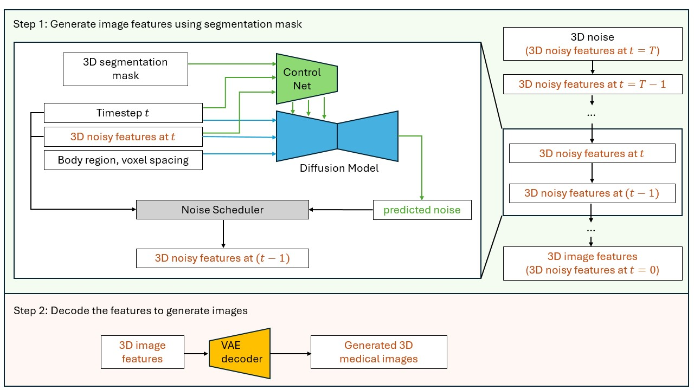

# Medical AI for Synthetic Imaging (MAISI)
This example shows the use cases of training and validating Nvidia MAISI (Medical AI for Synthetic Imaging), a 3D Latent Diffusion Model that can generate large CT images with paired segmentation masks, variable volume size and voxel size, as well as controllable organ/tumor size.

The training and inference workflow of MAISI is depicted in the figure below. It begins by training an autoencoder in pixel space to encode images into latent features. Following that, it trains a diffusion model in the latent space to denoise the noisy latent features. During inference, it first generates latent features from random noise by applying multiple denoising steps using the trained diffusion model. Finally, it decodes the denoised latent features into images using the trained autoencoder.
<p align="center">
  
  <br>
  <em>Figure 1: MAISI training scheme</em>
</p>

<p align="center">
  
  <em>Figure 2: MAISI inference scheme</em>
</p>
MAISI is based on the following papers:

[**Latent Diffusion:** Rombach, Robin, et al. "High-resolution image synthesis with latent diffusion models." CVPR 2022.](https://openaccess.thecvf.com/content/CVPR2022/papers/Rombach_High-Resolution_Image_Synthesis_With_Latent_Diffusion_Models_CVPR_2022_paper.pdf)

[**ControlNet:**  Lvmin Zhang, Anyi Rao, Maneesh Agrawala; “Adding Conditional Control to Text-to-Image Diffusion Models.” ICCV 2023.](https://openaccess.thecvf.com/content/ICCV2023/papers/Zhang_Adding_Conditional_Control_to_Text-to-Image_Diffusion_Models_ICCV_2023_paper.pdf)

### 1. Installation
Please refer to the [Installation of MONAI Generative Model](../README.md)

### 2. Model inference and example outputs

The inference script generate images based on the setting in [configuration files](./config/config_maisi.json).

- `"spacing"`: voxel size of generated images. E.g., if set to `[1.5, 1.5, 2.0]`, it will generate images with a resolution of 1.5x1.5x2.0 mm.
- `"output_size"`: volume size of generated images. E.g., if set to `[512, 512, 256]`, it will generate images with size of 512x512x256. They need to be divisible by 16. If you have a small GPU memory size, you should adjust it to small numbers.
- `"controllable_anatomy_size"`: a list of controllable anatomy and its size scale (0--1). E.g., if set to `[["liver", 0.5],["hepatic tumor", 0.3]]`, the generated image will contain liver that have a median size, with size around 50% percentile, and hepatic tumor that is relatively small, with around 30% percentile. The output will contain paired image and segmentation mask for the controllable anatomy.
- `"body_region"`: If "controllable_anatomy_size" is not specified, "body_region" will be used to constrain the region of generated images. It needs to be chosen from "head", "chest", "thorax", "abdomen", "pelvis", "lower".
- `"anatomy_list"`: If "controllable_anatomy_size" is not specified, the output will contain paired image and segmentation mask for the anatomy in "anatomy_list".

Before you start inference, please set the path in [./config/environment.json](./config/environment.json).

To generate one image during inference, please run the following command:
```bash
python inference.py -c ./configs/config_maisi.json -e ./configs/environment.json --num_output_samples 1
```
`--num_output_samples` defines how many images it would generate.


An example output is shown below.
<p align="center">
  
&nbsp; &nbsp; &nbsp; &nbsp;
  
&nbsp; &nbsp; &nbsp; &nbsp;
  
</p>

### 3. Training example
Training data preparation can be found in [./data/README.md](./data/README.md)

#### [3.1 3D Autoencoder Training](./train_autoencoder.py)

The network configuration files are located in [./config/config_train_32g.json](./config/config_train_32g.json) for 32G GPU
and [./config/config_train_16g.json](./config/config_train_16g.json) for 16G GPU.
You can modify the hyperparameters in these files to suit your requirements.

The training script resamples the brain images based on the voxel spacing specified in the `"spacing"` field of the configuration files. For instance, `"spacing": [1.1, 1.1, 1.1]` resamples the images to a resolution of 1.1x1.1x1.1 mm. If you have a GPU with larger memory, you may consider changing the `"spacing"` field to `"spacing": [1.0, 1.0, 1.0]`.

The training script uses the batch size and patch size defined in the configuration files. If you have a different GPU memory size, you should adjust the `"batch_size"` and `"patch_size"` parameters in the `"autoencoder_train"` to match your GPU. Note that the `"patch_size"` needs to be divisible by 4.

Before you start training, please set the path in [./config/environment.json](./config/environment.json).

- `"model_dir"`: where it saves the trained models
- `"tfevent_path"`: where it saves the tensorboard events
- `"output_dir"`: where you store the generated images during inference.
- `"resume_ckpt"`: whether to resume training from existing checkpoints.
- `"data_base_dir"`: where you store the Brats dataset.

Below is the the training command for single GPU.

```bash
python train_autoencoder.py -c ./config/config_train_32g.json -e ./config/environment.json -g 1
```

The training script also enables multi-GPU training. For instance, if you are using eight 32G GPUs, you can run the training script with the following command:
```bash
export NUM_GPUS_PER_NODE=8
torchrun \
    --nproc_per_node=${NUM_GPUS_PER_NODE} \
    --nnodes=1 \
    --master_addr=localhost --master_port=1234 \
    train_autoencoder.py -c ./config/config_maisi.json -e ./config/environment.json -g ${NUM_GPUS_PER_NODE}
```

<p align="center">
  
&nbsp; &nbsp; &nbsp; &nbsp;
  
</p>

With eight DGX1V 32G GPUs, it took around 55 hours to train 1000 epochs.

#### [3.2 3D Latent Diffusion Training](./train_diffusion.py)
The training script uses the batch size and patch size defined in the configuration files. If you have a different GPU memory size, you should adjust the `"batch_size"` and `"patch_size"` parameters in the `"diffusion_train"` to match your GPU. Note that the `"patch_size"` needs to be divisible by 16.

To train with single 32G GPU, please run:
```bash
python train_diffusion.py -c ./config/config_maisi.json -e ./config/environment.json -g 1
```

The training script also enables multi-GPU training. For instance, if you are using eight 32G GPUs, you can run the training script with the following command:
```bash
export NUM_GPUS_PER_NODE=8
torchrun \
    --nproc_per_node=${NUM_GPUS_PER_NODE} \
    --nnodes=1 \
    --master_addr=localhost --master_port=1234 \
    train_diffusion.py -c ./config/config_maisi.json -e ./config/environment.json -g ${NUM_GPUS_PER_NODE}
```
<p align="center">
  
&nbsp; &nbsp; &nbsp; &nbsp;
  
</p>

#### [3.3 3D ControNet Training](./train_controlnet.py)


### 4. Questions and bugs

- For questions relating to the use of MONAI, please use our [Discussions tab](https://github.com/Project-MONAI/MONAI/discussions) on the main repository of MONAI.
- For bugs relating to MONAI functionality, please create an issue on the [main repository](https://github.com/Project-MONAI/MONAI/issues).
- For bugs relating to the running of a tutorial, please create an issue in [this repository](https://github.com/Project-MONAI/Tutorials/issues).

### Reference
[1] [Rombach, Robin, et al. "High-resolution image synthesis with latent diffusion models." CVPR 2022.](https://openaccess.thecvf.com/content/CVPR2022/papers/Rombach_High-Resolution_Image_Synthesis_With_Latent_Diffusion_Models_CVPR_2022_paper.pdf)

[2] [Menze, Bjoern H., et al. "The multimodal brain tumor image segmentation benchmark (BRATS)." IEEE transactions on medical imaging 34.10 (2014): 1993-2024.](https://ieeexplore.ieee.org/document/6975210)

[3] [Pinaya et al. "Brain imaging generation with latent diffusion models"](https://arxiv.org/abs/2209.07162)
