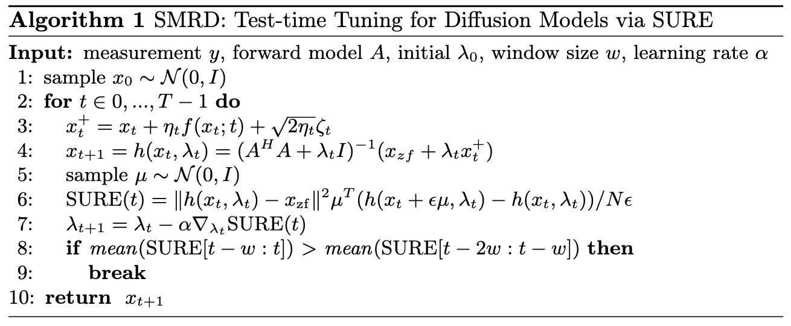

SURE-Based Robust MRI Reconstruction with Diffusion Models (SMRD). MICCAI 2023 (https://link.springer.com/chapter/10.1007/978-3-031-43898-1_20)

This showcases how the conjugate gradient method can be used to enforce measurement consistency in diffusion model based MRI reconstruction. It also shows
how the SURE-based method can be used to perform early stopping, so fewer iterations and artefacts are introduced during the generation of the reconstructed image.
