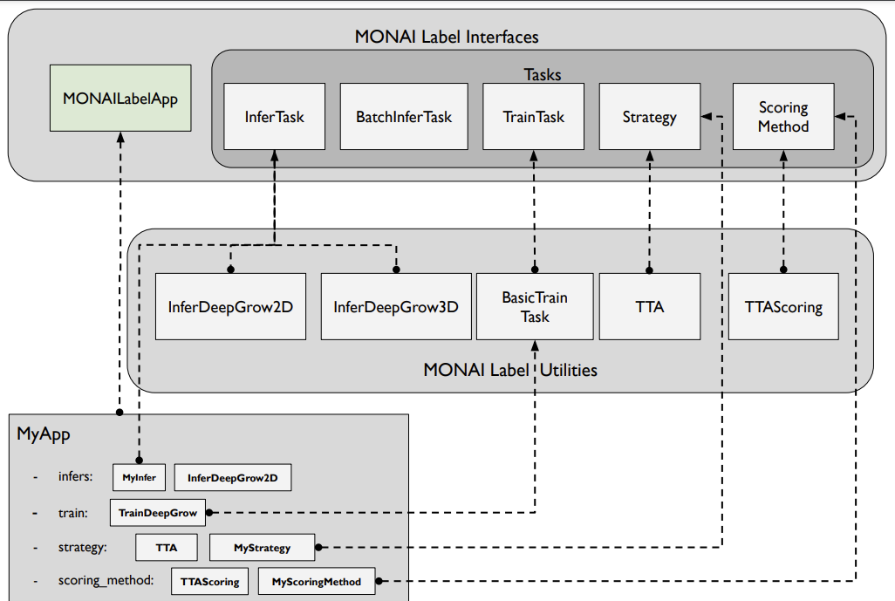

# MONAI Label Tutorial: Develop MONAI Label App - the monaibundle App Example

This tutorial demonstrates the monaibundle app modules for building a MONAI Label app. We show detailed structures for developing applications. MONAI Label provides interfaces and deployment utilities that end-users can develop in a serverless way. Medical image labeling applications are typically categorized into different imaging modalities, MONAI Label offers several sample teamplate apps including `radiology`, `pathology`, and `endoscopy`, each app is associated with processing features corresponding to radiographic, microscopic, and endoscopic images. However, AI-assisted algorithms, especially deep learning-based approaches are consisted of similar modules. Such as model inference, training pipeline, image pre-processing, post-process, or active learning strategies. Apart from above templates apps, this tutorial indroduces desgin details of monaibundle app with MONAI Label interfaces, and demonstrate how to integrate the modules into a complete app and deployable to MONAI Label server.

Modules Overview: MONAI Label provides interfaces that can be implemented by the label app developer for custom functionality as well as
utilities that are readily usable in the labeling app.

## 1. Design `monaibundle` app

In the following sections, we demonstrate the design of a specific application - `monaibundle` app. The `monaibundle` app is a special app that can adapt bundle config models to MONAI Label. It's not a standard application for a single type of medical imaging modality. We show how `monaibundle` app is designed and made as a general interface for bundles.

Follow MONAI Label app modules, we need to define the **InferTask** and **TrainTask** first. Bundle config files typically consist of complete parameters, functions, class, and handlers in JSON or YAML format. Firstly, the monaibundle app needs to define constants to match the design standards of bundles. The infer task constant class is shown below:

<pre style="background: #f4f4f4; border: 1px solid #ddd; border-left: 3px solid #02a3a3; line-height: 1.6; padding: 1.5em;">
class BundleConstants:
    def configs(self) -> Sequence[str]:
        return ["inference.json", "inference.yaml"]

    def metadata_json(self) -> str:
        return "metadata.json"

    def model_pytorch(self) -> str:
        return "model.pt"

    def model_torchscript(self) -> str:
        return "model.ts"

    def key_device(self) -> str:
        return "device"

    def key_bundle_root(self) -> str:
        return "bundle_root"

    def key_network_def(self) -> str:
        return "network_def"

    def key_preprocessing(self) -> Sequence[str]:
        return ["preprocessing", "pre_transforms"]

    def key_postprocessing(self) -> Sequence[str]:
        return ["postprocessing", "post_transforms"]

    def key_inferer(self) -> Sequence[str]:
        return ["inferer"]
</pre>

### 1.1. Design Infer Task

`monaibundle` app loads most configurations from the bundle directly, unlike other template apps, it needs to define a separate InferTask named **BundleInferTask**.

Below is part of the code section, it shows how the inference configurations are loaded by `ConfigParser`, the bundle configs are passed from JSON/YAML files. Network, pre-transformations, infer parameters, data-loaders are instantiated in the class.

<pre style="background: #f4f4f4; border: 1px solid #ddd; border-left: 3px solid #02a3a3; line-height: 1.6; padding: 1.5em;">
class BundleInferTask(BasicInferTask):
    """
    This provides Inference Engine for Monai Bundle.
    """

    def __init__(
        self,
        path: str,
        conf: Dict[str, str],
        const: Optional[BundleConstants] = None,
        type: Union[str, InferType] = InferType.SEGMENTATION,
        pre_filter: Optional[Sequence] = None,
        post_filter: Optional[Sequence] = [SaveImaged],
        extend_load_image: bool = True,
        add_post_restore: bool = True,
        dropout: float = 0.0,
        **kwargs,
    ):
        self.valid: bool = False
        self.const = const if const else BundleConstants()

        self.pre_filter = pre_filter
        self.post_filter = post_filter
        self.extend_load_image = extend_load_image
        self.add_post_restore = add_post_restore
        self.dropout = dropout

        config_paths = [c for c in self.const.configs() if os.path.exists(os.path.join(path, "configs", c))]
        if not config_paths:
            logger.warning(f"Ignore {path} as there is no infer config {self.const.configs()} exists")
            return

        self.bundle_config = ConfigParser()
        self.bundle_config.read_config(os.path.join(path, "configs", config_paths[0]))
        self.bundle_config.config.update({self.const.key_bundle_root(): path})
        if self.dropout > 0:
            self.bundle_config["network_def"]["dropout"] = self.dropout

        network = None
        model_path = os.path.join(path, "models", self.const.model_pytorch())
        if os.path.exists(model_path):
            network = self.bundle_config.get_parsed_content(self.const.key_network_def(), instantiate=True)
        else:
            model_path = os.path.join(path, "models", self.const.model_torchscript())
            if not os.path.exists(model_path):
                logger.warning(
                    f"Ignore {path} as neither {self.const.model_pytorch()} nor {self.const.model_torchscript()} exists"
                )
                return
</pre>

In the **BundleInferTask**, we can also update the transformations loaded from bundle JSON/YAML files. For example, to better adapt to MONAI Label, we can filter transformations by passing to argument, and we can extend transformation for customization purposes.

- Pre-transforms
<pre style="background: #f4f4f4; border: 1px solid #ddd; border-left: 3px solid #02a3a3; line-height: 1.6; padding: 1.5em;">
def pre_transforms(self, data=None) -> Sequence[Callable]:
    pre = []
    for k in self.const.key_preprocessing():
        if self.bundle_config.get(k):
            c = self.bundle_config.get_parsed_content(k, instantiate=True)
            pre = list(c.transforms) if isinstance(c, Compose) else c
    pre = self._filter_transforms(pre, self.post_filter)

    if pre and self.extend_load_image:
        res = []
        for t in pre:
            if isinstance(t, LoadImaged):
                res.append(LoadImageTensord(keys=t.keys, load_image_d=t))
            else:
                res.append(t)
        pre = res
    return pre
</pre>

- Infer Type:
<pre style="background: #f4f4f4; border: 1px solid #ddd; border-left: 3px solid #02a3a3; line-height: 1.6; padding: 1.5em;">
def inferer(self, data=None) -> Inferer:
    for k in self.const.key_inferer():
        if self.bundle_config.get(k):
            return self.bundle_config.get_parsed_content(k, instantiate=True)  # type: ignore
    return SimpleInferer()
</pre>

- Post-transforms
<pre style="background: #f4f4f4; border: 1px solid #ddd; border-left: 3px solid #02a3a3; line-height: 1.6; padding: 1.5em;">
def post_transforms(self, data=None) -> Sequence[Callable]:
    post = []
    for k in self.const.key_postprocessing():
        if self.bundle_config.get(k):
            c = self.bundle_config.get_parsed_content(k, instantiate=True)
            post = list(c.transforms) if isinstance(c, Compose) else c
    post = self._filter_transforms(post, self.post_filter)

    if self.add_post_restore:
        post.append(Restored(keys=self.key_pred, ref_image=self.key_image))
    return post
</pre>

### 1.2. Design Trainer Task

Similar to **BundleInferTask**, most training configurations are from bundle config files. Below is a code section of **BundleTranTask**, bundle file roots, configs are passed and instantiated by the config parser.

<pre style="background: #f4f4f4; border: 1px solid #ddd; border-left: 3px solid #02a3a3; line-height: 1.6; padding: 1.5em;">
class BundleTrainTask(TrainTask):
    def __init__(self, path: str, conf: Dict[str, str], const: Optional[BundleConstants] = None):
        self.valid: bool = False
        self.conf = conf
        self.const = const if const else BundleConstants()

        config_paths = [c for c in self.const.configs() if os.path.exists(os.path.join(path, "configs", c))]
        if not config_paths:
            logger.warning(f"Ignore {path} as there is no train config {self.const.configs()} exists")
            return

        self.bundle_path = path
        self.bundle_config_path = os.path.join(path, "configs", config_paths[0])

        self.bundle_config = ConfigParser()
        self.bundle_config.read_config(self.bundle_config_path)
        self.bundle_config.config.update({self.const.key_bundle_root(): self.bundle_path})

        # https://docs.monai.io/en/latest/mb_specification.html#metadata-json-file
        self.bundle_metadata_path = os.path.join(path, "configs", "metadata.json")
        with open(os.path.join(path, "configs", self.const.metadata_json())) as fp:
            metadata = json.load(fp)

        super().__init__(metadata.get("description", ""))
        self.valid = True
</pre>

For trainer task, monaibundle app directly uses bundle API to trigger the training process. After config files are loaded and updated, the app calls `bundle.run` API to start training epochs.

<pre style="background: #f4f4f4; border: 1px solid #ddd; border-left: 3px solid #02a3a3; line-height: 1.6; padding: 1.5em;">
monai.bundle.run(
    "training",
    meta_file=self.bundle_metadata_path,
    config_file=self.bundle_config_path,
    **overrides,
)
</pre>

### 1.3. Design Scoring Task

The Scoring task and active learning are essential to MONAI Label experience. For monaibundle app, we use the **EpistemicScoring** method for scoring each sample image. Below is a sample section code of EpistemicScoring, it used dropout, and calculate entropy for each sample.

<pre style="background: #f4f4f4; border: 1px solid #ddd; border-left: 3px solid #02a3a3; line-height: 1.6; padding: 1.5em;">
class EpistemicScoring(ScoringMethod):
    """
    First version of Epistemic computation used as active learning strategy
    """

    def __init__(
        self,
        infer_task: BasicInferTask,
        max_samples=0,
        simulation_size=5,
        use_variance=False,
        key_output_entropy="epistemic_entropy",
        key_output_ts="epistemic_ts",
    ):
        super().__init__(f"Compute initial score based on dropout - {infer_task.description}")
        self.infer_task = infer_task
        self.dimension = infer_task.dimension

        self.max_samples = max_samples
        self.simulation_size = simulation_size
        self.use_variance = use_variance
        self.key_output_entropy = key_output_entropy
        self.key_output_ts = key_output_ts

    def entropy_volume(self, vol_input):
        # The input is assumed with repetitions, channels and then volumetric data
        vol_input = vol_input.cpu().detach().numpy() if isinstance(vol_input, torch.Tensor) else vol_input
        vol_input = vol_input.astype(dtype="float32")
        dims = vol_input.shape
        reps = dims[0]
        entropy = np.zeros(dims[2:], dtype="float32")

        # Threshold values less than or equal to zero
        threshold = 0.00005
        vol_input[vol_input <= 0] = threshold

        # Looping across channels as each channel is a class
        if len(dims) == 5 if self.dimension == 3 else 4:
            for channel in range(dims[1]):
                t_vol = np.squeeze(
                    vol_input[:, channel, :, :, :] if self.dimension == 3 else vol_input[:, channel, :, :]
                )
                t_sum = np.sum(t_vol, axis=0)
                t_avg = np.divide(t_sum, reps)
                t_log = np.log(t_avg)
                t_entropy = -np.multiply(t_avg, t_log)
                entropy = entropy + t_entropy
        else:
            t_vol = np.squeeze(vol_input)
            t_sum = np.sum(t_vol, axis=0)
            t_avg = np.divide(t_sum, reps)
            t_log = np.log(t_avg)
            t_entropy = -np.multiply(t_avg, t_log)
            entropy = entropy + t_entropy

        # Returns a 3D volume of entropy
        return entropy

</pre>

### 1.4. Config the `main` Script

A MONAI Label app needs a module to tie together inference, training, and image selection. And provide the end-user with a seamless simultaneous model training and annotation experience.
In this section, we provide details of `monaibundle` app's `main.py`.

#### 1.4.1 Load bundle

In the main class of the `monaibundle` app, the first step is to load the bundle from bundle directories. The initialization step identifies the availability of the provided bundle. The get_bundle_models function returns the directories of the local or downloaded bundles.

<pre style="background: #f4f4f4; border: 1px solid #ddd; border-left: 3px solid #02a3a3; line-height: 1.6; padding: 1.5em;">
class MyApp(MONAILabelApp):
    def __init__(self, app_dir, studies, conf):
        self.models = get_bundle_models(app_dir, conf)
        # Add Epistemic model for scoring
        self.epistemic_models = (
            get_bundle_models(app_dir, conf, conf_key="epistemic_model") if conf.get("epistemic_model") else None
        )
        if self.epistemic_models:
            # Get epistemic parameters
            self.epistemic_max_samples = int(conf.get("epistemic_max_samples", "0"))
            self.epistemic_simulation_size = int(conf.get("epistemic_simulation_size", "5"))
            self.epistemic_dropout = float(conf.get("epistemic_dropout", "0.2"))

        super().__init__(
            app_dir=app_dir,
            studies=studies,
            conf=conf,
            name=f"MONAILabel - Bundle ({monailabel.__version__})",
            description="DeepLearning models provided via Bundle",
            version=monailabel.__version__,
        )
</pre>

#### 1.4.2 Main app script methods initializations

In the `man.py`, we can initialize the modules of infer, trainer, scoring tasks and active learning strategy that are defined in monailabel interfaces.
Each model or network workflow will associate with one infer, trainer, and scoring method.

- Infer Initialization

<pre style="background: #f4f4f4; border: 1px solid #ddd; border-left: 3px solid #02a3a3; line-height: 1.6; padding: 1.5em;">
    def init_infers(self) -> Dict[str, InferTask]:
        infers: Dict[str, InferTask] = {}
        #################################################
        # Models
        #################################################
        for n, b in self.models.items():
            i = BundleInferTask(b, self.conf)
            logger.info(f"+++ Adding Inferer:: {n} => {i}")
            infers[n] = i
        return infers
</pre>

- Trainer Initialization

<pre style="background: #f4f4f4; border: 1px solid #ddd; border-left: 3px solid #02a3a3; line-height: 1.6; padding: 1.5em;">
    def init_trainers(self) -> Dict[str, TrainTask]:
        trainers: Dict[str, TrainTask] = {}
        if strtobool(self.conf.get("skip_trainers", "false")):
            return trainers

        for n, b in self.models.items():
            t = BundleTrainTask(b, self.conf)
            if not t or not t.is_valid():
                continue

            logger.info(f"+++ Adding Trainer:: {n} => {t}")
            trainers[n] = t
        return trainers
</pre>

- Active Learning Strategy Initialization

<pre style="background: #f4f4f4; border: 1px solid #ddd; border-left: 3px solid #02a3a3; line-height: 1.6; padding: 1.5em;">
    def init_strategies(self) -> Dict[str, Strategy]:
        strategies: Dict[str, Strategy] = {
            "random": Random(),
            "first": First(),
        }

        logger.info(f"Active Learning Strategies:: {list(strategies.keys())}")
        return strategies
</pre>

- Scoring Method Initialization

<pre style="background: #f4f4f4; border: 1px solid #ddd; border-left: 3px solid #02a3a3; line-height: 1.6; padding: 1.5em;">
    def init_scoring_methods(self) -> Dict[str, ScoringMethod]:
        methods: Dict[str, ScoringMethod] = {}
        if not self.conf.get("epistemic_model"):
            return methods

        for n, b in self.epistemic_models.items():
            # Create BundleInferTask task with dropout instantiation for scoring inference
            i = BundleInferTask(
                b,
                self.conf,
                train_mode=True,
                skip_writer=True,
                dropout=self.epistemic_dropout,
                post_filter=[SaveImaged, Invertd],
            )
            methods[n] = EpistemicScoring(
                i, max_samples=self.epistemic_max_samples, simulation_size=self.epistemic_simulation_size
            )
            if not methods:
                continue
            methods = methods if isinstance(methods, dict) else {n: methods[n]}
            logger.info(f"+++ Adding Scoring Method:: {n} => {b}")

        logger.info(f"Active Learning Scoring Methods:: {list(methods.keys())}")
        return methods
</pre>

## 2. Deploy the `monaibundle` app

Users can read detailed code by fetching the `monaibundle` app

<pre style="background: #f4f4f4; border: 1px solid #ddd; border-left: 3px solid #02a3a3; line-height: 1.6; padding: 1.5em;">
# fetch monaibundle app
monailabel apps --name monaibundle --download --output apps
# Start MONAI Label server
monailabel start_server --app monaibundle --studies &lt;path/to/datastore&gt; --conf models &lt;bundlename&gt;
</pre>

MONAI Label user apps are readily deployable on the MONAI Label Server. Simply, MONAI Label Server opens HTTP connection endpoints that define what actions clients can take, then the server relays the action to the MONAI Label application which defines how the actions are taken.
