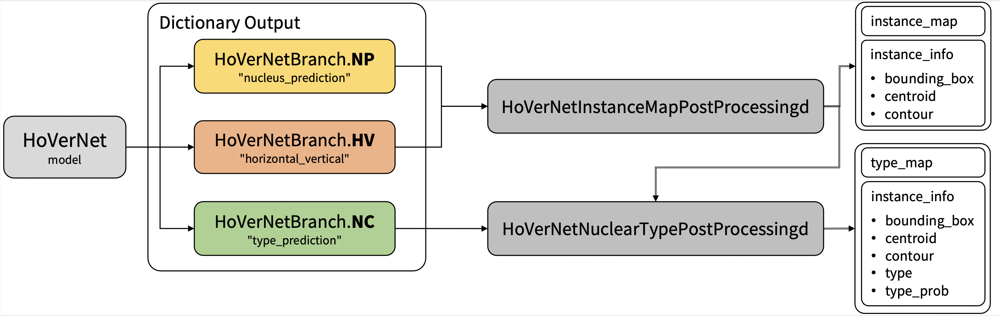

# HoVerNet Examples

This folder contains ignite version examples to run train and validate a HoVerNet [1] model.
It also has torch version notebooks to run training and evaluation.
<p align="center">
  

### 1. Data

CoNSeP datasets which are used in the examples can be downloaded from <https://warwick.ac.uk/fac/cross_fac/tia/data/HoVerNet/>.

- First download CoNSeP dataset to `DATA_ROOT` (default is `"/workspace/Data/Pathology/CoNSeP"`).
- Run `python prepare_patches.py` to prepare patches from images.

### 2. Questions and bugs

- For questions relating to the use of MONAI, please us our [Discussions tab](https://github.com/Project-MONAI/MONAI/discussions) on the main repository of MONAI.
- For bugs relating to MONAI functionality, please create an issue on the [main repository](https://github.com/Project-MONAI/MONAI/issues).
- For bugs relating to the running of a tutorial, please create an issue in [this repository](https://github.com/Project-MONAI/Tutorials/issues).

### 3. List of notebooks and examples

#### [Prepare Your Data](./prepare_patches.py)

This example is used to prepare patches from tiles referring to the implementation from <https://github.com/vqdang/hover_net/blob/master/extract_patches.py>. Prepared patches will be saved in `DATA_ROOT`/Prepared.

```bash
# Run to get all possible arguments
python ./prepare_patches.py -h

# Prepare patches from images using default arguments
python ./prepare_patches.py

# Prepare patch to use custom arguments
python ./prepare_patches.py \
    --root `DATA_ROOT` \
    --ps 540 540 \
    --ss 164 164
```

#### [HoVerNet Training](./training.py)

This example uses MONAI workflow to train a HoVerNet model on prepared CoNSeP dataset.
Since HoVerNet is training via a two-stage approach. First initialized the model with pre-trained weights on the [ImageNet dataset](https://ieeexplore.ieee.org/document/5206848), trained only the decoders for the first 50 epochs, and then fine-tuned all layers for another 50 epochs. We need to specify `--stage` during training.

There are two training modes in total. If "original" mode is specified, it uses [270, 270] and [80, 80] for `patch_size` and `out_size` respectively. If "fast" mode is specified, it uses [256, 256] and [164, 164] for `patch_size` and `out_size` respectively. The results we show below are based on the "fast" model.

Each user is responsible for checking the content of models/datasets and the applicable licenses and determining if suitable for the intended use.
The license for the pre-trained model used in examples is different than MONAI license. Please check the source where these weights are obtained from:
<https://github.com/vqdang/hover_net#data-format>

If you didn't use the default value in data preparation, set ``--root `DATA_ROOT`/Prepared`` for each of the training commands.

```bash
# Run to get all possible arguments
python ./training.py -h

# Train a HoVerNet model on single-GPU or CPU-only (replace with your own ckpt path)
export CUDA_VISIBLE_DEVICES=0; python training.py \
                                --stage 0 \
                                --ep 50 \
                                --bs 16 \
                                --log-dir ./logs
export CUDA_VISIBLE_DEVICES=0; python training.py \
                                --stage 1 \
                                --ep 50 \
                                --bs 16 \
                                --log-dir ./logs \
                                --ckpt logs/stage0/model.pt

# Train a HoVerNet model on multi-GPU with default arguments
torchrun --nnodes=1 --nproc_per_node=2 training.py
torchrun --nnodes=1 --nproc_per_node=2 training.py --stage 1
```

#### [HoVerNet Validation](./evaluation.py)

This example uses MONAI workflow to evaluate the trained HoVerNet model on prepared test data from CoNSeP dataset.
Using this training pipeline in the "fast" mode, we have achieved the following metrics: Dice: 0.8329, PQ: 0.4977 and F1d: 0.7421.

```bash
# Run to get all possible arguments
python ./evaluation.py -h

# Evaluate a HoVerNet model on single-GPU or CPU-only
python ./evaluation.py \
    --root `save_root` \
    --ckpt logs/stage0/model.pt

# Evaluate a HoVerNet model on multi-GPU with default arguments
torchrun --nnodes=1 --nproc_per_node=2 evaluation.py
```

#### [HoVerNet Inference](./inference.py)

This example uses MONAI workflow to run inference for HoVerNet model on arbitrary sized region of interest.
Under the hood, it will use a sliding window approach to run inference on overlapping patches and then put the results
of the inference together and makes an output image the same size as the input. Then it will run the post-processing on
this output image and create the final results. This example save the instance map and type map as png files but it can
be modified to save any output of interest.

```bash
# Run to get all possible arguments
python ./inference.py -h

# Run HoVerNet inference on single-GPU or CPU-only
python ./inference.py \
        --root `save_root` \
        --ckpt logs/stage0/model.pt

# Run HoVerNet inference on multi-GPU with default arguments
torchrun --nnodes=1 --nproc_per_node=2 ./inference.py
```

## Disclaimer

This is an example, not to be used for diagnostic purposes.

## Reference
[1] Simon Graham, Quoc Dang Vu, Shan E Ahmed Raza, Ayesha Azam, Yee Wah Tsang, Jin Tae Kwak, Nasir Rajpoot, Hover-Net: Simultaneous segmentation and classification of nuclei in multi-tissue histology images, Medical Image Analysis, 2019
https://doi.org/10.1016/j.media.2019.101563
