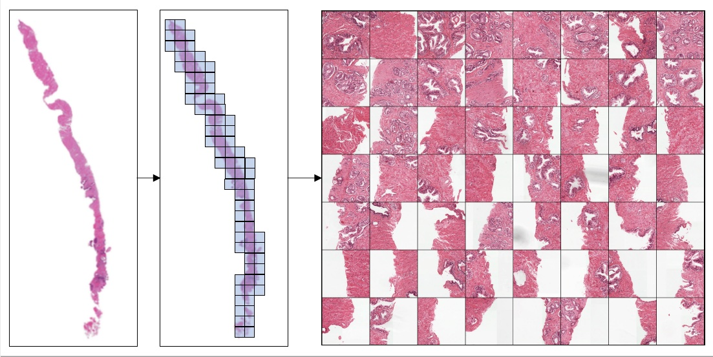
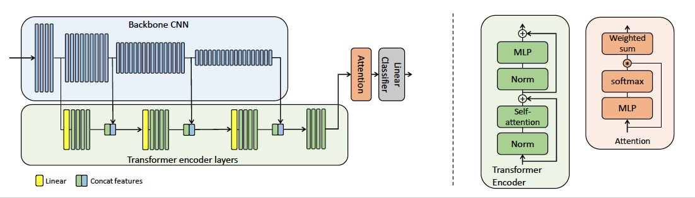
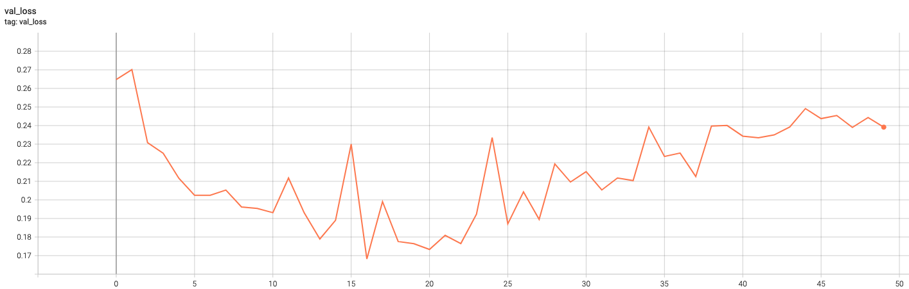
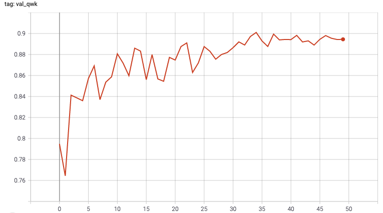

# Multiple Instance Learning (MIL) Examples

This tutorial contains a baseline method of Multiple Instance Learning (MIL) classification from Whole Slide Images (WSI).
The dataset is from  [Prostate cANcer graDe Assessment (PANDA) Challenge - 2020](https://www.kaggle.com/c/prostate-cancer-grade-assessment/) for cancer grade classification from prostate histology WSIs.
The implementation is based on:

Andriy Myronenko, Ziyue Xu, Dong Yang, Holger Roth, Daguang Xu: "Accounting for Dependencies in Deep Learning Based Multiple Instance Learning for Whole Slide Imaging". In MICCAI (2021). [arXiv](https://arxiv.org/abs/2111.01556)




## Requirements

The script is tested with:

- `Ubuntu 18.04` | `Python 3.6` | `CUDA 11.0` | `Pytorch 1.10`

- the default pipeline requires about 16GB memory per gpu

- it is tested on 4x16gb multi-gpu machine

## Dependencies and installation

### MONAI

Please install the required dependencies

```bash
pip install tifffile
pip install imagecodecs
```

For more information please check out [the installation guide](https://docs.monai.io/en/latest/installation.html).

### Data

Prostate biopsy WSI dataset can be downloaded from Prostate cANcer graDe Assessment (PANDA) Challenge on [Kaggle](https://www.kaggle.com/c/prostate-cancer-grade-assessment/data).
In this tutorial, we assume it is downloaded in the `/PandaChallenge2020` folder

## Examples

Check all possible options

```bash
python ./panda_mil_train_evaluate_pytorch_gpu.py -h
```

### Train

Train in multi-gpu mode with AMP using all available gpus,
assuming the training images in /PandaChallenge2020/train_images folder,
it will use the pre-defined 80/20 data split in [datalist_panda_0.json](https://drive.google.com/drive/u/0/folders/1CAHXDZqiIn5QUfg5A7XsK1BncRu6Ftbh)

```bash
python -u panda_mil_train_evaluate_pytorch_gpu.py
    --data_root=/PandaChallenge2020/train_images \
    --amp \
    --distributed \
    --mil_mode=att_trans \
    --batch_size=4 \
    --epochs=50 \
    --logdir=./logs
```

If you need to use only specific gpus, simply add the prefix `CUDA_VISIBLE_DEVICES=...`

```bash
CUDA_VISIBLE_DEVICES=0,1,2,3 python -u panda_mil_train_evaluate_pytorch_gpu.py
    --data_root=/PandaChallenge2020/train_images \
    --amp \
    --distributed \
    --mil_mode=att_trans \
    --batch_size=4 \
    --epochs=50 \
    --logdir=./logs
```

### Validation

Run inference of the best checkpoint over the validation set

```bash
# Validate checkpoint on a single gpu
python -u panda_mil_train_evaluate_pytorch_gpu.py
    --data_root=/PandaChallenge2020/train_images \
    --amp \
    --mil_mode=att_trans \
    --checkpoint=./logs/model.pt \
    --validate
```

### Inference

Run inference on a different dataset. It's the same script as for validation,
we just specify a different data_root and json list files

```bash
python -u panda_mil_train_evaluate_pytorch_gpu.py
    --data_root=/PandaChallenge2020/some_other_files \
    --dataset_json=some_other_files.json
    --amp \
    --mil_mode=att_trans \
    --checkpoint=./logs/model.pt \
    --validate
```

### Stats

Expected train and validation loss curves




Expected validation QWK metric



## Questions and bugs

- For questions relating to the use of MONAI, please use our [Discussions tab](https://github.com/Project-MONAI/MONAI/discussions) on the main repository of MONAI.
- For bugs relating to MONAI functionality, please create an issue on the [main repository](https://github.com/Project-MONAI/MONAI/issues).
- For bugs relating to the running of a tutorial, please create an issue in [this repository](https://github.com/Project-MONAI/Tutorials/issues).
