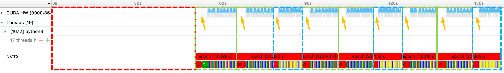
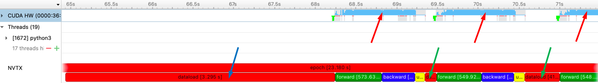
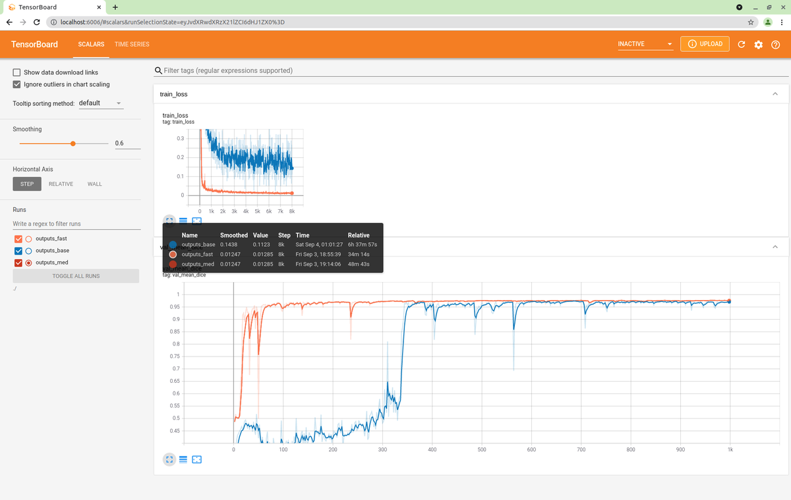
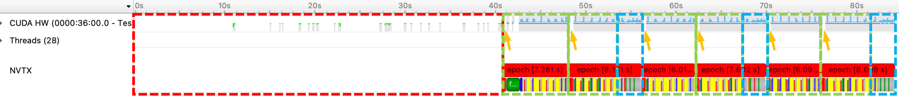

# NVIDIA Nsight Systems
[NVIDIA Nsight™ Systems](https://developer.nvidia.com/nsight-systems) is a system-wide performance analysis tool designed to visualize an application’s algorithms, help to identify the largest opportunities to optimize, and tune to scale efficiently across any quantity or size of CPUs and GPUs.

# NVIDIA Tools Extension (NVTX)
The [NVIDIA® Tools Extension Library (NVTX)](https://github.com/NVIDIA/NVTX) is a powerful mechanism that allows users to manually instrument their application. With a C-based and a python-based Application Programming Interface (API) for annotating events, code ranges, and resources in your applications. Applications that integrate NVTX can use NVIDIA Nsight, Tegra System Profiler, and Visual Profiler to capture and visualize these events and ranges. In general, the NVTX can bring valuable insight into the application while incurring almost no overhead.

# MONAI Training Pipeline and NVTX
[MONAI](https://github.com/Project-MONAI/MONAI) is a high-level framework for deep learning in healthcare imaging.

For performance profiling, we mainly focus on two fronts: data loading/transforms, and training/validation iterations.

[Transforms](https://github.com/Project-MONAI/MONAI/tree/dev/monai/transforms) is one core concept of data handling in MONAI, similar to [TorchVision Transforms](https://pytorch.org/vision/stable/transforms.html). Several of these transforms are usually chained together, using a [Compose](https://github.com/Project-MONAI/MONAI/blob/2f1c7a5d1b47c8dd21681dbe1b67213aa3278cd7/monai/transforms/compose.py#L35) class, to create a preprocessing or postprocessing pipeline that performs manipulation of the input data and makes it suitable for training a deep learning model or inference. To dig into the cost of each transform, we enable the insertion of NVTX annotations via [MONAI NVTX Transforms](https://github.com/Project-MONAI/MONAI/blob/dev/monai/utils/nvtx.py).

For training and validation steps, they are easier to track by setting NVTX annotations within the loop.

# Profiling Spleen Segmentation Pipeline
## Run Nsight Profiling
With environment prepared `requirements.txt`, we use `nsys profile` on the trainer under basic settings for 6 epochs (with validation every 2 epochs). All results shown below are from experiments performed on a DGX-2 workstation using a single V-100 GPU.

```python
nsys profile \
     --output ./output_base \
     --force-overwrite true \
     --trace-fork-before-exec true \
     python3 train_base_nvtx.py
```

# Identify Potential Performance Improvements
## Profile Results
After profiling, the computing details can be visualized via Nsight System GUI. (The version of Nsight used in the tutorial is 2021.3.1.54-ee9c30a OSX)



## Observations
As shown in the above figure, we focus on two sections: CUDA (first row), and NVTX (last two rows). Nsight provides information regarding GPU utilization (CUDA), and specific NVTX tags we added to track certain behaviors.
In this example, we added NVTX tags to track each epoch, as well as operations within each step (data transforms, forward, backward, etc.). As shown within the second last row, each solid red block represents a single epoch.
As we perform validation every two epochs, the even epochs will be longer than the odd ones since it includes both training (green dashed region) and validation (blue dashed region).
Also in this pipeline, we used CacheDataset, and the initial 40~50 seconds (red dashed region) are for loading all training images into CPU RAM.

As can be observed from the figure, there are data loading/IO gaps between epochs (pointed out by orange arrows).

Let's zoom in and look closer at the beginning of the second epoch.



As shown in the zoomed view:
- Between epochs, there is a considerable amount of time costs for data loading (pointed out by the blue arrow);
- Between steps of training, the time of data loading is much smaller (pointed by green arrows);
- The GPU utilization (CUDA HW) is decent during the training step (pointed by red arrows);

Upon further analysis of convergence, it appears that the convergence is relatively slow (blue curve in the tensorboard figure below). Therefore, there are two directions of performance improvement:

- Per-epoch time reduction: by utilizing pre-indexing and thread-based dataloader for more efficient data loading;
- Faster convergence: by utilizing different optimizers and loss functions.

One optimized solution can be found [here](https://github.com/Project-MONAI/tutorials/blob/main/acceleration/fast_training_tutorial.ipynb). Based on the validation accuracy curves, we can observe that the optimized solution (orange curve) has much faster convergence. The GPU utilization rate is above 90% on average.



# Analyzing Performance Improvement
## Profile Results
We again use `nsys profile` to further analyze the optimized training script.

```python
nsys profile \
     --output ./outputs_fast \
     --force-overwrite true \
     --trace-fork-before-exec true \
     python3 train_fast_nvtx.py
```
And the profiling result is



As shown in the figure, the optimized solution:

- Still has the initial 40~50 seconds (red dashed region) for loading all training images into CPU RAM;
- Uses much less time for data loading (pointed by orange arrows);
- The total time per epoch on training (green dashed region) and validation (blue dashed region) has been significantly reduced. For the baseline pipeline, a training epoch takes 12-14 sec, and a training+validation epoch takes 22-23 sec; for the improved pipeline, a training epoch takes 6-7 sec, and a training+validation epoch takes ~8 sec.

Therefore, the computing efficiency and the overall training process are thus be improved by a large margin.

Moreover, another profiling example for pathological image analysis can be found in the following [link](https://github.com/Project-MONAI/tutorials/blob/main/performance_profiling/pathology/profiling_train_base_nvtx.md).
