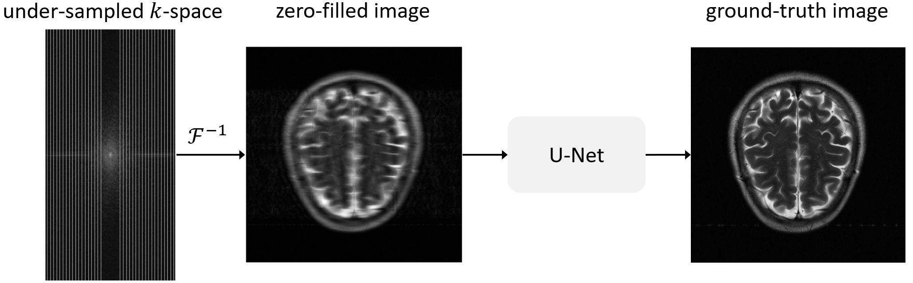
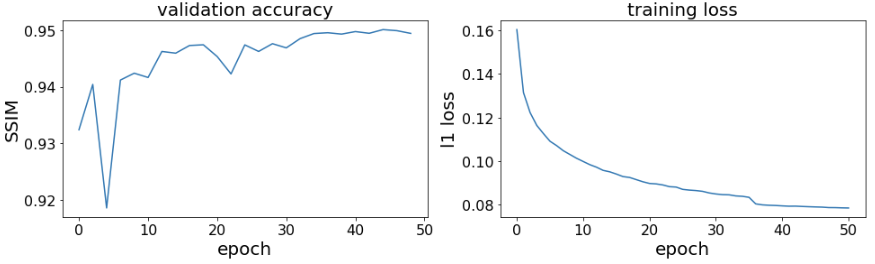

# Accelerated MRI reconstruction with U-Net

This folder contains code to train and validate a U-Net for accelerated MRI reconstruction. Accelerated MRI reconstruction is a compressed sensing task where the goal is to recover a ground-truth image from an under-sampled measurement. The under-sampled measurement is based in the frequency domain and is often called the $k$-space.

***

### List of contents

* [Questions and bugs](#Questions-and-bugs)

* [Dataset](#Dataset)

* [Model checkpoint](#Model-checkpoint)

* [Training](#Training)

* [Inference](#Inference)

***

# Questions and bugs

- For questions relating to the use of MONAI, please us our [Discussions tab](https://github.com/Project-MONAI/MONAI/discussions) on the main repository of MONAI.
- For bugs relating to MONAI functionality, please create an issue on the [main repository](https://github.com/Project-MONAI/MONAI/issues).
- For bugs relating to the running of a tutorial, please create an issue in [this repository](https://github.com/Project-MONAI/Tutorials/issues).

# Dataset

The experiments are performed on the [fastMRI](https://fastmri.org/dataset) dataset. Users should request access to the dataset
from the [owner's website](https://fastmri.org/dataset).

**Note.** Since the ground truth is not released with the test set of the fastMRI dataset, it is a common practice in the literature
to perform inference on the validation set of the fastMRI dataset. This could be in the form of testing on the whole validation
set (for example this work [https://www.ncbi.nlm.nih.gov/pmc/articles/PMC8767765/](https://www.ncbi.nlm.nih.gov/pmc/articles/PMC8767765/)).
 
Another approach is to split the validation set into validation and test sets and keep the test portion for inference (for exmple this work [https://arxiv.org/pdf/2111.02549.pdf](https://arxiv.org/pdf/2111.02549.pdf)). Note that both approaches are conceptually similar
in that splitting the validation set does not change the fact that the splits belong to the same distribution.
 
Other workarounds to this problem include (1) skipping validation during training and saving the model checkpoint of the last epoch for inference on the validation set, and (2) submitting model results to the [fastMRI public leaderboard](https://fastmri.org/leaderboards/).

# Model checkpoint

We have already provided a model checkpoint [unet_mri_reconstruction.pt](https://github.com/Project-MONAI/MONAI-extra-test-data/releases/download/0.8.1/unet_mri_reconstruction.pt) for a U-Net with `7,782,849` parameters. To obtain this checkpoint, we trained
a U-Net with the default hyper-parameters in `train.py` on the T2 subset of the brain dataset (`500` training and `180` validation volumes). The user can train their model on an arbitrary portion of the dataset.

Our checkpoint achieves `0.9496` SSIM on the fastMRI T2 validation subset which is comparabale to the original result reported on the
[fastMRI public leaderboard](https://fastmri.org/leaderboards/) (which is `0.9474` SSIM). The training dynamics for our checkpoint is depicted in the figure below.

# Training

Running `train.py` trains a U-Net. The default setup automatically detects a GPU for training; if not available, CPU will be used.

    # Run this to get a full list of training arguments
    python ./train.py -h

    # This is an example of calling train.py
    python ./train.py
        --data_path_train train_dir \
        --data_path_val val_dir \
        --exp accelerated_mri_recon \
        --exp_dir ./ \
        --mask_type equispaced \
        --num_epochs 50 \
        --num_workers 0 \
        --lr 0.0001

# Inference

The notebook `inference.ipynb` contains an example to perform validation. Average SSIM score over the validation set is computed and then
one sample is picked for visualization.
