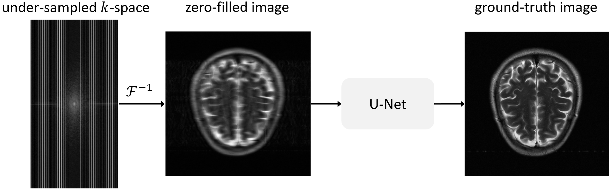

# Accelerated MRI reconstruction with U-Net

This folder contains code to train and validate a U-Net for accelerated MRI reconstruction. Accelerated MRI reconstruction is a compressed sensing task where the goal is to recover a ground-truth image from an under-sampled measurement. The under-sampled measurement is based on the frequency domain and is often called the $k$-space.

***

### List of contents

* [Questions and bugs](#Questions-and-bugs)

* [Dataset](#Dataset)

* [Model checkpoint](#Model-checkpoint)

* [Training](#Training)

* [Inference](#Inference)

* [Acknowledgment](#Acknowledgement)

***

# Questions and bugs

- For questions relating to the use of MONAI, please use our [Discussions](https://github.com/Project-MONAI/MONAI/discussions) tab](https://github.com/Project-MONAI/MONAI/discussions) on the main repository of MONAI.
- For bugs relating to MONAI functionality, please create an issue on the [main repository](https://github.com/Project-MONAI/MONAI/issues).
- For bugs relating to the running of a tutorial, please create an issue in [this repository](https://github.com/Project-MONAI/Tutorials/issues).

# Dataset

The experiments are performed on the [fastMRI](https://fastmri.org/dataset) brain multi-coil dataset (AXT2 modality). Users should request access to the dataset
from the [owner's website](https://fastmri.org/dataset). Remember to use the `$PATH` where you downloaded the data in `train.py`
or `inference.ipynb` accordingly.
Please notice that this dataset is under a noncommercial license. You may not use it for commercial purposes.
For our experiments, we created a subset of the fastMRI dataset which contains a `500/179/133` split for `train/val/test`. Please download [fastmri_data_split.json](https://github.com/Project-MONAI/MONAI-extra-test-data/releases/download/0.8.1/fastmri_data_split.json) and put it here under `./data`.

**Note.** The dataset files that need to be downloaded from [fastMRI](https://fastmri.org/dataset) are `brain_multicoil_train.tar.gz` (~1228.8 GB) and `brain_multicoil_val.tar.gz` (~350.9 GB).

# Model checkpoint

We have already provided a model checkpoint [unet_mri_reconstruction.pt](https://github.com/Project-MONAI/MONAI-extra-test-data/releases/download/0.8.1/unet_mri_reconstruction.pt) for a U-Net with `7,782,849` parameters. To obtain this checkpoint, we trained
a U-Net with the default hyper-parameters in `train.py` on the T2 subset of the brain dataset. The user can train their model on an arbitrary portion of the dataset.

The training dynamics for our checkpoint are depicted in the figure below.

# Training

Running `train.py` trains a U-Net. The default setup automatically detects a GPU for training; if not available, the CPU will be used.

    # Run this to get a full list of training arguments
    python ./train.py -h

    # This is an example of calling train.py
    python ./train.py
        --data_path_train train_dir \
        --data_path_val val_dir \
        --exp accelerated_mri_recon \
        --exp_dir ./ \
        --mask_type equispaced \
        --num_epochs 50 \
        --num_workers 0 \
        --lr 0.0001

# Inference

The notebook `inference.ipynb` contains an example to perform inference. The average SSIM score over the test subset is computed and then
one sample is picked for visualization.

Our checkpoint achieves `0.9436` SSIM on our test subset which is comparable to the original result reported on the
[fastMRI public leaderboard](https://fastmri.org/leaderboards/) (which is `0.9474` SSIM). Note that the results reported
on the leaderboard are for the unreleased test set. Moreover, the leaderboard model is trained on the validation set.

# Acknowledgment
Data used in the preparation of this tutorial were obtained from the NYU fastMRI Initiative database (fastmri.med.nyu.edu).[citation of Knoll et al Radiol Artif Intell. 2020 Jan 29;2(1):e190007.
doi: 10.1148/ryai.2020190007. (https://pubs.rsna.org/doi/10.1148/ryai.2020190007), and the arXiv paper: https://arxiv.org/abs/1811.08839] As such, NYU fastMRI investigators provided data but did not participate in analysis or writing of this tutorial. A listing of NYU fastMRI investigators, subject to updates, can be found at:fastmri.med.nyu.edu. The primary goal of fastMRI is to test whether machine learning can aid in the reconstruction of medical images.
