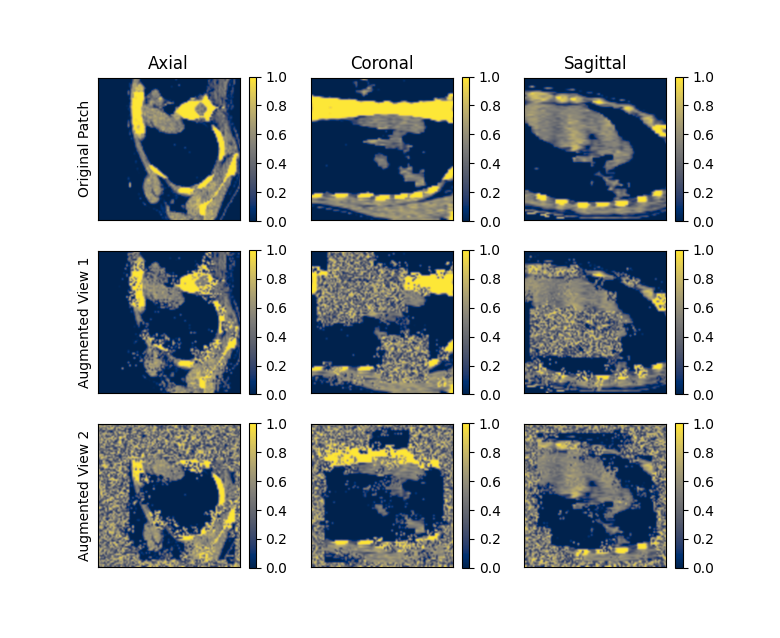

# Self-Supervised Pretraining Tutorial

This directory contains two scripts. The first script 'ssl_script_train.py' generates
a good set of pre-trained weights using unlabeled data with self-supervised tasks that
are based on augmentations of different types. The second script 'ssl_finetune_train.py' uses
the pre-trained weights generated from the first script and performs fine-tuning on a fully supervised
task.

### Steps to run the tutorial
1.) Download the two datasets [TCIA-Covid19](https://wiki.cancerimagingarchive.net/display/Public/CT+Images+in+COVID-19)
& [BTCV](https://www.synapse.org/#!Synapse:syn3193805/wiki/217789) (More detail about them in the Data section)\
2.) Modify the paths for data_root, json_path & logdir in ssl_script_train.py\
3.) Run the 'ssl_script_train.py'\
4.) Modify the paths for data_root, json_path, pretrained_weights_path from 2.) and
logdir_path in 'ssl_finetuning_train.py'\
5.) Run the ssl_finetuning_script.py\
6.) And that's all folks, use the model to your needs

### 1.Data
Pretraining Dataset: The TCIA Covid-19 dataset was used for generating the pretrained weights.
The dataset contains a total of 771 3D CT Volumes. The volumes were split into training and validation sets
of 600 and 171 3D volumes correspondingly. The data is available for download at this [link](https://wiki.cancerimagingarchive.net/display/Public/CT+Images+in+COVID-19).
If this dataset is being used in your work
please use [1] as reference. A json file is provided which contains the suggested training and validation split
in the json_files directory of the self-supervised training tutorial.

Fine-tuning Dataset: The dataset from Beyond the Cranial Vault Challenge [(BTCV)](https://www.synapse.org/#!Synapse:syn3193805/wiki/217789)
2015 hosted at MICCAI was used as a fully supervised fine-tuning task on the pre-trained weights. The dataset
consists of 30 3D Volumes with annotated labels of upto 13 different organs [2]. There are 3 json files provided in the
json_files directory for the dataset. They correspond to having different number of training volumes ranging 6, 12 and 24.
All 3 json files have the same validation split.

References:

1.) Harmon, Stephanie A., et al. "Artificial intelligence for the detection of COVID-19 pneumonia on
chest CT using multinational datasets." Nature communications 11.1 (2020): 1-7.

2.) Tang, Yucheng, et al. "High-resolution 3D abdominal segmentation with random patch network fusion."
Medical Image Analysis 69 (2021): 101894.

### 2. Network Architectures

For pretraining a modified version of ViT [1] has been used, it can be referred [here](https://docs.monai.io/en/latest/networks.html#vitautoenc)
from MONAI. The original ViT was modified by attachment of two 3D Convolutional Transpose Layers to achieve a similar
reconstruction size as that of the input image. The ViT is the backbone for the UNETR [2] network architecture which was
used for the fine-tuning fully supervised tasks.

The pretrained backbone of ViT weights were loaded to UNETR and the decoder head still relies on random initialization
for adaptability of the new downstream task. This flexibility also allows the user to adapt the ViT backbone to their
own custom created network architectures as well which uses the ViT backbone.

References:

1.) Dosovitskiy, Alexey, et al. "An image is worth 16x16 words: Transformers for image recognition at scale."
arXiv preprint arXiv:2010.11929 (2020).

2.) Hatamizadeh, Ali, et al. "Unetr: Transformers for 3d medical image segmentation."
arXiv preprint arXiv:2103.10504 (2021).

### 3. Self-supervised Tasks

The pretraining pipeline has two aspects to it. The first it uses augmentation to mutate the data and the second is
it utilizes to a regularized [constrastive loss](https://docs.monai.io/en/latest/losses.html#contrastiveloss) [3] to
learn feature representations of the unlabeled data. The multiple augmentations are applied on a randomly selected 3D
foreground patch from a 3D volume. Two augmented views of the same 3D patch are generated for the constrastive loss as
it functions by drawing the two augmented views closer to each other.

The augmentations mutate the 3D patch in different ways and the primary task of the network is to reconstruct
the original image. The different augmentations used are classical techniques such as in-painting [1], out-painting [1]
and noise augmentation to the image by local pixel shuffling [2]. The secondary task of the network is to simultaneously
reconstruct the two augmented views as similar to each other as possible via the regularized contrastive loss [3] as it's
objective is to maximize the agreement. The term regularized has been used here because the contrastive loss is adjusted
by the reconstruction loss as a dynamic weight itself.

The below example image depicts the usage of the augmentations pipeline where two augmented views are drawn of the same
3D patch:

The three columns are the three views of axial, coronal, sagittal of a randomly selected patch of size 96x96x96.
The top row is the ground truth image which is not augmented. The middle row is the same image when mutated by augmentations.
The bottom row is a 2nd view of the same patch but augmented with different probabilities
The objective of the SSL network is to reconstruct the original top row image from the first view. The contrastive loss
is driven by maximizing agreement of the reconstruction based on input of the two augmented views .

References:

1.) Pathak, Deepak, et al. "Context encoders: Feature learning by inpainting." Proceedings of the IEEE conference on
   computer vision and pattern recognition. 2016.

2.) Chen, Liang, et al. "Self-supervised learning for medical image analysis using image context restoration." Medical
image analysis 58 (2019): 101539.

3.) Chen, Ting, et al. "A simple framework for contrastive learning of visual representations." International conference
on machine learning. PMLR, 2020.

### 4. Experiment Hyper-parameters

Training Hyper-Parameters for SSL: \
Epochs: 300 \
Validation Frequency: 2 \
Learning Rate: 1e-4 \
Batch size: 4 3D Volumes (Total of 8 as 2 samples were drawn per 3D Volume) \
Loss Function: L1
Contrastive Loss Temperature: 0.005

Training Hyper-parameters for Fine-tuning BTCV task (All settings have been kept consistent with prior [UNETR 3D
Segmentation tutorial](https://github.com/Project-MONAI/tutorials/blob/master/3d_segmentation/unetr_btcv_segmentation_3d.ipynb)): \
Number of Steps: 30000 \
Validation Frequency: 100 steps \
Batch Size: 1 3D Volume (4 samples are drawn per 3D volume) \
Learning Rate: 1e-4 \
Loss Function: DiceCELoss

### 4. Training & Validation Curves for pretraining SSL

L1 error reported for training and validation when performing the SSL training

### 5. Results of the Fine-tuning vs Random Initialization on BTCV

| Training Volumes      | Validation Volumes | Random Init Dice score | Pretrained Dice Score | Relative Performance Improvement |
| ----------------      | ----------------   | ----------------       | ----------------      | ----------------        |
| 6      | 6 | 63.07 | 70.09 | ~11.13% |
| 12      | 6 | 76.06 | 79.55 | ~4.58% |
| 24      | 6 | 78.91 | 82.30 | ~4.29% |
