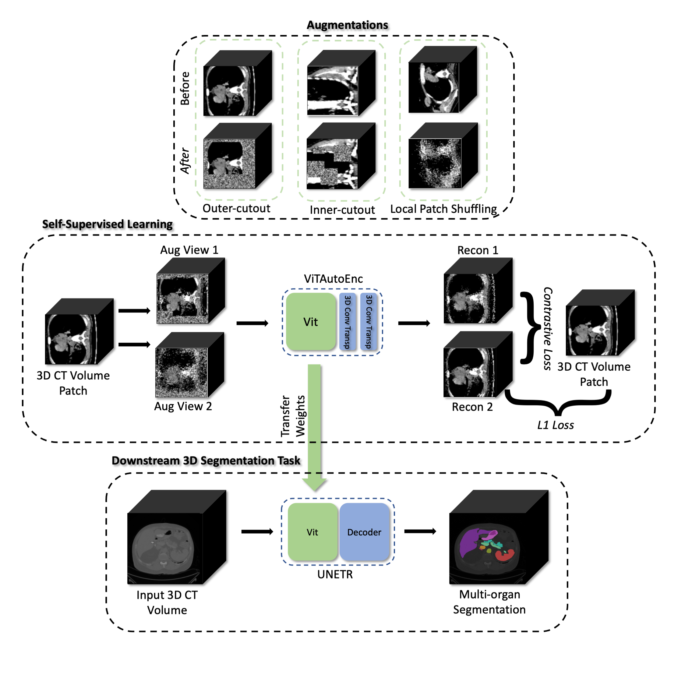
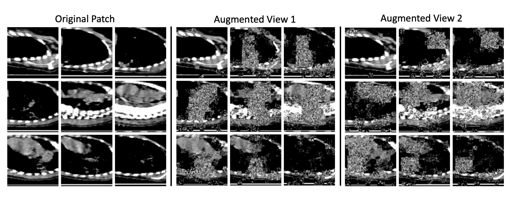
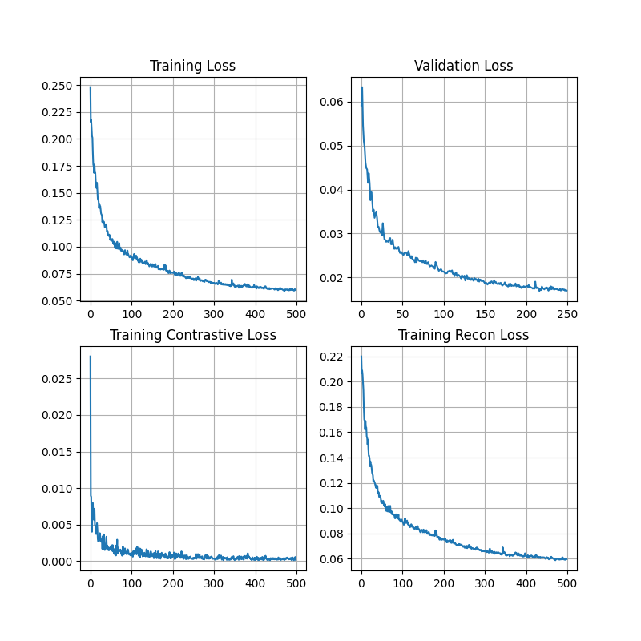

# Self-Supervised Pre-training Tutorial

This directory contains two Jupyter notebooks. The first is notebook 'ssl_train.ipynb' which generates
a good set of pre-trained weights using unlabeled data with self-supervised tasks that
are based on augmentations of different types. The second is notebook 'ssl_finetune.ipynb' uses
the pre-trained weights generated from the first script and performs fine-tuning on a fully supervised
task.

The tutorial also provides a multi-GPU version of the SSL training. Code to run multi-gpu SSL can
be found in `multi_gpu` directory. Detailed instructions on how to run it can be found section 6.

### Steps to run the tutorial
1. Download the two datasets [TCIA-Covid19](https://wiki.cancerimagingarchive.net/display/Public/CT+Images+in+COVID-19)
& [BTCV](https://www.synapse.org/#!Synapse:syn3193805/wiki/217789) (More detail about them in the Data section)
2. Modify the paths for data_root, json_path & logdir in ssl_train.ipynb
3. Run the 'ssl_train.ipynb'
4. Modify the paths for data_root, json_path, pre-trained_weights_path from Step 2 and
logdir_path in 'ssl_finetune.ipynb'
5. Run the 'ssl_finetune.ipynb'
6. And that's all folks, use the model to your needs

### 1. Data
Pre-training Dataset: The TCIA Covid-19 dataset was used for generating the
pre-trained weights. The dataset contains a total of 771 3D CT Volumes. The volumes were split into training and validation sets
of 600 and 171 3D volumes correspondingly. The data is available for download at this
[link](https://wiki.cancerimagingarchive.net/display/Public/CT+Images+in+COVID-19).
If this dataset is being used in your work,  please use 1 as a reference. A JSON file is provided
which contains the training and validation splits that were used for the training. The JSON file can be found in the
json_files directory of the self-supervised training tutorial.

Fine-tuning Dataset: The dataset from Beyond the Cranial Vault Challenge
[(BTCV)](https://www.synapse.org/#!Synapse:syn3193805/wiki/217789)
2015 hosted at MICCAI, was used as a fully supervised fine-tuning task on the pre-trained weights. The dataset
consists of 30 3D Volumes with annotated labels of up to 13 different organs [2]. There are 3 JSON files provided in the
json_files directory for the dataset. They correspond to having a different number of training volumes ranging from
6, 12 and 24. All 3 JSON files have the same validation split.

References:

1.) Harmon, Stephanie A., et al. "Artificial intelligence for the detection of COVID-19 pneumonia on
chest CT using multinational datasets." Nature communications 11.1 (2020): 1-7.

2.) Tang, Yucheng, et al. "High-resolution 3D abdominal segmentation with random patch network fusion."
Medical Image Analysis 69 (2021): 101894.

### 2. Network Architectures

For pre-training a modified version of ViT [1] has been used, it can be referred to
[here](https://docs.monai.io/en/latest/networks.html#vitautoenc)
from MONAI. The original ViT was modified by the attachment of two 3D Convolutional Transpose Layers to achieve a similar
reconstruction size as that of the input image. The ViT is the backbone for the UNETR [2] network architecture which
was used for fine-tuning fully supervised tasks.

The pre-trained backbone of ViT weights was loaded to UNETR and the decoder head still relies on random initialization
for adaptability of the new downstream task. This flexibility also allows the user to adapt the ViT backbone to their custom-created network architectures as well.

References:

1.) Dosovitskiy, Alexey, et al. "An image is worth 16x16 words: Transformers for image recognition at scale."
arXiv preprint arXiv:2010.11929 (2020).

2.) Hatamizadeh, Ali, et al. "Unetr: Transformers for 3d medical image segmentation."
arXiv preprint arXiv:2103.10504 (2021).

### 3. Self-supervised Tasks

The pre-training pipeline has two aspects to it (Refer figure shown below). First, it uses augmentation (top row) to
mutate the data and second, it utilizes regularized
[contrastive loss](https://docs.monai.io/en/latest/losses.html#contrastiveloss) [3] to learn feature representations
of the unlabeled data. The multiple augmentations are applied on a randomly selected 3D foreground patch from a 3D
volume. Two augmented views of the same 3D patch are generated for the contrastive loss as it functions by drawing
the two augmented views closer to each other if the views are generated from the same patch, if not then it tries to
maximize the disagreement. The CL offers this functionality on a mini-batch.

The augmentations mutate the 3D patch in various ways, the primary task of the network is to reconstruct
the original image. The different augmentations used are classical techniques such as in-painting [1], out-painting [1]
and noise augmentation to the image by local pixel shuffling [2]. The secondary task of the network is to simultaneously
reconstruct the two augmented views as similar to each other as possible via regularized contrastive loss [3] as its
objective is to maximize the agreement. The term regularized has been used here because contrastive loss is adjusted
by the reconstruction loss as a dynamic weight itself.

The below example image depicts the usage of the augmentation pipeline where two augmented views are drawn of the same
3D patch:

Multiple axial slices of a 96x96x96 patch are shown before the augmentation (Ref Original Patch in the above figure).
Augmented Views 1 & 2 are different augmentations generated via the transforms on the same cubic patch. The objective
of the SSL network is to reconstruct the original top-row image from the first view. The contrastive loss
is driven by maximizing the agreement of the reconstruction based on the input of the two augmented views.

References:

1.) Pathak, Deepak, et al. "Context encoders: Feature learning by inpainting." Proceedings of the IEEE conference on
   computer vision and pattern recognition. 2016.

2.) Chen, Liang, et al. "Self-supervised learning for medical image analysis using image context restoration." Medical
image analysis 58 (2019): 101539.

3.) Chen, Ting, et al. "A simple framework for contrastive learning of visual representations." International conference
on machine learning. PMLR, 2020.

### 4. Experiment with Hyper-parameters

Training Hyper-Parameters for SSL: \
Epochs: 300 \
Validation Frequency: 2 \
Learning Rate: 1e-4 \
Batch size: 4 3D Volumes (Total of 8 as 2 samples were drawn per 3D Volume) \
Loss Function: L1
Contrastive Loss Temperature: 0.005

Training Hyper-parameters for Fine-tuning BTCV task (All settings have been kept consistent with prior
[UNETR 3D Segmentation tutorial](../3d_segmentation/unetr_btcv_segmentation_3d.ipynb): \
Number of Steps: 30000 \
Validation Frequency: 100 steps \
Batch Size: 1 3D Volume (4 samples are drawn per 3D volume) \
Learning Rate: 1e-4 \
Loss Function: DiceCELoss

### 4. Training & Validation Curves for pre-training SSL

L1 error reported for training and validation when performing the SSL training. Please note the contrastive loss is not
L1.

### 5. Results of the Fine-tuning vs Random Initialization on BTCV

| Training Volumes      | Validation Volumes | Random Init Dice score | Pre-trained Dice Score | Relative Performance Improvement |
| ----------------      | ----------------   | ----------------       | ----------------      | ----------------        |
| 6      | 6 | 63.07 | 70.09 | ~11.13% |
| 12      | 6 | 76.06 | 79.55 | ~4.58% |
| 24      | 6 | 78.91 | 82.30 | ~4.29% |

### 6. Multi-GPU SSL Training

At the time of creation of this tutorial, the below additional dependencies are required:
`pip install timm==0.4.12`

To begin training with 2 GPU's please see the below example command for execution of the SSL multi-gpu training
script:

`CUDA_VISIBLE_DEVICES=0,1 python -m torch.distributed.launch --nproc_per_node=2 mgpu_ssl_train.py --batch_size=8 --epochs=500 --base_lr=2e-4 --logdir_path=/to/be/defined --output=/to/be/defined --data_root=/to/be/defined --json_path=/to/be/defined`

It can be configured to launch on more GPU's by adding the relevant `CUDA Device` ID in `CUDA_VISIBLE_DEVICES`
and increasing the total count of GPU's `--nproc_per_node`

Below are expected run time comparison for the multi-GPU benchmarked on A100:

| Hardware         | Training Time  |
|------------------|----------------|
| 2 GPU A100 80 GB | 2 hrs 15 mins  |

### Tutorial Usage Citation

If you found the tutorial to be helpful in your work please support us by citing the below reference:

1.) Tang, Yucheng, Dong Yang, Wenqi Li, Holger R. Roth, Bennett Landman, Daguang Xu, Vishwesh Nath, and Ali Hatamizadeh. "Self-supervised pre-training of swin transformers for 3d medical image analysis." In Proceedings of the IEEE/CVF Conference on Computer Vision and Pattern Recognition, pp. 20730-20740. 2022.

Bibtex: `@inproceedings{tang2022self,
  title={Self-supervised pre-training of swin transformers for 3d medical image analysis},
  author={Tang, Yucheng and Yang, Dong and Li, Wenqi and Roth, Holger R and Landman, Bennett and Xu, Daguang and Nath, Vishwesh and Hatamizadeh, Ali},
  booktitle={Proceedings of the IEEE/CVF Conference on Computer Vision and Pattern Recognition},
  pages={20730--20740},
  year={2022}
}
`
