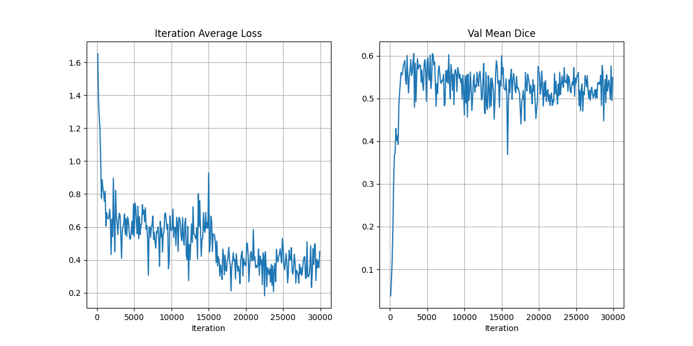

# Pre-trained SwinUNETR Backbone on ~50,000 3D Volumes

This tutorial is an example of how to use the latest set of SwinUNETR pre-trained weights. The pre-training was done using multiple public datasets with over ~50,000 3D CT and MR volumes.

Benchmark on BTCV with using the pre-trained weights as compared to random initialization shows promising gains in terms of accuracy/performance.

### Steps to run the tutorial
1. Download the dataset [BTCV](https://www.synapse.org/#!Synapse:syn3193805/wiki/217789) (More detail is provided in the Data section)
1. Modify the paths for pretrained_path, data_root, json_path & logdir in [swinunetr_finetune.ipynb](swinunetr_finetune.ipynb)
1. Run the [swinunetr_finetune.ipynb](swinunetr_finetune.ipynb)

### 1. Data
Pre-training Dataset: Datasets from multiple sources has been used. Below is a list of all the different datasets that were utilized for training the SwinUNETR network architecture:

| Dataset Name            | Source          | No. Data |
|-------------------------|-----------------|----------|
| Aomic-1000              | Open Neuro      | ~2700    |
| QTIM                    | Open Neuro      | ~1350    |
| Brats 2021              | Brats Challenge | ~5000    |
| LUNA 16                 | LUNA Challenge  | ~900     |
| NLST                    | TCIA            | ~33500   |
| Duke Breast Cancer MR   | TCIA            | ~5000    |
| Acrin Breast MR         | TCIA            | ~7000    |
| Prostate MR             | TCIA            | ~900     |
| Stony Brook Chest CT    | TCIA            | ~2700    |
| Upenn GBM               | TCIA            | ~2700    |
| LIDC                    | TCIA            | ~500     |
| Covid-19                | TCIA            | ~700     |
| Colonography Trials     | TCIA            | ~1600    |
| Head and Neck Carcinoma | TCIA            | ~1300    |

Fine-tuning Dataset: The dataset from Beyond the Cranial Vault Challenge
[(BTCV)](https://www.synapse.org/#!Synapse:syn3193805/wiki/217789)
2015 hosted at MICCAI, was used as a fully supervised fine-tuning task on the pre-trained weights. The dataset
consists of 30 3D Volumes with annotated labels of up to 13 different organs [2]. There are 3 JSON files provided in the
json_files directory for the dataset. They correspond to having a different number of training volumes ranging from
3, 5, 7, 12 and 24. All 5 JSON files have the same validation split.

### 2. Pretrained SwinUNETR Weights

The entire SwinUNETR model including encoder and decoder was trained end-to-end using self-supervised learning techniques as outlined in [1].

### 3. Finetuning SwinUNETR with BTCV Experiment Hyper-parameters

Training Hyper-parameters for Fine-tuning BTCV task : \
Number of Steps: 30000 \
Validation Frequency: 100 steps \
Batch Size: 1 3D Volume (4 samples are drawn per 3D volume) \
Learning Rate: 4e-4 \
Loss Function: DiceCELoss

### 5. Results of the Fine-tuning vs Random Initialization on BTCV

| Training Volumes | % of Dataset | Validation Volumes | Random Init Dice score | Pre-trained Dice Score |
|------------------|--------------|--------------|------------------------|------------------------|
| 3                | 10%          | 6            | 58.29                  | 60.47                  |
| 5                | 20%          | 6            | 67.46                  | 68.25                  |
| 7                | 30%          | 6            | 71.22                  | 72.43                  |
| 12               | 50%          | 6            | 79.39                  | 79.94                  |
| 24               | 100%         | 6            | 82.63                  | 82.64                  |

On complete execution of the jupyter notebook the below example training and validation curves are expected. The below plot is with 10% of BTCV data.

### Tutorial Usage Citation

If you found the tutorial to be helpful in your work please support us by citing the below reference:

1.) Valanarasu JM, Tang Y, Yang D, Xu Z, Zhao C, Li W, Patel VM, Landman B, Xu D, He Y, Nath V. Disruptive Autoencoders: Leveraging Low-level features for 3D Medical Image Pre-training. arXiv preprint arXiv:2307.16896. 2023 Jul 31.

Bibtex: `@article{valanarasu2023disruptive,
  title={Disruptive Autoencoders: Leveraging Low-level features for 3D Medical Image Pre-training},
  author={Valanarasu, Jeya Maria Jose and Tang, Yucheng and Yang, Dong and Xu, Ziyue and Zhao, Can and Li, Wenqi and Patel, Vishal M and Landman, Bennett and Xu, Daguang and He, Yufan and others},
  journal={arXiv preprint arXiv:2307.16896},
  year={2023}
}
`

2.) Tang, Y., Yang, D., Li, W., Roth, H.R., Landman, B., Xu, D., Nath, V. and Hatamizadeh, A., 2022. Self-supervised pre-training of swin transformers for 3d medical image analysis. In Proceedings of the IEEE/CVF Conference on Computer Vision and Pattern Recognition (pp. 20730-20740).

Bibtex: `@inproceedings{tang2022self,
  title={Self-supervised pre-training of swin transformers for 3d medical image analysis},
  author={Tang, Yucheng and Yang, Dong and Li, Wenqi and Roth, Holger R and Landman, Bennett and Xu, Daguang and Nath, Vishwesh and Hatamizadeh, Ali},
  booktitle={Proceedings of the IEEE/CVF Conference on Computer Vision and Pattern Recognition},
  pages={20730--20740},
  year={2022}
}
`

3.) Tang, Y., Gao, R., Lee, H.H., Han, S., Chen, Y., Gao, D., Nath, V., Bermudez, C., Savona, M.R., Abramson, R.G. and Bao, S., 2021. High-resolution 3D abdominal segmentation with random patch network fusion. Medical image analysis, 69, p.101894.

Bibtex: `@article{tang2021high,
  title={High-resolution 3D abdominal segmentation with random patch network fusion},
  author={Tang, Yucheng and Gao, Riqiang and Lee, Ho Hin and Han, Shizhong and Chen, Yunqiang and Gao, Dashan and Nath, Vishwesh and Bermudez, Camilo and Savona, Michael R and Abramson, Richard G and others},
  journal={Medical image analysis},
  volume={69},
  pages={101894},
  year={2021},
  publisher={Elsevier}
}
`
