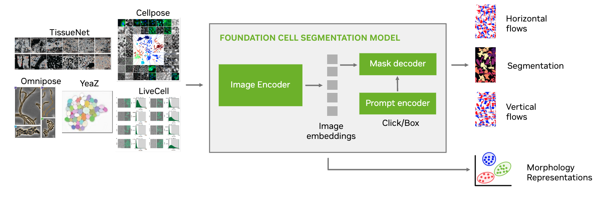

# VISTA-2D Cell Segmentation with Segment Anything Model (SAM) & MONAI

The tutorial demonstrates how to train a cell segmentation model using the [MONAI](https://monai.io/) framework and the [Segment Anything Model (SAM)](https://github.com/facebookresearch/segment-anything) on the [Cellpose dataset](https://www.cellpose.org/).

In summary, the tutorial covers the following:
- Initialization of the CellSamWrapper model with pre-trained SAM weights
- Creation of data lists for training, validation, and testing
- Definition of data transforms for training and validation
- Setup of datasets and dataloaders with MONAI
- Implementation of the training loop, including:
    - Loss function (CellLoss)
    - Accuracy function (CellAcc)
    - Optimizer (SGD)
- Mixed precision training with GradScaler
- Sliding window inference via MONAI
- Visualization of training loss, validation loss, and validation accuracy
- Inference on a single validation image
- Visualization of input image, ground truth, and model prediction

For a more elaborate experience we encourage you to take a look at the [VISTA-2DMONAI bundle](https://github.com/Project-MONAI/VISTA/tree/main/vista2d).
